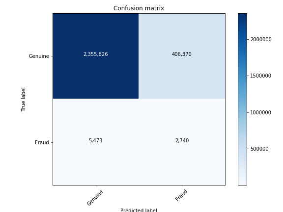
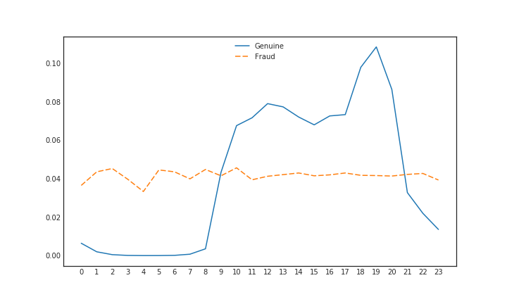
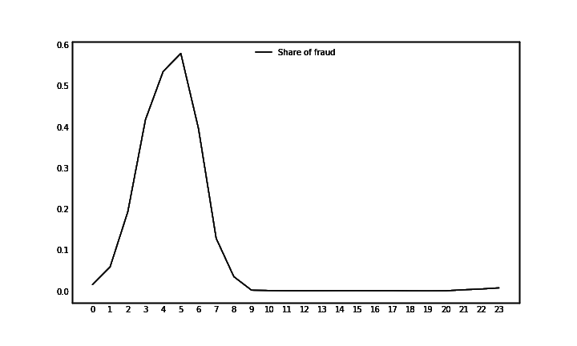
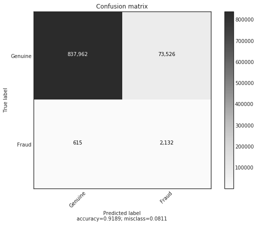
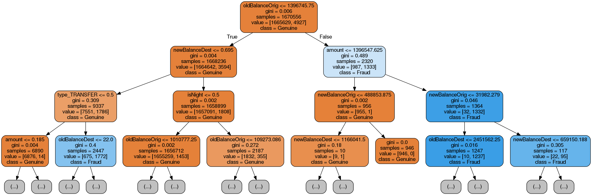

# Chapter 2 - Working with structured data

# Introduction
Structured data is a term for any data that resides in a fixed field within a record or file. Relational databases and spreadsheets are two examples of structured data. Usually, structured data is presented in a table in which each column presents a type of value and each row represents a new entry. Its structured format means that this type of data lends itself to classical statistical analysis. This is also why most data science or analysis work is done on structured data and much less on the unstructured data that the rest of this book deals with. 

Structured data is also the most common type of data available to businesses and most machine learning problems that need to be solved in finance deal with structured data in some way. Company fundamentals, transactions, order books, option prices, suppliers, etc. are all information usually collected in spreadsheets or databases. 

This chapter will walk you through a structured data problem, from developing a heuristic baseline to feature engineering to an end to end approach. It also introduces Keras, a neural network library used throughout the book. 

# The data

The dataset we will work with is a synthetic dataset of transactions generated by a payment simulator. The goal is to find fraudulent transactions, a classic machine learning problem many financial institutions deal with.

step|type|amount|nameOrig|oldBalanceOrig|newBalanceOrig|nameDest|oldBalanceDest|newBalanceDest|isFraud|isFlaggedFraud
---|---|---|---|---|---|---|---|---|---|---
1|PAYMENT|9839.64|C1231006815|170136.0|160296.36|M1979787155|0.0|0.0|0|0
1|PAYMENT|1864.28|C1666544295|21249.0|19384.72|M2044282225|0.0|0.0|0|0
1|TRANSFER|181.0|C1305486145|181.0|0.0|C553264065|0.0|0.0|1|0
1|CASH_OUT|181.0|C840083671|181.0|0.0|C38997010|21182.0|0.0|1|0
1|PAYMENT|11668.14|C2048537720|41554.0|29885.86|M1230701703|0.0|0.0|0|0
1|PAYMENT|7817.71|C90045638|53860.0|46042.29|M573487274|0.0|0.0|0|0
1|PAYMENT|7107.77|C154988899|183195.0|176087.23|M408069119|0.0|0.0|0|0
1|PAYMENT|7861.64|C1912850431|176087.23|168225.59|M633326333|0.0|0.0|0|0
1|PAYMENT|4024.36|C1265012928|2671.0|0.0|M1176932104|0.0|0.0|0|0
1|DEBIT|5337.77|C712410124|41720.0|36382.23|C195600860|41898.0|40348.79|0|0

The data has 11 fields:
- step: Maps time. Each step corresponds to one hour.
- type: The type of the transaction, can be CASH-IN, CASH-OUT, DEBIT, PAYMENT and TRANSFER
- amount: The amount of the transaction 
- nameOrig: Account that started the transaction 
- oldbalanceOrig: Old balance of the origin
- newbalanceOrig: New balance of the origin after transaction 
- nameDest: Destination account
- oldbalanceDest: Old balance of destination. This information is not available to merchant accounts whose names start with M.
- newbalanceDest: New balance of destination. This information is not available to merchant accounts.
- isFraud: Whether the transaction was fraudulent.
- isFlaggedFraud: Whether the old system flagged the transaction as fraud.

Overall, there are about 6.3 million transactions in our dataset. As fraud occurs only in transfers or cash outs, all other transactions were dropped, leaving about 2.8 million examples to work with.

See E. A. Lopez-Rojas , A. Elmir, and S. Axelsson., 2016, "PaySim: A financial mobile money simulator for fraud detection" for more information on the data.

# Heuristic, Feature, End to End 

Before we dive into developing models, let's take a second to pause and ponder over the different kinds of models we could build:

- A **heuristic** is a simple 'rule of thumb' developed purely by humans. Usually, the heuristic stems from expert knowledge of the problem.
- A **feature based** model relies heavily on humans modifying the data to create new, meaningful features, which are then fed into a (simple) machine learning algorithm. This approach mixes expert knowledge with learning from data.
- An **end to end** model is learned purely from raw data. No human expertise is used and the model learns everything directly from observations.

In our case, a heuristic could be to mark all transactions with transaction type TRANSFER and an amount over $200,000 as fraudulent. Heuristics have the advantage that they are fast to develop and easy to implement. However, their performance is often poor and fraudsters can easily game the system. For the heuristic above, transferring only $199,999 would already evade detection.

To create features, experts craft indicators that distinguish fraud from genuine transactions. This is often done using statistical data analysis. This takes longer than developing a heuristic but usually yields better results.

Finally, to train an end to end model, much data has to be collected and labeled. This data is then used to create an end to end model that learns purely from data without using expert knowledge. This often yields the best results but takes much time. Collecting data is an expensive task as humans have to label millions of records. 

Shipping a poor model is often better than not shipping anything. A heuristic that lets through half of the fraudulent transaction is better than having no fraud detection.


It is good practice to first develop a heuristic. If this heuristic meets the basic requirements of the task it can be shipped. The heuristic then becomes the baseline that any other approach has to beat. Next, efforts should be directed to build a feature based model. As soon as this model beats the heuristic, it can be shipped. Feature based models often deliver pretty decent performance on structured data tasks which affords the company the time to undertake the long and expensive task of building an end to end model. Once the end to end model beats the feature based model it can be shipped as well.

# The ML software stack

In this chapter, we will be using a range of different libraries that are commonly used in machine learning. Our stack consists of:
- **Numpy** numpy adds support for large, multidimensional arrays as well as a large collection of mathematical functions.
- **Pandas** is a library for data manipulation and analysis. It is sort of like 'Excel but in Python' as it offers data structures to handle tables and tools to manipulate them.
- **SciKit Learn** is a machine learning library offering a wide range of algorithms and utilities.
- **TensorFlow** is a dataflow programming library which enables working with neural networks.
- **Keras** is a neural network library that can act as a simplified interface to TensorFlow.
- **Matplotlib** is a plotting library.
- **Jupyter** is a development environment. All code examples in this book is available in Jupyter Notebooks.

Most of this book is dedicated to working with Keras. However, this chapter makes extensive use of all other libraries as well. The goal is less to teach all the tips and tricks of all the libraries, but to show how they integrate into the process of creating a predictive model.

# Evaluating a simple heuristic 
Let's start by defining a simple heuristic and measuring how well it does:
> Heuristic: Any transaction whos type is TRANSFER and amount is over $200,000 is fraudulent. All others are not. 

## Making predictions with the heuristic 
We will make predictions using our heuristic over the entire training set to get an idea of how well this heuristic does.
```Python
df['Fraud_Heuristic'] = np.where(((df['type'] == 'TRANSFER') & 
                                  (df['amount'] > 200000)),1,0)
```
The line above creates a new column 'Fraud_Heuristic' and assigns a value of 1 in rows where the type is TRANSFER and the amount is more than 200,000. You can see how such a simple metric could be quickly deployed as it is only a few lines of code.

## The F1 score
We need a common metric to evaluate all of our models on. In the last chapter we used accuracy. However, there are much fewer fraudulent transactions than there are genuine ones. A model that classifies all transactions as genuine can have a very high accuracy. A metric that is designed to deal with such skewed distribution is the F1 score. The F1 score considers true and false positives and negatives:
||Predicted Negative|Predicted Positive|
|-|-----------------|------------------|
|Actual Negative|True Negative (TN)|False Positive (FP)|
|Actual Positive|False Negative (FN)|True Positive (TP)|

We can then first compute the **precision** of our model, which specifies the share of predicted positives that where actually positives:

$$precision = \frac{TP}{TP + FP}$$

**Recall** measures the share of predicted positives over actual positives:
$$recall = \frac{TP}{TP + FN}$$

The F1 score is the harmonic mean of the two measures:
$$F_1 = 2 * \frac{precision * recall}{precision + recall}$$

To compute this metric in Python, we can use the metrics module of scikit learn, or sklearn for short. 
```Python
from sklearn.metrics import f1_score
```

Given the predictions we made above, we can now easily compute the F1 score:
```Python
f1_score(y_pred=df['Fraud_Heuristic'],y_true=df['isFraud'])
```
```
out: 0.013131315551742895
```

What this number exactly means is a bit harder to interpret than what accuracy means. In this case it is the harmonic mean of the share of correctly caught frauds over everything labeled as a fraud and the share of correctly caught frauds over all frauds. 

## Evaluation with a confusion matrix
A more qualitative and interpretable way of evaluating a model is a confusion matrix. As the name suggests, it shows how our classifier confuses classes. See the code appendix for the ``plot_confusion_matrix`` function.
```Python
from sklearn.metrics import confusion_matrix
cm = confusion_matrix(y_pred=df['Fraud_Heuristic'],y_true=df['isFraud'])
plot_confusion_matrix(cm,['Genuine','Fraud'])
```



Of the 2,770,409 examples in our dataset, 2,355,826 were correctly classified as genuine. But 406,370 were falsely classified as fraud. In fact, only 2,740 examples were correctly classified as fraud. If our heuristic classified a transaction as fraudulent, it was genuine in 99.3% of the cases. Only 34.2% of frauds get caught. All this information is incorporated into the f1 score, but it is easier to read from a confusion matrix. The reason we use both is that it is good to have a single number which tells us which model is better but also a more graphical insight into how the model is better.

Our heuristic performs quite poorly. In the next sections we will see if we can do better.

# Feature engineering
The objective of feature engineering is to exploit qualitative insight by humans to create better ML models. The human engineer usually uses three sources of insight: Intuition, expert domain knowledge and statistical analysis. Many times, it is possible to come up with some features for a problem just from intuition. In our fraud case, it seems intuitive that fraudsters will create new accounts for their schemes and won't use the bank account they pay for their groceries with. Domain experts can use their extensive knowledge of the problem to come up with more of such intuitions. They know better how fraudsters behave and can craft features that indicate such behavior. All these intuitions are then usually confirmed by statistical analysis. Sometimes, it is also possible to discover features from statistical analysis. Thorough statistical analysis might turn up some quirks which can be turned into predictive features. But engineers have to beware of the **data trap**. The predictive features found in the data might only exist in the data. Any dataset will spit out some predictive feature if wrangled long enough. For features found in statistical analysis, it is important to establish a **qualitative rationale** of why this statistical predictive feature exist and should exist outside of the dataset as well.

The goal of this section is not to show all feature engineering that could be done on this dataset, but just to highlight the three approaches and how they can be turned into features.

## Feature from intuition: Fraudsters don't sleep
Without knowing much about fraud, intuitively fraudsters are shady people that operate in the dark. Genuine transactions will intuitively happen mostly during the day as people sleep at night. The time steps in our dataset represent one hour so we can get the time of the day by taking the remainder of a division by 24:
```Python
df['hour'] = df['step'] % 24
```
We can next count the number of fraudulent and genuine transactions at different times:
```Python
frauds = []
genuine = []
for i in range(24):
    f = len(df[(df['hour'] == i) & (df['isFraud'] == 1)])
    g = len(df[(df['hour'] == i) & (df['isFraud'] == 0)])
    frauds.append(f)
    genuine.append(g)
```
Finally, we can plot the share of genuine and fraudulent transactions over the day:
```Python
fig, ax = plt.subplots(figsize=(10,6))
ax.plot(genuine/np.sum(genuine), label='Genuine')
ax.plot(frauds/np.sum(frauds),dashes=[5, 2], label='Fraud')
plt.xticks(np.arange(24))
legend = ax.legend(loc='upper center', shadow=True)
```

We can clearly see that there are much fewer genuine transactions at night while fraudulent behavior continues over time. To be sure that the night is a time where we can hope to catch fraud we can also plot the number of fraudulent transactions as a share of all transactions:
```Python
fig, ax = plt.subplots(figsize=(10,6))
ax.plot(np.divide(frauds,np.add(genuine,frauds)), label='Share of fraud')
plt.xticks(np.arange(24))
legend = ax.legend(loc='upper center', shadow=True)
```

At around 5am, over 60% of all transactions seem to be fraudulent. The time of the day is a good feature to catch fraud.

## Expert insight: Transfer, than cash out 
The description of the dataset comes with a description of the expected behavior of fraudsters: First they transfer money to a bank account they control. Than they cash out at an ATM. We can check if there are fraudulent transfer destinations that are the origin of fraudulent cash outs:
```Python
dfFraudTransfer = df[(df.isFraud == 1) & (df.type == 'TRANSFER')]
dfFraudCashOut = df[(df.isFraud == 1) & (df.type == 'CASH_OUT')]
dfFraudTransfer.nameDest.isin(dfFraudCashOut.nameOrig).any()
```
```
out: False
```
There seem to be no fraudulent transfers that are the origin of fraudulent cash outs. The behavior expected by the experts is not visible in our data. This could mean that fraudsters behave differetly now, or that our data does not capture the behavior. Either way, we can not use this insight for predictive modeling here.

## Statistical quirks: Errors in balances 
Close examination of the data shows that there are some transactions for which the old and the new balance of the destination is zero, although the transaction amount is not zero. This is odd, so we might want to investigate if this kind of oddity yields predictive power. We can calculate the share of fraudulent transactions with this property:
```Python
dfOdd = df[(df.oldBalanceDest == 0) & 
           (df.newBalanceDest == 0) & 
           (df.amount)]

len(dfOdd[(df.isFraud == 1)]) / len(dfOdd)
```
```
out: 0.7046398891966759
```
70% of such odd transactions are fraudulent, so this quirk seems to be a good feature as well. However, it is important to ask how this quirk got into our data in the first place. One possibility would be that the transactions never come through. This could happen for a number of reasons: There might be another fraud prevention system in place that blocks the transactions, or the origin of the destination has insufficient funds. We have no way of verifying the first option from the data, but we can check on the second:
```Python
len(dfOdd[(dfOdd.oldBalanceOrig <= dfOdd.amount)]) / len(dfOdd)
```
```
out: 0.8966412742382271
```
Close to 90% of the odd transactions have insufficient funds. We can now construct a rationale in which fraudsters try to drain a bank account of all its funds more often than regular people. This rationale is needed to avoid the data trap. Once established, the rationale has to be constantly scrutinized. In this case, it fails to explain 10% of the odd transactions. If this number rises, it could hurt the performance of our model in production.

# Preparing the data for Keras
In chapter 1 we have seen that neural networks only take numbers as imputs. Not not all information in our table are numbers. So we have to prepare the data for Keras to meaningfully work with it:
## Types of statistical data
There are three types of data: 
- **Nominal** data comes in discrete categories which can not be ordered. In our case, the type of transfer is a nominal variable. There are four discrete types but it does not make sense to put them in any order. 'TRANSFER' can not be 'more' than 'CASH_OUT'. They are just separate categories.
- **Ordinal** data is also discrete categories but they can be ordered. For example if coffee comes in sizes large, medium or small, those are distinct categories, but they can be compared. Large is more than small. 

- **Numerical** data can be ordered but we can also perform mathematical operations on it. An example in our data is the amount. We can compare amounts, but we can also subtract them or add them up.

Nominal and ordinal data are both **categorical data**, as they describe discrete categories.

Numerical data works fine with neural networks out of the box. Categorical data needs special treatment. 

There are two ways of preparing categorical data:

## One Hot Encoding
The most often used method to encode categorical data is called 'one hot'. In one hot encoding, we create a new variable, a so called **dummy variable** for each category. We then set the dummy variable to 1 if the transaction is member of a certain category and to zero otherwise:

**Categorical**
|Transaction|Type|
|-----------|----|
|1|TRANSFER|
|2|CASH_OUT|
|3|TRANSFER|

**One Hot**
|Transaction|Type_TRANSFER|Type_CASH_OUT|
|-----------|-------------|-------------|
|1|1|0|
|2|0|1|
|3|1|0|

Pandas offers a function to create dummy variables out of the box. Before however, it makes sense to add 'Type_' in front of all actual transaction types. The dummy variables will be named after the name of the category, by adding 'Type_' to the beginning we know that these dummy variables indicate the type.

```Python 
df['type'] = 'Type_' + df['type'].astype(str)
```
This line does three things. `df['type'].astype(str)` converts all entries in the 'type' column to strings. Then the prefix 'Type_' is added by combining the strings. This new column of combined strings then replaces the original 'type' column.

We can now get the dummy variables.
```Python
dummies = pd.get_dummies(df['type'])
```
Note that the `get_dummies()` function creates a new dataframe. We now have to attach this dataframe to the main dataframe:
```Python
df = pd.concat([df,dummies],axis=1)
```
`concat()` concentates two dataframes. We concentate along axis 1 to add the dataframe as new columns. Now that the dummy variables are in our main dataframe, we can remove the original column:

```Python
del df['type']
```
And, voila, we turned our categorical variable into something a neural network can work with.

## Entity embeddings
This section makes use of embeddings and the Keras functional API, which both get introduced in chapter 5. It is best to work through chapter 5 first, before returning here. The following sections of the book will use one hot encodings so you do not need to worry about understanding these parts right now.

When dealing with text in chapter 5, we saw that embeddings are an extremely useful tool. Not only do they reduce the number of dimensions needed for encoding over one-hot encoding and thus decrease memory usage. They also reduce sparsity in the input activations, which helps reduce overfitting and they can encode semantic meanings as vectors. The same advantages that made embeddings useful for text make them useful for categorical data.

### Tokenizing categories
Just as with text, we have to tokenize inputs before feeding them into the embeddings layer. To do so, we have to create a mapping dictionary that maps categories to a token:
```Python
map_dict = {}
for token, value in enumerate(df['type'].unique()):
    map_dict[value] = token   
```
This code loops over all unique type categories while counting up. The first category gets the token 0, the second 1, etc. Our map_dict looks like this:
```
{'CASH_IN': 4, 'CASH_OUT': 2, 'DEBIT': 3, 'PAYMENT': 0, 'TRANSFER': 1}
```

We can now apply this mapping to our dataframe:
```Python
df["type"].replace(map_dict, inplace=True)
```
All types will now be replaced by their token.

We have to deal with the non categorical values in our dataframe separately. We can create a list of columns that are not the type and not the target like this:

```Python
other_cols = [c for c in df.columns if ((c != 'type') and (c != 'isFraud'))]
```
### Creating input models
Our model will have two inputs: One for the types with an embedding layer, and one for all other, non categorical variables. To later easily combine them, we keep track of their inputs and outputs with two arrays:

```Python
inputs = []
outputs = []
```
The model that acts as in input for the type receives a one dimensional input and parses it through an embedding layer. The outputs of the embedding layer are then reshaped into flat arrays.
```Python
num_types = len(df['type'].unique())
type_embedding_dim = 3

type_in = Input(shape=(1,))
type_embedding = Embedding(num_types,type_embedding_dim,input_length=1)(type_in)
type_out = Reshape(target_shape=(type_embedding_dim,))(type_embedding)

type_model = Model(type_in,type_out)

inputs.append(type_in)
outputs.append(type_out)
```
The type embeddings have 3 layers here. This is an arbitrary choice and experimentation with different numbers of dimensions might improve results.

For all other inputs we also create an input. It has as many dimensions as there are non-categorical variables and consists of a single dense layer with no activation function. The dense layer is optional, the inputs could also be directly parsed into the head model. More layers could also be added.
```Python
num_rest = len(other_cols)

rest_in = Input(shape = (num_rest,))
rest_out = Dense(16)(rest_in)

rest_model = Model(rest_in,rest_out)

inputs.append(rest_in)
outputs.append(rest_out)
```

Now that we have created the two input models, we can concentate. On top of the two concentated inputs we will build our head model.
```Python
concatenated = Concatenate()(outputs)
``` 

Now we can build and compile the overall model:
```Python
x = Dense(16)(concatenated)
x = Activation('sigmoid')(x)
x = Dense(1)(concatenated)
model_out = Activation('sigmoid')(x)

merged_model = Model(inputs, model_out)
merged_model.compile(loss='binary_crossentropy', 
                     optimizer='adam', 
                     metrics=['accuracy'])
```

### Training the model
To train a model with multiple inputs, we need to provide a list of X values for each input. So we first split up our dataframe:
```Python
types = df['type']
rest = df[other_cols]
target = df['isFraud']
```
And then train the model by providing a list of the two inputs and the target:
```Python
history = merged_model.fit([types.values,rest.values],target.values, 
                           epochs = 1, batch_size = 128)
                           
```
```
out: 
Epoch 1/1
6362620/6362620 [==============================] - 78s 12us/step - 
loss: 0.0208 - acc: 0.9987
```
# Creating predictive models with Keras
Our data now contains the following columns:
```
'amount', 
'oldBalanceOrig', 
'newBalanceOrig', 
'oldBalanceDest',
'newBalanceDest', 
'isFraud', 
'isFlaggedFraud', 
'type_CASH_OUT',
'type_TRANSFER', 
'isNight'
```
All data is prepared so we can use it for creating a model. 

## Extract the target 
In order to train, a neural network needs a target. In our case `isFraud` is the target, so we have to separate it from the rest of the data. 

```Python
y_df = df['isFraud']
x_df = df.drop('isFraud',axis=1)
```
The first step only returns the `isFraud` column and assigns it to `y_df`. The second step returns all columns but `isFraud` and assigns it to `x_df`.

We also need to convert our data from pandas `DataFrame` to numpy arrays. Pandas `DataFrame` is built on top of numpy arrays but comes with lots of extra bells and whistles that make all the preprocessing we did earlier possible. For training a neural net however, we just need the underlying data.
```Python
y = y_df.values
X = x_df.values
```
## Create a test set 
When we train our model, we run the risk of **overfitting**. Overfitting means our model memorizes the x y mapping in our training dataset, but does not find the function that describes the true relationship between x and y. This is problematic because once we run our model **out of sample**, speak on data not in our training set, it might do very poorly. To prevent this, we create a so called **test set**. The test set is a hold out dataset and we only use it to evaluate our model once we think it is doing fairly well to see how well it performs on data it has not seen yet. The test set is usually randomly sampled from the total data. SciKit Learn offers a convenient function to do this:
```Python
from sklearn.model_selection import train_test_split

X_train, X_test, y_train, y_test = train_test_split(X, y, 
                                                    test_size=0.33, 
                                                    random_state=42)
```
`train_test_split` will randomly assign rows to either train or test set. You can specify the `test_size`, the share of data that goes into the test set (here 33%), as well as a random state. Assigning the `random_state` makes sure that while the process is pseudo random, it will always return the same split, which makes our work more reproducible. 

## Create a validation set 
Each time we test our model with our test set, we occur a bit of **information leakage**. The developer of the model, thats you, will use the information from the test to create a better model. Thus, the developer might overfit the test set, too. We don't want to use the test set too often, but it is still useful to measure out of sample performance frequently. To this end, we create a **validation set**, also called dev set. We can do this the same way we created the test set, by just splitting the training data again:
```Python
X_train, X_test, y_train, y_test = train_test_split(X_train, y_train, 
                                                    test_size=0.1, 
                                                    random_state=42)
```

## Oversample the training data 
Remember that only a tiny fraction transactions was actually fraudulent and that a model always classifying transactions as genuine would have very high accuracy? To make sure we train our model on the true relationships, we can **oversample** the training data. This means, we add frauds to our dataset until we have the same amount of fraudulent as genuine transactions. A useful library for this kind of task is `imblearn`, which includes a `SMOTE` function. SMOTE, Synthetic Minority Over-sampling Technique, is a clever way of oversampling that tries to create new samples while maintaining the same decision boundaries for the classes.

```Python
sm = SMOTE(random_state=42)
X_train_res, y_train_res = sm.fit_sample(X_train, y_train)
```

## Building the model 
Now it is finally time to build a neural network! Like in chapter 1, we import the required Keras modules:
```Python
from keras.models import Sequential
from keras.layers import Dense, Activation
```
In practice, many structured data problems require very low learning rates. To set the learning rate for the gradient descent optimizer, we also need to import the optimizer:
```Python
from keras.optimizers import SGD
```
### Create a simple baseline
Before getting into fancy models, it is wise to start with a simple logistic regression baseline, to make sure that our model actually trains.
```Python
model = Sequential()
model.add(Dense(1, input_dim=9))
model.add(Activation('sigmoid'))
```
Here you see a logistic regressor, which is the same as a 1 layer neural network.

```Python 
model.compile(loss='binary_crossentropy',
              optimizer=SGD(lr=1e-5), 
              metrics=['acc'])
```
Here, we compile the model. Instead of just passing `'sgd'` to specify the optimizer, we create a custom instance of SGD in which we set the learning rate to 0.00001. Tracking accuracy is not needed, since we evaluate our models by the f1 score, but it still reveals some interesting behavior.

```Python
model.fit(X_train_res,y_train_res,
          epochs=5, 
          batch_size=256, 
          validation_data=(X_val,y_val))
```

Notice how we pass the validation data to Keras. We create a tuple in which we store the data. We train for 5 epochs:
```out:
Train on 3331258 samples, validate on 185618 samples
Epoch 1/5
3331258/3331258 [==============================] - 20s 6us/step - loss: 3.3568 - acc: 0.7900 - val_loss: 3.4959 - val_acc: 0.7807
Epoch 2/5
3331258/3331258 [==============================] - 20s 6us/step - loss: 3.0356 - acc: 0.8103 - val_loss: 2.9473 - val_acc: 0.8151
Epoch 3/5
3331258/3331258 [==============================] - 20s 6us/step - loss: 2.4450 - acc: 0.8475 - val_loss: 0.9431 - val_acc: 0.9408
Epoch 4/5
3331258/3331258 [==============================] - 20s 6us/step - loss: 2.3416 - acc: 0.8541 - val_loss: 1.0552 - val_acc: 0.9338
Epoch 5/5
3331258/3331258 [==============================] - 20s 6us/step - loss: 2.3336 - acc: 0.8546 - val_loss: 0.8829 - val_acc: 0.9446

```

Notice a few things here: First, we train on about 3.3 million samples. This is more than the data we initially had. The sudden increase comes from oversampling. Second, the trainings accuracy is significantly lower than the validation accuracy. This is because the traing set is balanced while validation set is not. A model classifying everything as genuine would have over 99% accuracy on the validation set but just 50% accuracy on the trainings set. 

We can now make predictions on our test set to evaluate the baseline:
```Python
y_pred = model.predict(X_test)
```
Before evaluating our baseline, we need to turn the probabilities given by our model into absolute predictions. We classify everything that has a fraud probability above 50% to be a fraud:
```Python
y_pred[y_pred > 0.5] = 1
y_pred[y_pred < 0.5] = 0
```

Our f1 score is already significantly better than it was for the heuristic: 
```Python
f1_score(y_pred=y_pred,y_true=y_test)
```
```
out: 0.054384286716408395
```

By plotting the confusion matrix we can see that our model has indeed improved over the heuristic:
```Python
cm = confusion_matrix(y_pred=y_pred,y_true=y_test)
plot_confusion_matrix(cm,['Genuine','Fraud'], normalize=False)
```


### Building more complex models 
After we have created a simple baseline, we can go on to more complex models 
This is just an example of a two layer network:
```Python
model = Sequential()
model.add(Dense(16,input_dim=9))
model.add(Activation('tanh'))
model.add(Dense(1))
model.add(Activation('sigmoid'))

model.compile(loss='binary_crossentropy',optimizer=SGD(lr=1e-5), metrics=['acc'])

model.fit(X_train_res,y_train_res,
          epochs=5, batch_size=256, 
          validation_data=(X_val,y_val))
          
y_pred = model.predict(X_test)

y_pred[y_pred > 0.5] = 1
y_pred[y_pred < 0.5] = 0
```
We again benchmark by the f1 score 
```Python
f1_score(y_pred=y_pred,y_true=y_test)
```
```
out: 0.087220701988752675
```
The more complex model does better in this case.

# A brief primer on tree based methods
No chapter on structured data would be complete without mentioning tree based methods, like random forests or XGBoost. In the realm of predictive modeling for structured data, tree based methods are very successful. However, they do not well on more advanced tasks, like image recognition or sequence to sequence modeling, which is why the rest of the book does not deal with them. It is worth knowing them, however.

## A simple decision tree
The basic idea behind tree based methods is the decision tree. Decision trees split up data to create the maximum difference in outcome. Lets assume for a second that our `isNight` feature is the greatest predictor of fraud. A decision tree would split our dataset by whether the transactions happened at night or not. For all nightly transactions, it would then look for the next best predictor of fraud, and it does the same for all day transactions. 
Sklearn has a handy decision tree module:
```Python
from sklearn.tree import DecisionTreeClassifier
dtree=DecisionTreeClassifier()
dtree.fit(X_train,y_train)
```

The resulting tree looks like this:


Simple decision trees can give a lot of insight into data. Here you see for example, that the most important feature seems to be the old balance of the origin.

## A random forrest
A random forest is a collection of decision trees. It is trained by taking subsets of the training data and training decision trees on those subsets. Often, those subsets do not include all features of the training data. After many trees are created, their predictions are averaged to create the final prediction. The idea is that errors of the trees are not correlated, so that using many trees cancels out the error.

```Python
from sklearn.ensemble import  RandomForestClassifier

rf = RandomForestClassifier(n_estimators=10,n_jobs=-1)
rf.fit(X_train_res,y_train_res)
```
Notice two things here: First, random forrests have far fewer knobs to tune than neural networks. In this case, we just specify the number of estimators, speak, the number of trees we would like our forrest to have. The `n_jobs` argument tells the random forrest how many trees we would like to train in parallel. -1 stands for 'as many as there are CPU cores'.

```Predict 
y_pred = rf.predict(X_test)
f1_score(y_pred=y_pred,y_true=y_test)
```
```
out: 0.8749502190362406
```
The random forrest does an order of magnitude better than the neural net. Its confusion plot shows that the random forrest significantly reduced the number of false positives.


## XGBoost
XGBoost stands for Xtreme Gradient Boosting. The idea behind gradient boosting is to train a decision tree, and then to train a second decision tree on the errors of the first decision tree. This way, many layers of decision trees can be added that slowly reduce the total model error. XGBoost is a popular library that implements this very efficiently.

Gradient boosting classifiers can be created and trained just like random forrests from sklearn:
```Python
import xgboost as xgb

booster = xgb.XGBClassifier(n_jobs=-1)
booster = booster.fit(X_train,y_train)
```

```Python
y_pred = booster.predict(X_test)
f1_score(y_pred=y_pred,y_true=y_test)
```
```
out: 0.85572959604286891
```
The gradient booster does about equally well as random forrest on this task. A common approach is to take both a random forrest and a gradient booster and to average the results to get an even better model.

The bulk of machine learnings jobs in business today is done on relatively simple structured data. Random forests and gradient boosting are therefore the standard tools that most practitioners use. The value generation does not come from carefully tweaking the model or coming up with cool architectures, but from massaging the data and creating good features. However, as tasks get more complex and more semantic understanding of unstructured data is needed, these tools fail.

# End to end modeling
Our current approach relies on engineered features. An alternative is **end to end** (E2E) modeling. In E2E modeling, raw, unstructured data about a transaction would be used. This could include the description text made in a transfer, video feeds from cameras monitoring the cash machine or other sources of data. E2E is often more successful than feature engineering provided that you have enough data available. It can take millions of examples to properly train an E2E model, but often it is the only way to gain acceptable results. Especially, when it is hard to codify the rules for something. Humans can recognize things in images well but it is hard to come up with exact rules that distinguish things. This is where E2E gets to shine. In our dataset, we do not have access to more data, but the rest of the book demos various E2E models.

# Exercises
Visit Kaggle.com and search for a competition that has structured data. One example is the Titanic competition. Create a new Kernel, do some feature engineering and try to build a predictive model. How much can you improve by investing time into feature engineering versus model tweaking? Can you think of an end to end approach for the problem?

# Summary
In this book, we have taken a structured data problem from raw data to strong predictive models. We have learned about heuristics, feature engineering and end to end modeling. We have seen the value of clear evaluation metrics and baselines.