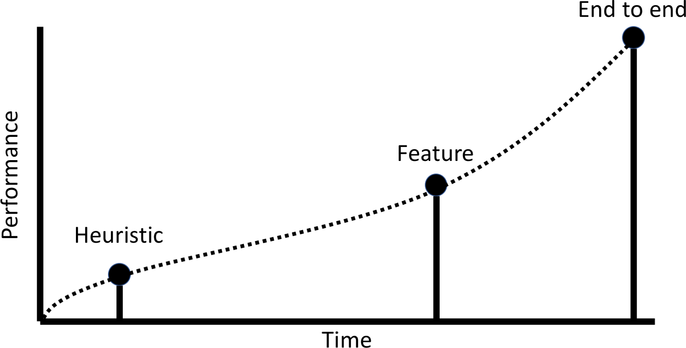

# Chapter 2 - Working with structured data

# Introduction
Structured data is a term for any data that resides in a fixed field within a record or file. Relational databases and spreadsheets are two examples of structured data. Usually, structured data is presented in a table in which each column presents a type of value and each row represents a new entry. Its structured format means that this type of data lends itself to classical statistical analysis. This is also why most data science or analysis work is done on structured data and much less on the unstructured data that the rest of this book deals with. 

Structured data is also the most common type of data available to businesses and most machine learning problems that need to be solved in finance deal with structured data in some way. Company fundamentals, transactions, order books, option prices, suppliers, etc. are all information usually collected in spreadsheets or databases. 

This chapter will walk you through a structured data problem, from developing a heuristic baseline to feature engineering to an end to end approach. It also introduces Keras, a neural network library used throughout the book. 

# The data

The dataset we will work with is a synthetic dataset of transactions generated by a payment simulator. The goal is to find fraudulent transactions, a classic machine learning problem many financial institutions deal with.

step|type|amount|nameOrig|oldBalanceOrig|newBalanceOrig|nameDest|oldBalanceDest|newBalanceDest|isFraud|isFlaggedFraud
---|---|---|---|---|---|---|---|---|---|---
1|PAYMENT|9839.64|C1231006815|170136.0|160296.36|M1979787155|0.0|0.0|0|0
1|PAYMENT|1864.28|C1666544295|21249.0|19384.72|M2044282225|0.0|0.0|0|0
1|TRANSFER|181.0|C1305486145|181.0|0.0|C553264065|0.0|0.0|1|0
1|CASH_OUT|181.0|C840083671|181.0|0.0|C38997010|21182.0|0.0|1|0
1|PAYMENT|11668.14|C2048537720|41554.0|29885.86|M1230701703|0.0|0.0|0|0
1|PAYMENT|7817.71|C90045638|53860.0|46042.29|M573487274|0.0|0.0|0|0
1|PAYMENT|7107.77|C154988899|183195.0|176087.23|M408069119|0.0|0.0|0|0
1|PAYMENT|7861.64|C1912850431|176087.23|168225.59|M633326333|0.0|0.0|0|0
1|PAYMENT|4024.36|C1265012928|2671.0|0.0|M1176932104|0.0|0.0|0|0
1|DEBIT|5337.77|C712410124|41720.0|36382.23|C195600860|41898.0|40348.79|0|0

The data has 11 fields:
- step: Maps time. Each step corresponds to one hour.
- type: The type of the transaction, can be CASH-IN, CASH-OUT, DEBIT, PAYMENT and TRANSFER
- amount: The amount of the transaction 
- nameOrig: Account that started the transaction 
- oldbalanceOrig: Old balance of the origin
- newbalanceOrig: New balance of the origin after transaction 
- nameDest: Destination account
- oldbalanceDest: Old balance of destination. This information is not available to merchant accounts whose names start with M.
- newbalanceDest: New balance of destination. This information is not available to merchant accounts.
- isFraud: Whether the transaction was fraudulent.
- isFlaggedFraud: Whether the old system flagged the transaction as fraud.

Overall, there are about 6.3 million transactions in our dataset.

See E. A. Lopez-Rojas , A. Elmir, and S. Axelsson., 2016, "PaySim: A financial mobile money simulator for fraud detection" for more information on the data.

# Heuristic, Feature, End to End 

Before we dive into developing models, let's take a second to pause and ponder over the different kinds of models we could build:

- A **heuristic** is a simple 'rule of thumb' developed purely by humans. Usually, the heuristic stems from expert knowledge of the problem.
- A **feature based** model relies heavily on humans modifying the data to create new, meaningful features, which are then fed into a (simple) machine learning algorithm. This approach mixes expert knowledge with learning from data.
- An **end to end** model is learned purely from raw data. No human expertise is used and the model learns everything directly from observations.

In our case, a heuristic could be to mark all transactions with transaction type TRANSFER and an amount over $200,000 as fraudulent. Heuristics have the advantage that they are fast to develop and easy to implement. However, their performance is often poor and fraudsters can easily game the system. For the heuristic above, transferring only $199,999 would already evade detection.

To create features, experts craft indicators that distinguish fraud from genuine transactions. This is often done using statistical data analysis. This takes longer than developing a heuristic but usually yields better results.

Finally, to train an end to end model, much data has to be collected and labeled. This data is then used to create an end to end model that learns purely from data without using expert knowledge. This often yields the best results but takes much time. Collecting data is an expensive task as humans have to label millions of records. 

Shipping a poor model is often better than not shipping anything. A heuristic that lets through half of the fraudulent transaction is better than having no fraud detection.



It is good practice to first develop a heuristic. If this heuristic meets the basic requirements of the task it can be shipped. The heuristic then becomes the baseline that any other approach has to beat. Next, efforts should be directed to build a feature based model. As soon as this model beats the heuristic, it can be shipped. Feature based models often deliver pretty decent performance on structured data tasks which affords the company the time to undertake the long and expensive task of building an end to end model. Once the end to end model beats the feature based model it can be shipped as well.

# Evaluating a simple heuristic 
Let's start by defining a simple heuristic and measuring how well it does:
> Heuristic: Any transaction whos type is TRANSFER and amount is over $200,000 is fraudulent. All others are not. 

## The F1 score
We need a common metric to evaluate all of our models on. In the last chapter we used accuracy. However, there are much fewer fraudulent transactions than there are genuine ones. A model that classifies all transactions as genuine can have a very high accuracy. A metric that is designed to deal with such skewed distribution is the F1 score. The F1 score considers true and false positives and negatives:
||Predicted Negative|Predicted Positive|
|-|-----------------|------------------|
|Actual Negative|True Negative (TN)|False Positive (FP)|
|Actual Positive|False Negative (FN)|True Positive (TP)|

We can then first compute the **precision** of our model, which specifies the share of predicted positives that where actually positives:

$$precision = \frac{TP}{TP + FP}$$

**Recall** measures the share of predicted positives over actual positives:
$$recall = \frac{TP}{TP + FN}$$

The F1 score is the harmonic mean of the two measures:
$$F_1 = 2 * \frac{precision * recall}{precision + recall}$$

To compute this metric in Python, we can use the metrics module of scikit learn, or sklearn for short. Sklearn is a popular library which has many useful machine learning tools, including a wide array of metrics
```Python
from sklearn.metrics import f1_score
```
