# Chapter 3 - Computer Vision
When Snapchat introduced a filter featuring a breakdancing hotdog, its stock price surged. But investors where less interested in the hotdogs handstand. What fascinated them was that Snap had built powerful computer vision technology. It's app could not only take pictures, it could find the surfaces in the pictures that a hotdog could breakdance on and then stick the hotdog there. Even when the user moved the phone, the hotdog kept dancing in the same spot.

The dancing hotdog might be one of the more silly applications of computer vision, but it shows the potential of the technology. In a world full of cameras, from the billions of smartphones to security cameras to satellites to IOT devices being able to interpret the images yields great benefit. 

Computer vision allows us to perceive and interpret the real world at scale. No analyst could ever look at millions of satellite images to mark mining sites and track their activity over time. But computers can. Another example of the same technology would be to count cars in the parking lots of retailers to estimate how well sales go. This kind is done by several firms and will probably find more usage in the future.

A slightly less fancy but never the less important application of computer vision in finance is insurance. Insurers might use drones to fly over roofs to spot issues before they become an expensive problem. Or they might inspect factories and equipment they insured. The applications are near endless.

# A note on libraries
This chapter makes use of the following libraries:
- Keras 
- Tensorflow 
- Sklearn 
- OpenCV 
- numpy
- Seaborn 
- tqdm 


All of these, except for OpenCV can be installed via `pip` (e.g. `pip install keras`). OpenCV requires a slightly more complex installation procedure which is well documented online and does not necessarily add to this chapter. Both Kaggle and Google Colab come with OpenCV preinstalled. To run these examples, make sure you have OpenCV installed and can import it with `import cv2`

# ConvNets
Convolutional Neural Networks, ConvNets for short, are the driving engine behind computer vision. ConvNets allow us to work with larger images while keeping the size of the network reasonable. The name Convolutional Neural Net comes from the mathematical operation that differentiates them from regular neural nets. Convolution is the mathematical correct term for sliding one matrix over another matrix. You will see in a minute why this is important for ConvNets but also why this is not the best name in the world. Actually, ConvNets should be called Filter Nets. Because what makes them work is the fact that they use filters. In this section, we will work with the MNIST dataset. The MNIST dataset is a collection of handwritten digits that has become a standard 'hallo world' application for computer vision.

## Filters on MNIST
What does a computer actually see when it sees an image? The value of the pixels are stored as numbers in the computer. So when the computer 'sees' a black and white image of a seven, what it actually sees is something like this:
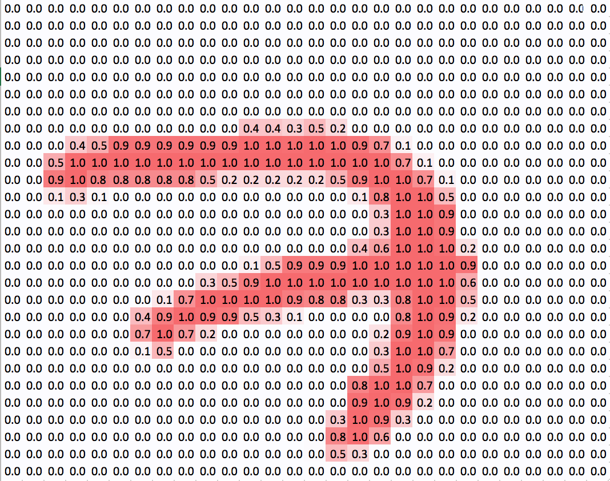

The larger numbers in the image have been highlighted to make the seven visible for humans, but for the computer an image is really just numbers. This means, we can perform all kinds of mathematical operations on the image.

When detecting numbers, there are a few lower level features that make a number. A seven for example is a combination of one vertical straight line, one straight line on the top and one straight line through the middle. A nine for contrast is made up of four rounded lines that form a circle at the top and a straight, vertical line. When detecting numbers, there are a few lower level features that make a number. A seven for example is a combination of one vertical straight line, one straight horizontal line on the top and one straight horizontal line through the middle. A nine for contrast is made up of four rounded lines that form a circle at the top and a straight, vertical line.

And now comes the central idea behind ConvNets (or Filter Nets): We can use small filters that detect a certain kind of low level feature like a vertical line and then slide it over the entire image to detect all the vertical lines in there. This is how a vertical line filter would look like:


It is a 3 by 3 matrix. To detect vertical lines in our image, we slide this filter over the image. We start in the top left corner and slice out the most top left 3 by 3 grid of pixels (all zeros in this case). We then perform an element wise multiplication of all elements in the filter with all elements in the slice of the image. The nine products get then summed up and a bias is added. This value then forms the output of the filter and gets passed on as a new pixel to the next layer.

$$Z_1 = \sum{A_0 * F_1} + b_1$$

The output of our vertical line filter looks like this:

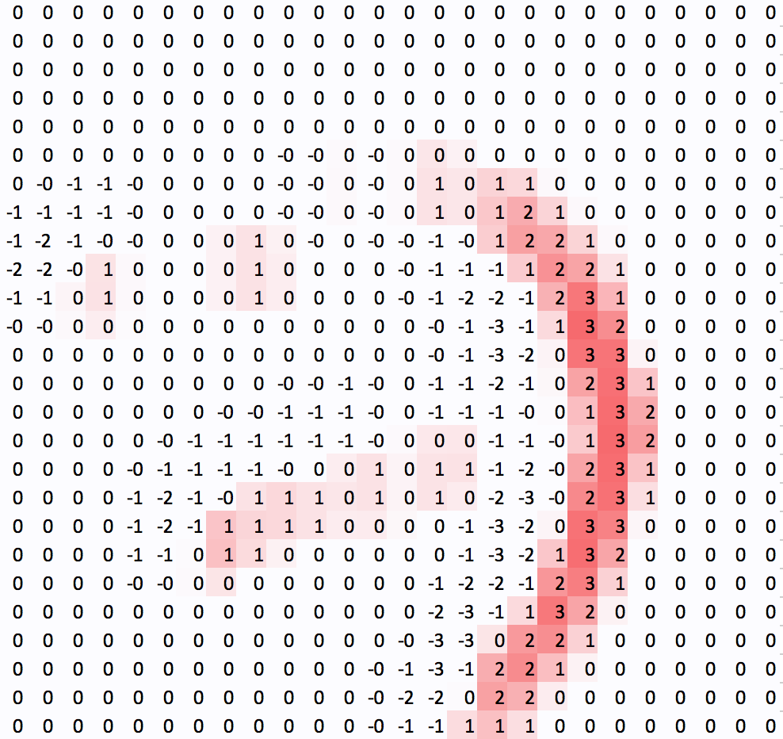

Notice that the vertical lines are visible while the horizontal lines are gone. Only a few artifacts remain. Also notice how the filter captures the vertical line from one side. Since it responds to high pixel values on the left, and low pixel values on the right, only the right side of the output shows strong positive values while the left side of the line actually shows negative values. This is not a big problem in practice as there are usually different filters for different kinds of lines and directions.

## Adding a second filter
Our vertical filter is cool, but we already noticed that we also need to filter our image for horizontal lines to detect a seven. Our vertical filter might look like this:
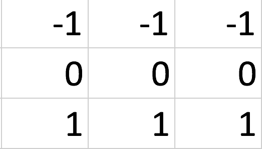

We can now slide this filter over our image the exact same way we did with the vertical filter. 
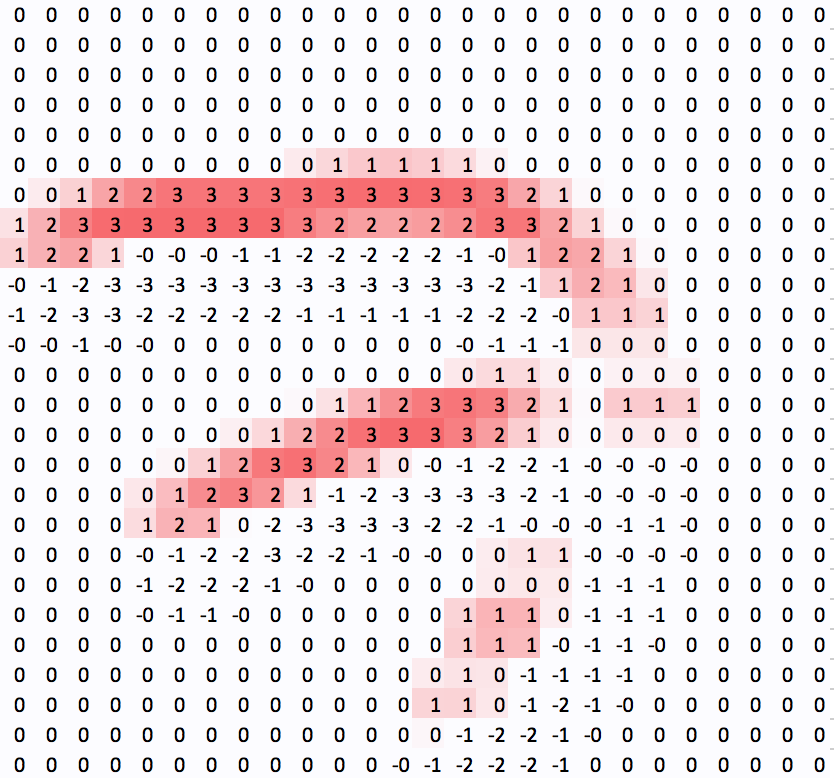

See how this filter removes the vertical lines and pretty much only leaves the horizontal lines?

But what do we now pass on to the next layer? We stack the outputs of both filters on top of each other, creating a 3 dimensional cube.

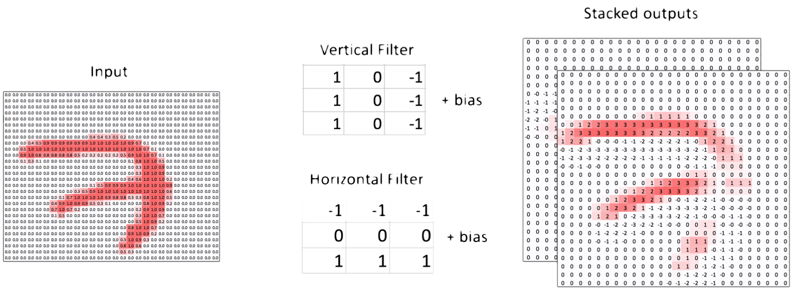

By adding multiple convolutional layers, our CNN can extract ever more complex and semantic features. 

# Filters on Color images
Of course, our filter technique does not only work on black and white images. Let's have a look at color images. Any color image consists of 3 layers, or channels. One red channel, one blue channel and one green channel, RGB for short. When these 3 channels are laid on top of each other, they add up to the color image that we know. An image is therefore not flat, but actually a cube, a 3 dimensional matrix. When we want to apply a filter to the image, we have to apply it to all three channels at once. We will therefore perform an element wise multiplication between two, three dimensional cubes. Our three by three filter now also has a depth of 3 and thus 9 parameters plus the bias.

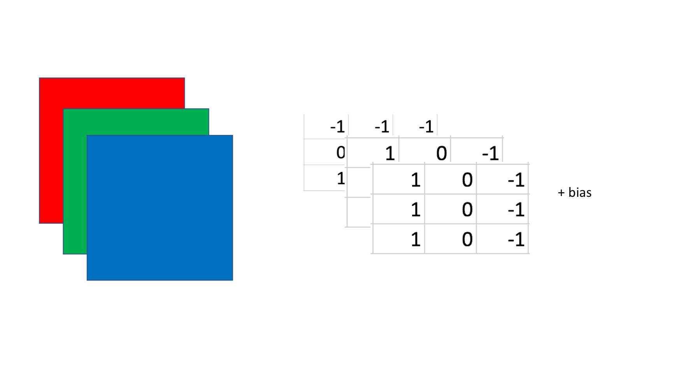

This cube gets slided over the image just like the two dimensional matrix did before. The element wise products get then again summed up, the bias is added and the outcome represents a pixel in the next layer. Filters always capture the whole depth of the previous layer. They never get slided depth wise, only along the height and width of the image.

# The building blocks of ConvNets in Keras
In this section, we will build a simple ConvNet for classifying MNIST characters and learn about the different pieces that make up modern ConvNets. The dataset can be directly imported from Keras:
```Python
from keras.datasets import mnist
(x_train, y_train), (x_test, y_test) = mnist.load_data()
```

The dataset contains 60,000, 28 by 28 pixel images. MNIST characters are black and white, so the data shape usually does not include channels.
```Python
x_train.shape
```
```
out: (60000, 28, 28)
```

We will take a closer look at color channels later, but for now we will expand our data dimensions to show that we have only one color channel:
```Python
x_train = np.expand_dims(x_train,-1)
x_test = np.expand_dims(x_test,-1)
x_train.shape
```
```
out: (60000, 28, 28, 1)
```
## Conv2D
Conv2D is the actual convolutional layer. One Conv2D layer houses several filters. 

```Python
from keras.layers import Conv2D
from keras.models import Sequential

model = Sequential()

img_shape = (28,28,1)

model.add(Conv2D(filters=6,
                 kernel_size=3,
                 strides=1,
                 padding='valid',
                 input_shape=img_shape))
```

When creating a new Conv2D layer, we have to specify the number of filters we want to use, and the size of each filter. 

### Kernel Size
The size of the filter is also called `kernel_size` as the individual filters are sometimes called kernels. If we specify only a single number as a kernel size, Keras assumes that our filters are squares. In this case for example, our filter would be 3 by 3 pixels. It is possible to specify non-square kernel sizes by passing a tuple to the `kernel_size` parameter. For example we could choose to have a 3 by 4 pixel filter through `kernel_size = (3,4)`. However, this is very rare. In the majority of cases, filters have a size of either 3 by 3 or 5 by 5. Empirically, researchers found that this is a size that yields good results.

### Stride size
The step size, also called stride size, with which the convolutional filter slides over the image, usually referred to as feature map, is specified in the `strides` parameter. In the vast majority of cases, filters move pixel by pixel, so their stride size is set to 1. However, there are researchers that make extensive use of larger stride sizes to reduce the spatial size if the feature map. Like with the `kernel_size`, Keras assumes that we use the same stride size horizontally and vertically if we specify only one value and in the vast majority of cases that is correct. If we want to for example use a stride size of 1 horizontally but of 2 vertically, we can pass a tuple to the parameter `strides=(1,2)`. Similar to the filter size, this is rarely done.

### Padding
Finally, we have to add `padding` to our convolutional layer. Padding, adds zeros around our image. This can be used for two reasons: First, we might want to prevent our feature map from shrinking. Consider a 5 by 5 pixel feature map and a 3 by 3 filter. The filter only fits on the feature map 9 times, so we end up with a 3 by 3 output. This reduces the amount of information that we can capture in the next feature map. It also reduces how much the outer pixels of the input feature map can contribute to the task. The filter never centers on them, it only goes over them once.

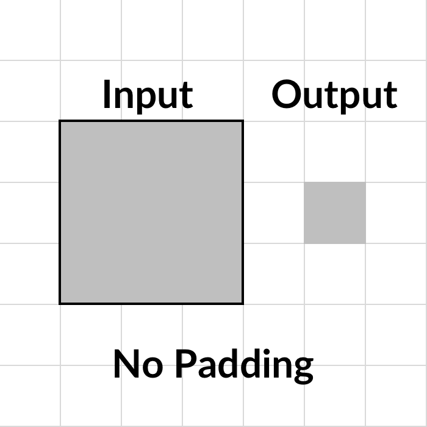


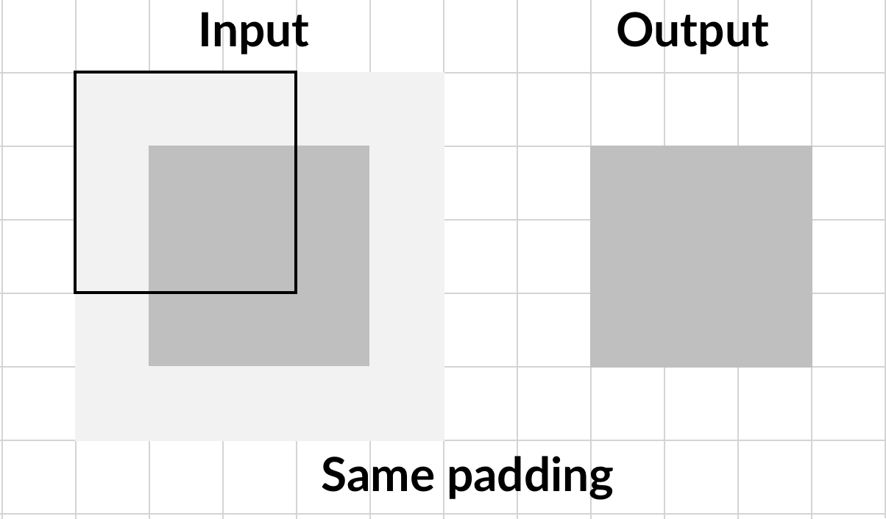

To ensure the output has the same size as the input, we can use `'same'` padding. Keras will then add enough zeros around the input feature map to preserve the size. The default padding setting however is `'valid'`. Valid padding does not preserve the feature map size, but only makes sure that the filter and stride size actually fits on the input feature map. 

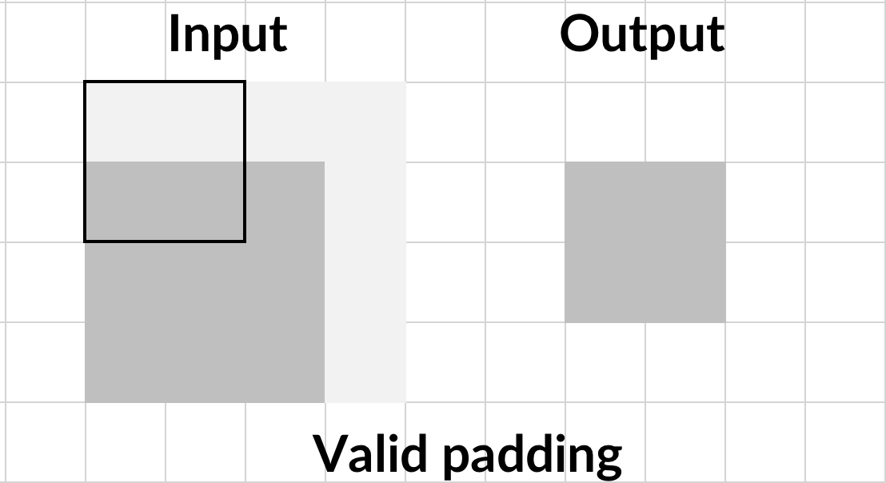

### Input shape 
Keras requires us to specify the input shape only for the first layer. For all following layers Keras will infer the input shape from the previous layers output shape.

### Simplified Conv2D notation
The above layer takes a 28 by 28 by 1 input and slides 6 filters with a 2 by 2 filter size over it going pixel by pixel. A more common way to specify the same layer would be

```Python
model.add(Conv2D(6,3,input_shape=img_shape))
```
The number of filters (here 6) and the filter size (here 3) are set as positional arguments while `strides` and `padding` default to `1` and `'valid'` respectively. If this was a layer deeper in the network we would not even have to specify the input shape.

### ReLu activation
Convolutional layers only perform a linear step. In order to approximate complex functions we need to introduce non-linearity with an activation function. The most common activation function for computer vision is the ReLu function. 

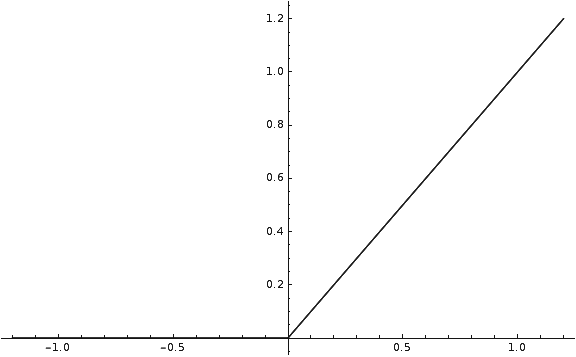

ReLu stands for rectified linear unit and its formula is

$$ReLu(x) = max(x,0)$$

In other words, the ReLu function returns the input if the input is positive, otherwise it returns zero.

This very simple function has been shown to be quite useful, making gradient descent converge faster. It is often argued that ReLu is faster because its derivative for all values above zero is just one, and does not become very small as the derivative for extreme values does with sigmoid or tanh. ReLu is also less computationally expensive than either sigmoid or tanh. It does not require any computationally expensive calculations, input values below zero are just set to zero and the rest is outputted as is. Unfortunately, ReLu activations are a bit fragile and can 'die'. When the gradient is very large and moves many weights in the negative direction then the derivative of ReLu will also always be zero, so the weights never get updated again. This might mean that a neuron never fires again. This can be mitigated through a smaller learning rate.

Because ReLu is fast and computationally cheap it has become the default activation functions for many practitioners. To use the ReLu function in Keras, we can just name it as the desired activation function in the activation layer:

```Python
model.add(Activation('relu'))
```
## MaxPooling2D
It is common to use a pooling layer after a number of convolutional layers. Pooling decreases the spatial size of the feature map. This reduces the number of parameters needed in a neural net and thus reduces overfitting.

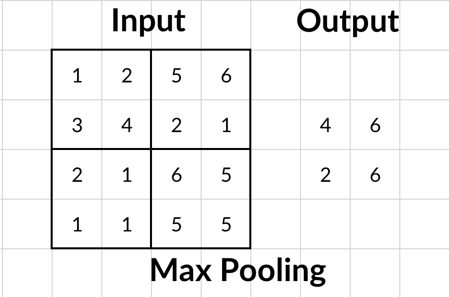

Maximum pooling returns the maximum element out of a pool. This is in contrast to for example average `AveragePooling2D` which returns the average of a pool. Max pooling often delivers superior results to average pooling, so it is the standard most practitioners use. 

```Python
from keras.layers import MaxPool2D

model.add(MaxPool2D(pool_size=2, 
                    strides=None, 
                    padding='valid'))
```

When using a max pooling layer in Keras, we have to specify the desired pool size. The most common value is a 2 by 2 pool. Just as with the `Conv2D` layer, we can also specify a stride size. For pooling layers, the default is `None`, in which case Keras sets the stride size to be the same as the pool size. In other words, pools are next to each other and don't overlap. We can also specify padding, with valid being the default choice. Specifying `'same'` padding for pooling layers is extremely rare, since the point of a pooling layer is to reduce the spatial size of the feature map. 

Our `MaxPooling2D` layer here takes 2 by 2 pixel pools, next to each other with no overlap and returns the maximum element. A more common way of specifying the same layer is 

```python
model.add(MaxPool2D(2))
```
In which case both `strides` and `padding` are set to their defaults, `None` and `'valid'` respectively. There is usually no activation after a pooling layer, since the pooling layer does not perform a linear step.

## Flatten
You might have notices that our feature maps are 3 dimensional while our desired output is a one dimensional vector, containing the probability of each of the ten classes. How do we get from 3D to 1D? We `Flatten` our feature maps. The flatten operation works similar to numpy's flatten operation. It takes in a batch of feature maps with dimensions `(batch_size, height, width, channels)` and returns a set of vectors with dimensions `(batch_size, height * width * channels)`. There are no hyper parameters to be set for this operation.
```Python
from keras.layers import Flatten

model.add(Flatten())
```

## Dense
ConvNets usually consists of a feature extraction part, the convolutional layers, as well as a classification part. The classification part is made up out of the simple fully connected layers that we already saw in chapters one & two. To distinguish the plain layers from all other types of layers, they are called `Dense` layers. In a dense layer, each input neuron is connected to an output neuron. We only have to specify the number of output neurons we would like, in this case ten.

```Python
model.add(Dense(10))
```
After the linear step of the dense layer we can add a softmax activation for multi-class regression, just as we did in chapter one and two.

```Python 
model.add(Activation('softmax'))
```

## Training MNIST 

Let's put it all together to train a ConvNet on MNIST:

### The model
First we specify the model:
```Python 
from keras.layers import Conv2D, Activation, MaxPool2D, Flatten, Dense
from keras.models import Sequential

img_shape = (28,28,1)

model = Sequential()

model.add(Conv2D(6,3,input_shape=img_shape))

model.add(Activation('relu'))

model.add(MaxPool2D(2))

model.add(Conv2D(12,3))

model.add(Activation('relu'))

model.add(MaxPool2D(2))

model.add(Flatten())

model.add(Dense(10))

model.add(Activation('softmax'))
``` 
You can see the general structure of a typical ConvNet here:

``` 
Conv2D
Pool 

Conv2D
Pool

Flatten 

Dense
```

The Convolution and pooling layers are used together in these 'blocks' very often, you can find neural nets which repeat the `Conv2D`, `MaxPool2D` combination tens of times.

We can get an overview of our model with 

```Python 
model.summary()
``` 

``` 
Layer (type)                 Output Shape              Param #   
=================================================================
conv2d_2 (Conv2D)            (None, 26, 26, 6)         60        
_________________________________________________________________
activation_3 (Activation)    (None, 26, 26, 6)         0         
_________________________________________________________________
max_pooling2d_2 (MaxPooling2 (None, 13, 13, 6)         0         
_________________________________________________________________
conv2d_3 (Conv2D)            (None, 11, 11, 12)        660       
_________________________________________________________________
activation_4 (Activation)    (None, 11, 11, 12)        0         
_________________________________________________________________
max_pooling2d_3 (MaxPooling2 (None, 5, 5, 12)          0         
_________________________________________________________________
flatten_2 (Flatten)          (None, 300)               0         
_________________________________________________________________
dense_2 (Dense)              (None, 10)                3010      
_________________________________________________________________
activation_5 (Activation)    (None, 10)                0         
=================================================================
Total params: 3,730
Trainable params: 3,730
Non-trainable params: 0
_________________________________________________________________
```

In this summary you can clearly see how the pooling layers reduce the size of the feature map. It is a little bit less obvious from the summary alone, but you can see how the output of the first `Conv2D` layer is 26 by 26 pixels, while the input images are 28 by 28 pixels. Using valid padding, the `Conv2D` also reduces the size of the feature map, although only a little bit. The same happens for the second `Conv2D` layer which shrinks the feature map from 13 by 13 pixels to 11 by 11 pixels


You can also see how the first convolutional layer has only 60 parameters while the `Dense` layer has 3,010, over 50 times as many parameters. Convolutional layers usually achieve surprising feats with very few parameters, which is why they are so popular. Often, the total number of parameters in a network can be significantly reduced by convolutional and pooling layers.

### Loading the data 

The MNIST dataset comes with Keras. Make sure you have an internet connection if you want to use the dataset directly via Keras, as Keras has to download it first.

```Python 
from keras.datasets import mnist
(x_train, y_train), (x_test, y_test) = mnist.load_data()
```

As explained at the beginning of the chapter, we want to reshape the dataset to have a channel dimension as well. The dataset as it comes does not have a channel dimension yet:

```Python 
x_train.shape
```

```
out:
(60000, 28, 28)
``` 

So we add a channel dimension with numpy:

```Python 
import numpy as np

x_train = np.expand_dims(x_train,-1)

x_test = np.expand_dims(x_test,-1)
``` 
Now there is a channel dimension.
```Python 
x_train.shape
```

```
out:
(60000, 28, 28,1)
``` 

### Compiling and training 
In previous chapters, we have used one hot encoded targets for multi class regression. While we have reshaped the data, the targets are still in their original form. They are a flat vector containing the number that an image shows as a number, that is, for the image above, the target would be `7`.
```Python 
y_train.shape
``` 
```
out:
(60000,)
```
Transforming targets to one hot encodings is a frequent and annoying task, so Keras allows us to just specify a loss function that converts targets to one hot on the fly. This loss function is called `'sparse_categorical_crossentropy'`. It is the same as the categorical crossentropy loss used in earlier chapters, only that it uses sparse, speak not one-hot encoded, targets. You still have to make sure that your network output has as many dimensions as there are classes, just as before.

We can now compile the model:
```Python
model.compile(loss='sparse_categorical_crossentropy', 
              optimizer='adam', 
              metrics=['acc'])
```
As you can see, we are using an Adam optimizer. The exact workings of Adam are explained in the next section, 'More bells and whistles for our neural network', for now you can just think of it as a more sophisticated version of stochastic gradient descent.

When training, we can directly specify a validation set in Keras:
```Python 
history = model.fit(x_train,
                    y_train,
                    batch_size=32,
                    epochs=5,
                    validation_data=(x_test,y_test))
```
```
Train on 60000 samples, validate on 10000 samples
Epoch 1/10
60000/60000 [==============================] - 19s 309us/step - loss: 5.3931 - acc: 0.6464 - val_loss: 1.9519 - val_acc: 0.8542
Epoch 2/10
60000/60000 [==============================] - 18s 297us/step - loss: 0.8855 - acc: 0.9136 - val_loss: 0.1279 - val_acc: 0.9635
Epoch 3/10
60000/60000 [==============================] - 18s 305us/step - loss: 0.1078 - acc: 0.9699 - val_loss: 0.0999 - val_acc: 0.9704
Epoch 4/10
60000/60000 [==============================] - 18s 304us/step - loss: 0.0840 - acc: 0.9752 - val_loss: 0.0779 - val_acc: 0.9796
Epoch 5/10
60000/60000 [==============================] - 18s 308us/step - loss: 0.0721 - acc: 0.9774 - val_loss: 0.0727 - val_acc: 0.9758
Epoch 6/10
60000/60000 [==============================] - 18s 307us/step - loss: 0.0624 - acc: 0.9808 - val_loss: 0.0678 - val_acc: 0.9796
Epoch 7/10
60000/60000 [==============================] - 18s 304us/step - loss: 0.0557 - acc: 0.9824 - val_loss: 0.0610 - val_acc: 0.9812
Epoch 8/10
60000/60000 [==============================] - 18s 304us/step - loss: 0.0522 - acc: 0.9838 - val_loss: 0.0666 - val_acc: 0.9808
Epoch 9/10
60000/60000 [==============================] - 18s 296us/step - loss: 0.0495 - acc: 0.9847 - val_loss: 0.0593 - val_acc: 0.9827
Epoch 10/10
60000/60000 [==============================] - 18s 296us/step - loss: 0.0473 - acc: 0.9854 - val_loss: 0.0663 - val_acc: 0.9814
```

To better see what is going on, we can plot the progress of training:

```Python 
import matplotlib.pyplot as plt

fig, ax = plt.subplots(figsize=(10,6))
gen = ax.plot(history.history['val_acc'], label='Validation Accuracy')
fr = ax.plot(history.history['acc'],dashes=[5, 2], label='Training Accuracy')

legend = ax.legend(loc='lower center', shadow=True)

plt.show()
``` 


Our model achieves about 98% validation accuracy. Pretty nice!

# More bells and whistles for our neural network 

## Momentum
Earlier, we motivated gradient descent as someone trying to find the way down a hill by just following the slope of the floor. Momentum can be motivated with an analogy to physics, where a ball is rolling down the same hill. A small bump in the hill would not make the ball roll in a completely different direction. The ball has some momentum, meaning that its movement gets influenced by its previous movement. The same can be added to gradient descent.

Instead of directly updating the model parameters with their gradient we update them with the exponentially weighted moving average. We can also motivate this from statistics: To avoid that we update our parameter with an outlier gradient, we take the moving average, which will smoothen out outliers and capture the general direction of the gradient.


The exponentially weighted moving average is a clever mathematical trick to compute a moving average without having to memorize a set of previous values. The exponentially weighted average $V$ of some value $\theta$ would be:

$$V_{t} = \beta * V_{t-1} + (1 - \beta) * \theta_t $$

A beta value of 0.9 would mean that 90% of the mean come from previous moving average $V_{t-1}$ and 10% come from the new value $\theta_t$. 

Using momentum makes learning more robust. We can augment the standard stochastic gradient descent optimizer in Keras with momentum by setting a value for beta: 
```Python 
from keras.optimizers import SGD
momentum_optimizer = SGD(lr=0.01, momentum=0.9)
```
This little code snippet creates a SGD optimizer with a learning rate of 0.01 and a beta value of 0.9. We can use it when we compile our model:
```Python 
model.compile(optimizer=momentum_optimizer,
              loss='sparse_categorical_crossentropy',
              metrics=['acc'])
```

## The adam optimizer
Kingma, D. P., & Ba, J. L. (2015)'s adam (adaptive momentum estimation) optimizer is another way to make gradient descent work better that has shown very good results and has therefore become a standard choice for many practitioners. We used it for MNIST for example. First it computes the exponentially weighted average of the gradients, just like a momentum optimizer does: 

$$ V_{dW} = \beta_1 * V_{dW} + (1 - \beta_1) * dW $$

But then it also computes the exponentially weighted average of the squared gradients:

$$S_{dW} = \beta_2 * S_{dW} + (1 - \beta_2) * dW^2$$
It then updates the model parameters like this:

$$ W = W - \alpha * \frac{V_{dW}}{\sqrt{S_{dW}} + \epsilon}$$
Where $\epsilon$ is a very small number to avoid division by zero.

This division by the root of squared gradients reduces the update speed when gradients are very large. This stabilizes learning as the learning algorithm does not get thrown off track by outliers as much. Together with adam, we got a new hyper parameter. Instead of having just one momentum factor $\beta$ we now have two, $\beta_1$ and $\beta_2$. The recommended values for $\beta_1$ and $\beta_2$ are 0.9 and 0.999 respectively. We can use adam in keras like this:

```Python 
from keras.optimizers import adam

adam_optimizer=adam(lr=0.1,
                beta_1=0.9, 
                beta_2=0.999, 
                epsilon=1e-08)

model.compile(optimizer=adam_optimizer,
              loss='sparse_categorical_crossentropy',
              metrics=['acc'])
```

As you have seen earlier, we can also compile the model by just passing the string `'adam'` as an optimizer. In this case Keras will create an adam optimizer for us and choose the recommended values.

## Regularization
Regularization is a technique to avoid overfitting. Overfitting is when the model fits the training data too well and does not generalize well to dev or test data.

### L2 Regularization
One popular technique to counter this is L2 regularization. L2 regularization adds the sum of squared weights to the loss function like this:

$$L_{Regularized}(W) = L(W) + \frac{\lambda}{2N} \sum W^2$$

Where $N$ is the number of training examples, and $\lambda$ is the regularization hyper parameter that influences how much we want to regularize.

Adding this regularization to the loss function means that high weights increase losses and the algorithm is incentivized to reduce weights. Small weights (around zero) mean that the neural network relies less on them. Therefore, a regularized algorithm will rely less on every single feature and every single node activation and will have a more holistic view, taking into account many features and activations. This will prevent the algorithm from overfitting. A common value for $\lambda$ is around 0.01.

### L1 Regularization
L1 regularization is very similar to L2 regularization but instead of adding the sum of squares it adds the sum of absolute values:

$$L_{Regularized}(W) = L(W) + \frac{\lambda}{2N}\sum||W||$$
In practice it is often a bit experimental which of the two works best, the difference is not very large.

### Regularization in Keras
In Keras, regularizers that are applied to the weights are called kernel_regularizer, regularizers that are applied to the bias are called bias_regularizer. You can also apply regularization directly to the activation of the nodes to prevent them from being activated very strongly with activity_regularizer. Let's add some L2 regularization to our network:

``` Python 
from keras.regularizers import l2

model = Sequential()


model.add(Conv2D(6,3,input_shape=img_shape, kernel_regularizer=l2(0.01)))

model.add(Activation('relu'))

model.add(MaxPool2D(2))

model.add(Conv2D(12,3,activity_regularizer=l2(0.01)))

model.add(Activation('relu'))

model.add(MaxPool2D(2))

model.add(Flatten())

model.add(Dense(10,bias_regularizer=l2(0.01)))

model.add(Activation('softmax'))
``` 
Setting a `kernel_regularizer` as done in the first convolutional layer in Keras means regularizing weights. Setting a `bias_regularizer` regularizes the bias and setting an `activity_regularizer` regularizes the output activations of a layer. Note that in this example, the regularizers are set to show them off, but they actually harm performance here. As you can see from the training results above, our network is not actually overfitting, so setting regularizers harms performance here and the model underfits. It reaches about 87% validation accuracy:
``` Python 
model.compile(loss='sparse_categorical_crossentropy', 
              optimizer = 'adam', 
              metrics=['acc'])
              
history = model.fit(x_train,
                    y_train,
                    batch_size=32,
                    epochs=10,
                    validation_data=(x_test,y_test))
```

```
Train on 60000 samples, validate on 10000 samples
Epoch 1/10
60000/60000 [==============================] - 22s 374us/step - loss: 7707.2773 - acc: 0.6556 - val_loss: 55.7280 - val_acc: 0.7322
Epoch 2/10
60000/60000 [==============================] - 21s 344us/step - loss: 20.5613 - acc: 0.7088 - val_loss: 6.1601 - val_acc: 0.6771
Epoch 3/10
60000/60000 [==============================] - 19s 323us/step - loss: 3.6656 - acc: 0.6576 - val_loss: 2.3230 - val_acc: 0.6651
Epoch 4/10
60000/60000 [==============================] - 20s 335us/step - loss: 1.9728 - acc: 0.6883 - val_loss: 1.7181 - val_acc: 0.7354
Epoch 5/10
60000/60000 [==============================] - 21s 343us/step - loss: 1.5655 - acc: 0.7618 - val_loss: 1.4479 - val_acc: 0.7945
Epoch 6/10
60000/60000 [==============================] - 19s 323us/step - loss: 1.3464 - acc: 0.8130 - val_loss: 1.5671 - val_acc: 0.7855
Epoch 7/10
60000/60000 [==============================] - 19s 322us/step - loss: 1.2079 - acc: 0.8388 - val_loss: 1.0932 - val_acc: 0.8545
Epoch 8/10
60000/60000 [==============================] - 19s 318us/step - loss: 1.1168 - acc: 0.8517 - val_loss: 1.2081 - val_acc: 0.8444
Epoch 9/10
60000/60000 [==============================] - 20s 335us/step - loss: 1.0269 - acc: 0.8597 - val_loss: 0.9990 - val_acc: 0.8463
Epoch 10/10
60000/60000 [==============================] - 20s 329us/step - loss: 0.9231 - acc: 0.8650 - val_loss: 0.8309 - val_acc: 0.8749
```

Notice that the model achieves a higher accuracy on the validation than on the training set. A clear sign of underfitting.

## Dropout
As the original paper title gives away, Dropout is "A Simple Way to Prevent Neural Networks from Overfitting". And it works by randomly removing nodes from the neural network:


KISHOR: THIS GRAPHIC IS FROM THE ORIGINAL DROPOUT PAPER, IS IT OKAY TO USE OR SHOULD I REPLICATE SUCH A GRPAHIC?

With dropout, each node has a small probability of having it's activation set to zero. This means that the learning algorithm can no longer rely heavily on single nodes, much like in L2 and L1 regularization. Dropout therefore also has a regularizing effect.

In Keras, dropout is a new type of layer. It is put after the activations you want to apply dropout to. It passes on activations, but sometimes it sets them to zero, achieving the same effect as dropout in the cells directly:

```Python 
from keras.layers import Dropout
model = Sequential()


model.add(Conv2D(6,3,input_shape=img_shape))
model.add(Activation('relu'))
model.add(MaxPool2D(2))

model.add(Dropout(0.2))

model.add(Conv2D(12,3))
model.add(Activation('relu'))
model.add(MaxPool2D(2))

model.add(Dropout(0.2))

model.add(Flatten())

model.add(Dense(10,bias_regularizer=l2(0.01)))

model.add(Activation('softmax'))
``` 

A dropout value of 0.5 is considered a good choice if overfitting is a serious problem. Values over 0.5 are not very helpful as the network would only have too few values to work with. In this case we chose a dropout value of 0.2, meaning that each cell has a 20% chance to be set to zero. Note that dropout is used after pooling. 

```Python 
model.compile(loss='sparse_categorical_crossentropy', 
              optimizer = 'adam', 
              metrics=['acc'])
              
history = model.fit(x_train,
                    y_train,
                    batch_size=32,
                    epochs=10,
                    validation_data=(x_test,y_test))
```
```
Train on 60000 samples, validate on 10000 samples
Epoch 1/10
60000/60000 [==============================] - 22s 371us/step - loss: 5.6472 - acc: 0.6039 - val_loss: 0.2495 - val_acc: 0.9265
Epoch 2/10
60000/60000 [==============================] - 21s 356us/step - loss: 0.2920 - acc: 0.9104 - val_loss: 0.1253 - val_acc: 0.9627
Epoch 3/10
60000/60000 [==============================] - 20s 333us/step - loss: 0.1891 - acc: 0.9406 - val_loss: 0.0819 - val_acc: 0.9753
Epoch 4/10
60000/60000 [==============================] - 20s 333us/step - loss: 0.1551 - acc: 0.9514 - val_loss: 0.0730 - val_acc: 0.9782
Epoch 5/10
60000/60000 [==============================] - 20s 336us/step - loss: 0.1367 - acc: 0.9574 - val_loss: 0.0728 - val_acc: 0.9767
Epoch 6/10
60000/60000 [==============================] - 20s 337us/step - loss: 0.1245 - acc: 0.9609 - val_loss: 0.0690 - val_acc: 0.9775
Epoch 7/10
60000/60000 [==============================] - 20s 336us/step - loss: 0.1178 - acc: 0.9629 - val_loss: 0.0571 - val_acc: 0.9822
Epoch 8/10
60000/60000 [==============================] - 21s 342us/step - loss: 0.1180 - acc: 0.9637 - val_loss: 0.0612 - val_acc: 0.9803
Epoch 9/10
60000/60000 [==============================] - 20s 339us/step - loss: 0.1095 - acc: 0.9655 - val_loss: 0.0533 - val_acc: 0.9841
Epoch 10/10
60000/60000 [==============================] - 21s 344us/step - loss: 0.1064 - acc: 0.9662 - val_loss: 0.0545 - val_acc: 0.9835
```
The low dropout value creates nice results. But again the network does better on the validation than training set, a clear sign of underfitting. Note that dropout is only applied at training time. When the model is used for predictions, dropout does not do anything.

## Batchnorm
Batchnorm, short for batch normalization is a technique 'normalizing' input data to a layer batch wise. Each batch, batchnorm computes the mean and standard deviation of the data and applies a transformation so that the mean is zero and the standard deviation is one. This makes training easier because the loss surface becomes more 'round'. Different means and standard deviations along different input dimensions would mean that the network would have to learn a more complicated function. We can make this easier by applying batchnorm.


In Keras, batchnorm is a new layer as well.

```Python 
from keras.layers import BatchNormalization


model = Sequential()


model.add(Conv2D(6,3,input_shape=img_shape))
model.add(Activation('relu'))
model.add(MaxPool2D(2))

model.add(BatchNormalization())

model.add(Conv2D(12,3))
model.add(Activation('relu'))
model.add(MaxPool2D(2))

model.add(BatchNormalization())

model.add(Flatten())

model.add(Dense(10,bias_regularizer=l2(0.01)))

model.add(Activation('softmax'))
```
```Python 
model.compile(loss='sparse_categorical_crossentropy', 
              optimizer = 'adam', 
              metrics=['acc'])
              
history = model.fit(x_train,
      y_train,
      batch_size=32,
      epochs=10,
      validation_data=(x_test,y_test))
```

``` 
Train on 60000 samples, validate on 10000 samples
Epoch 1/10
60000/60000 [==============================] - 25s 420us/step - loss: 0.2229 - acc: 0.9328 - val_loss: 0.0775 - val_acc: 0.9768
Epoch 2/10
60000/60000 [==============================] - 26s 429us/step - loss: 0.0744 - acc: 0.9766 - val_loss: 0.0668 - val_acc: 0.9795
Epoch 3/10
60000/60000 [==============================] - 25s 419us/step - loss: 0.0587 - acc: 0.9820 - val_loss: 0.0569 - val_acc: 0.9819
Epoch 4/10
60000/60000 [==============================] - 26s 428us/step - loss: 0.0495 - acc: 0.9845 - val_loss: 0.0544 - val_acc: 0.9835
Epoch 5/10
60000/60000 [==============================] - 26s 427us/step - loss: 0.0450 - acc: 0.9857 - val_loss: 0.0528 - val_acc: 0.9830
Epoch 6/10
60000/60000 [==============================] - 29s 492us/step - loss: 0.0404 - acc: 0.9870 - val_loss: 0.0509 - val_acc: 0.9839
Epoch 7/10
60000/60000 [==============================] - 29s 480us/step - loss: 0.0378 - acc: 0.9880 - val_loss: 0.0475 - val_acc: 0.9849
Epoch 8/10
60000/60000 [==============================] - 41s 683us/step - loss: 0.0350 - acc: 0.9887 - val_loss: 0.0493 - val_acc: 0.9858
Epoch 9/10
60000/60000 [==============================] - 39s 652us/step - loss: 0.0331 - acc: 0.9896 - val_loss: 0.0521 - val_acc: 0.9828
Epoch 10/10
60000/60000 [==============================] - 26s 432us/step - loss: 0.0314 - acc: 0.9897 - val_loss: 0.0518 - val_acc: 0.9843
```

Batchnorm often accelerates training by making it easier. You can see how accuracy jumps up in the first epoch already:

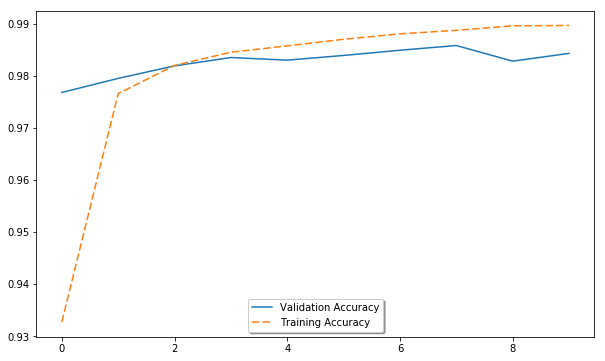

Batchnorm also has a mildly regularizing effect. Extreme values are often overfit to and batchnorm reduces extreme values, similar to activity regularization. All this makes batchnorm an extremely popular tool in computer vision.

