# Chapter 3 - Computer Vision
When Snapchat introduced a filter featuring a breakdancing hotdog, its stock price surged. But investors where less interested in the hotdogs handstand. What fascinated them was that Snap had built powerful computer vision technology. It's app could not only take pictures, it could find the surfaces in the pictures that a hotdog could breakdance on and then stick the hotdog there. Even when the user moved the phone, the hotdog kept dancing in the same spot.

The dancing hotdog might be one of the more silly applications of computer vision, but it shows the potential of the technology. In a world full of cameras, from the billions of smartphones to security cameras to satellites to IOT devices being able to interpret the images yields great benefit. 

Computer vision allows us to perceive and interpret the real world at scale. No analyst could ever look at millions of satellite images to mark mining sites and track their activity over time. But computers can. Another example of the same technology would be to count cars in the parking lots of retailers to estimate how well sales go. This kind is done by several firms and will probably find more usage in the future.

A slightly less fancy but never the less important application of computer vision in finance is insurance. Insurers might use drones to fly over roofs to spot issues before they become an expensive problem. Or they might inspect factories and equipment they insured. The applications are near endless.

# A note on libraries
This chapter makes use of the following libraries:
- Keras 
- Tensorflow 
- Sklearn 
- OpenCV 
- numpy
- Seaborn 
- tqdm 


All of these, except for OpenCV can be installed via `pip` (e.g. `pip install keras`). OpenCV requires a slightly more complex installation procedure which is well documented online and does not necessarily add to this chapter. Both Kaggle and Google Colab come with OpenCV preinstalled. To run these examples, make sure you have OpenCV installed and can import it with `import cv2`

# ConvNets
Convolutional Neural Networks, ConvNets for short, are the driving engine behind computer vision. ConvNets allow us to work with larger images while keeping the size of the network reasonable. The name Convolutional Neural Net comes from the mathematical operation that differentiates them from regular neural nets. Convolution is the mathematical correct term for sliding one matrix over another matrix. You will see in a minute why this is important for ConvNets but also why this is not the best name in the world. Actually, ConvNets should be called Filter Nets. Because what makes them work is the fact that they use filters. In this section, we will work with the MNIST dataset. The MNIST dataset is a collection of handwritten digits that has become a standard 'hallo world' application for computer vision.

## Filters on MNIST
What does a computer actually see when it sees an image? The value of the pixels are stored as numbers in the computer. So when the computer 'sees' a black and white image of a seven, what it actually sees is something like this:


The larger numbers in the image have been highlighted to make the seven visible for humans, but for the computer an image is really just numbers. This means, we can perform all kinds of mathematical operations on the image.

When detecting numbers, there are a few lower level features that make a number. A seven for example is a combination of one vertical straight line, one straight line on the top and one straight line through the middle. A nine for contrast is made up of four rounded lines that form a circle at the top and a straight, vertical line. When detecting numbers, there are a few lower level features that make a number. A seven for example is a combination of one vertical straight line, one straight horizontal line on the top and one straight horizontal line through the middle. A nine for contrast is made up of four rounded lines that form a circle at the top and a straight, vertical line.

And now comes the central idea behind ConvNets (or Filter Nets): We can use small filters that detect a certain kind of low level feature like a vertical line and then slide it over the entire image to detect all the vertical lines in there. This is how a vertical line filter would look like:


It is a 3 by 3 matrix. To detect vertical lines in our image, we slide this filter over the image. We start in the top left corner and slice out the most top left 3 by 3 grid of pixels (all zeros in this case). We then perform an element wise multiplication of all elements in the filter with all elements in the slice of the image. The nine products get then summed up and a bias is added. This value then forms the output of the filter and gets passed on as a new pixel to the next layer.

$$Z_1 = \sum{A_0 * F_1} + b_1$$

The output of our vertical line filter looks like this:


Notice that the vertical lines are visible while the horizontal lines are gone. Only a few artifacts remain. Also notice how the filter captures the vertical line from one side. Since it responds to high pixel values on the left, and low pixel values on the right, only the right side of the output shows strong positive values while the left side of the line actually shows negative values. This is not a big problem in practice as there are usually different filters for different kinds of lines and directions.

## Adding a second filter
Our vertical filter is cool, but we already noticed that we also need to filter our image for horizontal lines to detect a seven. Our vertical filter might look like this:


We can now slide this filter over our image the exact same way we did with the vertical filter. 


See how this filter removes the vertical lines and pretty much only leaves the horizontal lines?

But what do we now pass on to the next layer? We stack the outputs of both filters on top of each other, creating a 3 dimensional cube.


By adding multiple convolutional layers, our CNN can extract ever more complex and semantic features. 

# Filters on Color images
Of course, our filter technique does not only work on black and white images. Let's have a look at color images. Any color image consists of 3 layers, or channels. One red channel, one blue channel and one green channel, RGB for short. When these 3 channels are laid on top of each other, they add up to the color image that we know. An image is therefore not flat, but actually a cube, a 3 dimensional matrix. When we want to apply a filter to the image, we have to apply it to all three channels at once. We will therefore perform an element wise multiplication between two, three dimensional cubes. Our three by three filter now also has a depth of 3 and thus 9 parameters plus the bias.


This cube gets slided over the image just like the two dimensional matrix did before. The element wise products get then again summed up, the bias is added and the outcome represents a pixel in the next layer. Filters always capture the whole depth of the previous layer. They never get slided depth wise, only along the height and width of the image.

# The building blocks of ConvNets in Keras
In this section, we will build a simple ConvNet for classifying MNIST characters and learn about the different pieces that make up modern ConvNets. The dataset can be directly imported from Keras:
```Python
from keras.datasets import mnist
(x_train, y_train), (x_test, y_test) = mnist.load_data()
```

The dataset contains 60,000, 28 by 28 pixel images. MNIST characters are black and white, so the data shape usually does not include channels.
```Python
x_train.shape
```
```
out: (60000, 28, 28)
```

We will take a closer look at color channels later, but for now we will expand our data dimensions to show that we have only one color channel:
```Python
x_train = np.expand_dims(x_train,-1)
x_test = np.expand_dims(x_test,-1)
x_train.shape
```
```
out: (60000, 28, 28, 1)
```
## Conv2D
Conv2D is the actual convolutional layer. One Conv2D layer houses several filters. 

```Python
from keras.layers import Conv2D
from keras.models import Sequential

model = Sequential()

img_shape = (28,28,1)

model.add(Conv2D(filters=6,
                 kernel_size=3,
                 strides=1,
                 padding='valid',
                 input_shape=img_shape))
```

When creating a new Conv2D layer, we have to specify the number of filters we want to use, and the size of each filter. 

### Kernel Size
The size of the filter is also called `kernel_size` as the individual filters are sometimes called kernels. If we specify only a single number as a kernel size, Keras assumes that our filters are squares. In this case for example, our filter would be 3 by 3 pixels. It is possible to specify non-square kernel sizes by passing a tuple to the `kernel_size` parameter. For example we could choose to have a 3 by 4 pixel filter through `kernel_size = (3,4)`. However, this is very rare. In the majority of cases, filters have a size of either 3 by 3 or 5 by 5. Empirically, researchers found that this is a size that yields good results.

### Stride size
The step size, also called stride size, with which the convolutional filter slides over the image, usually referred to as feature map, is specified in the `strides` parameter. In the vast majority of cases, filters move pixel by pixel, so their stride size is set to 1. However, there are researchers that make extensive use of larger stride sizes to reduce the spatial size if the feature map. Like with the `kernel_size`, Keras assumes that we use the same stride size horizontally and vertically if we specify only one value and in the vast majority of cases that is correct. If we want to for example use a stride size of 1 horizontally but of 2 vertically, we can pass a tuple to the parameter `strides=(1,2)`. Similar to the filter size, this is rarely done.

### Padding
Finally, we have to add `padding` to our convolutional layer. Padding, adds zeros around our image. This can be used for two reasons: First, we might want to prevent our feature map from shrinking. Consider a 5 by 5 pixel feature map and a 3 by 3 filter. The filter only fits on the feature map 9 times, so we end up with a 3 by 3 output. This reduces the amount of information that we can capture in the next feature map. It also reduces how much the outer pixels of the input feature map can contribute to the task. The filter never centers on them, it only goes over them once.


To ensure the output has the same size as the input, we can use `'same'` padding. Keras will then add enough zeros around the input feature map to preserve the size. The default padding setting however is `'valid'`. Valid padding does not preserve the feature map size, but only makes sure that the filter and stride size actually fits on the input feature map. 


### Input shape 
Keras requires us to specify the input shape only for the first layer. For all following layers Keras will infer the input shape from the previous layers output shape.

### Simplified Conv2D notation
The above layer takes a 28 by 28 by 1 input and slides 6 filters with a 2 by 2 filter size over it going pixel by pixel. A more common way to specify the same layer would be

```Python
model.add(Conv2D(6,3,input_shape=img_shape))
```
The number of filters (here 6) and the filter size (here 3) are set as positional arguments while `strides` and `padding` default to `1` and `'valid'` respectively. If this was a layer deeper in the network we would not even have to specify the input shape.

### ReLu activation
Convolutional layers only perform a linear step. In order to approximate complex functions we need to introduce non-linearity with an activation function. The most common activation function for computer vision is the ReLu function. 


ReLu stands for rectified linear unit and its formula is

$$ReLu(x) = max(x,0)$$

In other words, the ReLu function returns the input if the input is positive, otherwise it returns zero.

This very simple function has been shown to be quite useful, making gradient descent converge faster. It is often argued that ReLu is faster because its derivative for all values above zero is just one, and does not become very small as the derivative for extreme values does with sigmoid or tanh. ReLu is also less computationally expensive than either sigmoid or tanh. It does not require any computationally expensive calculations, input values below zero are just set to zero and the rest is outputted as is. Unfortunately, ReLu activations are a bit fragile and can 'die'. When the gradient is very large and moves many weights in the negative direction then the derivative of ReLu will also always be zero, so the weights never get updated again. This might mean that a neuron never fires again. This can be mitigated through a smaller learning rate.

Because ReLu is fast and computationally cheap it has become the default activation functions for many practitioners. To use the ReLu function in Keras, we can just name it as the desired activation function in the activation layer:

```Python
model.add(Activation('relu'))
```
## MaxPooling2D
It is common to use a pooling layer after a number of convolutional layers. Pooling decreases the spatial size of the feature map. This reduces the number of parameters needed in a neural net and thus reduces overfitting.


Maximum pooling returns the maximum element out of a pool. This is in contrast to for example average `AveragePooling2D` which returns the average of a pool. Max pooling often delivers superior results to average pooling, so it is the standard most practitioners use. 

```Python
from keras.layers import MaxPool2D

model.add(MaxPool2D(pool_size=2, 
                    strides=None, 
                    padding='valid'))
```

When using a max pooling layer in Keras, we have to specify the desired pool size. The most common value is a 2 by 2 pool. Just as with the `Conv2D` layer, we can also specify a stride size. For pooling layers, the default is `None`, in which case Keras sets the stride size to be the same as the pool size. In other words, pools are next to each other and don't overlap. We can also specify padding, with valid being the default choice. Specifying `'same'` padding for pooling layers is extremely rare, since the point of a pooling layer is to reduce the spatial size of the feature map. 

Our `MaxPooling2D` layer here takes 2 by 2 pixel pools, next to each other with no overlap and returns the maximum element. A more common way of specifying the same layer is 

```python
model.add(MaxPool2D(2))
```
In which case both `strides` and `padding` are set to their defaults, `None` and `'valid'` respectively. There is usually no activation after a pooling layer, since the pooling layer does not perform a linear step.

## Flatten
You might have notices that our feature maps are 3 dimensional while our desired output is a one dimensional vector, containing the probability of each of the ten classes. How do we get from 3D to 1D? We `Flatten` our feature maps. The flatten operation works similar to numpy's flatten operation. It takes in a batch of feature maps with dimensions `(batch_size, height, width, channels)` and returns a set of vectors with dimensions `(batch_size, height * width * channels)`. There are no hyper parameters to be set for this operation.
```Python
from keras.layers import Flatten

model.add(Flatten())
```

## Dense
ConvNets usually consists of a feature extraction part, the convolutional layers, as well as a classification part. The classification part is made up out of the simple fully connected layers that we already saw in chapters one & two. To distinguish the plain layers from all other types of layers, they are called `Dense` layers. In a dense layer, each input neuron is connected to an output neuron. We only have to specify the number of output neurons we would like, in this case ten.

```Python
model.add(Dense(10))
```
After the linear step of the dense layer we can add a softmax activation for multi-class regression, just as we did in chapter one and two.

```Python 
model.add(Activation('softmax'))
```

## Training MNIST 

Let's put it all together to train a ConvNet on MNIST:

### The model
First we specify the model:
```Python 
from keras.layers import Conv2D, Activation, MaxPool2D, Flatten, Dense
from keras.models import Sequential

img_shape = (28,28,1)

model = Sequential()

model.add(Conv2D(6,3,input_shape=img_shape))

model.add(Activation('relu'))

model.add(MaxPool2D(2))

model.add(Conv2D(12,3))

model.add(Activation('relu'))

model.add(MaxPool2D(2))

model.add(Flatten())

model.add(Dense(10))

model.add(Activation('softmax'))
``` 
You can see the general structure of a typical ConvNet here:

``` 
Conv2D
Pool 

Conv2D
Pool

Flatten 

Dense
```

The Convolution and pooling layers are used together in these 'blocks' very often, you can find neural nets which repeat the `Conv2D`, `MaxPool2D` combination tens of times.

We can get an overview of our model with 

```Python 
model.summary()
``` 

``` 
Layer (type)                 Output Shape              Param #   
=================================================================
conv2d_2 (Conv2D)            (None, 26, 26, 6)         60        
_________________________________________________________________
activation_3 (Activation)    (None, 26, 26, 6)         0         
_________________________________________________________________
max_pooling2d_2 (MaxPooling2 (None, 13, 13, 6)         0         
_________________________________________________________________
conv2d_3 (Conv2D)            (None, 11, 11, 12)        660       
_________________________________________________________________
activation_4 (Activation)    (None, 11, 11, 12)        0         
_________________________________________________________________
max_pooling2d_3 (MaxPooling2 (None, 5, 5, 12)          0         
_________________________________________________________________
flatten_2 (Flatten)          (None, 300)               0         
_________________________________________________________________
dense_2 (Dense)              (None, 10)                3010      
_________________________________________________________________
activation_5 (Activation)    (None, 10)                0         
=================================================================
Total params: 3,730
Trainable params: 3,730
Non-trainable params: 0
_________________________________________________________________
```

In this summary you can clearly see how the pooling layers reduce the size of the feature map. It is a little bit less obvious from the summary alone, but you can see how the output of the first `Conv2D` layer is 26 by 26 pixels, while the input images are 28 by 28 pixels. Using valid padding, the `Conv2D` also reduces the size of the feature map, although only a little bit. The same happens for the second `Conv2D` layer which shrinks the feature map from 13 by 13 pixels to 11 by 11 pixels


You can also see how the first convolutional layer has only 60 parameters while the `Dense` layer has 3,010, over 50 times as many parameters. Convolutional layers usually achieve surprising feats with very few parameters, which is why they are so popular. Often, the total number of parameters in a network can be significantly reduced by convolutional and pooling layers.

### Loading the data 

The MNIST dataset comes with Keras. Make sure you have an internet connection if you want to use the dataset directly via Keras, as Keras has to download it first.

```Python 
from keras.datasets import mnist
(x_train, y_train), (x_test, y_test) = mnist.load_data()
```

As explained at the beginning of the chapter, we want to reshape the dataset to have a channel dimension as well. The dataset as it comes does not have a channel dimension yet:

```Python 
x_train.shape
```

```
out:
(60000, 28, 28)
``` 

So we add a channel dimension with numpy:

```Python 
import numpy as np

x_train = np.expand_dims(x_train,-1)

x_test = np.expand_dims(x_test,-1)
``` 
Now there is a channel dimension.
```Python 
x_train.shape
```

```
out:
(60000, 28, 28,1)
``` 

### Compiling and training 
In previous chapters, we have used one hot encoded targets for multi class regression. While we have reshaped the data, the targets are still in their original form. They are a flat vector containing the number that an image shows as a number, that is, for the image above, the target would be `7`.
```Python 
y_train.shape
``` 
```
out:
(60000,)
```
Transforming targets to one hot encodings is a frequent and annoying task, so Keras allows us to just specify a loss function that converts targets to one hot on the fly. This loss function is called `'sparse_categorical_crossentropy'`. It is the same as the categorical crossentropy loss used in earlier chapters, only that it uses sparse, speak not one-hot encoded, targets. You still have to make sure that your network output has as many dimensions as there are classes, just as before.

We can now compile the model:
```Python
model.compile(loss='sparse_categorical_crossentropy', 
              optimizer='adam', 
              metrics=['acc'])
```
As you can see, we are using an Adam optimizer. The exact workings of Adam are explained in the next section, 'More bells and whistles for our neural network', for now you can just think of it as a more sophisticated version of stochastic gradient descent.

When training, we can directly specify a validation set in Keras:
```Python 
history = model.fit(x_train,
                    y_train,
                    batch_size=32,
                    epochs=5,
                    validation_data=(x_test,y_test))
```
```
Train on 60000 samples, validate on 10000 samples
Epoch 1/10
60000/60000 [==============================] - 19s 309us/step - loss: 5.3931 - acc: 0.6464 - val_loss: 1.9519 - val_acc: 0.8542
Epoch 2/10
60000/60000 [==============================] - 18s 297us/step - loss: 0.8855 - acc: 0.9136 - val_loss: 0.1279 - val_acc: 0.9635
Epoch 3/10
60000/60000 [==============================] - 18s 305us/step - loss: 0.1078 - acc: 0.9699 - val_loss: 0.0999 - val_acc: 0.9704
Epoch 4/10
60000/60000 [==============================] - 18s 304us/step - loss: 0.0840 - acc: 0.9752 - val_loss: 0.0779 - val_acc: 0.9796
Epoch 5/10
60000/60000 [==============================] - 18s 308us/step - loss: 0.0721 - acc: 0.9774 - val_loss: 0.0727 - val_acc: 0.9758
Epoch 6/10
60000/60000 [==============================] - 18s 307us/step - loss: 0.0624 - acc: 0.9808 - val_loss: 0.0678 - val_acc: 0.9796
Epoch 7/10
60000/60000 [==============================] - 18s 304us/step - loss: 0.0557 - acc: 0.9824 - val_loss: 0.0610 - val_acc: 0.9812
Epoch 8/10
60000/60000 [==============================] - 18s 304us/step - loss: 0.0522 - acc: 0.9838 - val_loss: 0.0666 - val_acc: 0.9808
Epoch 9/10
60000/60000 [==============================] - 18s 296us/step - loss: 0.0495 - acc: 0.9847 - val_loss: 0.0593 - val_acc: 0.9827
Epoch 10/10
60000/60000 [==============================] - 18s 296us/step - loss: 0.0473 - acc: 0.9854 - val_loss: 0.0663 - val_acc: 0.9814
```

To better see what is going on, we can plot the progress of training:

```Python 
import matplotlib.pyplot as plt

fig, ax = plt.subplots(figsize=(10,6))
gen = ax.plot(history.history['val_acc'], label='Validation Accuracy')
fr = ax.plot(history.history['acc'],dashes=[5, 2], label='Training Accuracy')

legend = ax.legend(loc='lower center', shadow=True)

plt.show()
``` 


Our model achieves about 98% validation accuracy. Pretty nice!

# More bells and whistles for our neural network 

## Momentum
Earlier, we motivated gradient descent as someone trying to find the way down a hill by just following the slope of the floor. Momentum can be motivated with an analogy to physics, where a ball is rolling down the same hill. A small bump in the hill would not make the ball roll in a completely different direction. The ball has some momentum, meaning that its movement gets influenced by its previous movement. The same can be added to gradient descent.

Instead of directly updating the model parameters with their gradient we update them with the exponentially weighted moving average. We can also motivate this from statistics: To avoid that we update our parameter with an outlier gradient, we take the moving average, which will smoothen out outliers and capture the general direction of the gradient.


The exponentially weighted moving average is a clever mathematical trick to compute a moving average without having to memorize a set of previous values. The exponentially weighted average $V$ of some value $\theta$ would be:

$$V_{t} = \beta * V_{t-1} + (1 - \beta) * \theta_t $$

A beta value of 0.9 would mean that 90% of the mean come from previous moving average $V_{t-1}$ and 10% come from the new value $\theta_t$. 

Using momentum makes learning more robust. We can augment the standard stochastic gradient descent optimizer in Keras with momentum by setting a value for beta: 
```Python 
from keras.optimizers import SGD
momentum_optimizer = SGD(lr=0.01, momentum=0.9)
```
This little code snippet creates a SGD optimizer with a learning rate of 0.01 and a beta value of 0.9. We can use it when we compile our model:
```Python 
model.compile(optimizer=momentum_optimizer,
              loss='sparse_categorical_crossentropy',
              metrics=['acc'])
```

## The adam optimizer
Kingma, D. P., & Ba, J. L. (2015)'s adam (adaptive momentum estimation) optimizer is another way to make gradient descent work better that has shown very good results and has therefore become a standard choice for many practitioners. We used it for MNIST for example. First it computes the exponentially weighted average of the gradients, just like a momentum optimizer does: 

$$ V_{dW} = \beta_1 * V_{dW} + (1 - \beta_1) * dW $$

But then it also computes the exponentially weighted average of the squared gradients:

$$S_{dW} = \beta_2 * S_{dW} + (1 - \beta_2) * dW^2$$
It then updates the model parameters like this:

$$ W = W - \alpha * \frac{V_{dW}}{\sqrt{S_{dW}} + \epsilon}$$
Where $\epsilon$ is a very small number to avoid division by zero.

This division by the root of squared gradients reduces the update speed when gradients are very large. This stabilizes learning as the learning algorithm does not get thrown off track by outliers as much. Together with adam, we got a new hyper parameter. Instead of having just one momentum factor $\beta$ we now have two, $\beta_1$ and $\beta_2$. The recommended values for $\beta_1$ and $\beta_2$ are 0.9 and 0.999 respectively. We can use adam in keras like this:

```Python 
from keras.optimizers import adam

adam_optimizer=adam(lr=0.1,
                beta_1=0.9, 
                beta_2=0.999, 
                epsilon=1e-08)

model.compile(optimizer=adam_optimizer,
              loss='sparse_categorical_crossentropy',
              metrics=['acc'])
```

As you have seen earlier, we can also compile the model by just passing the string `'adam'` as an optimizer. In this case Keras will create an adam optimizer for us and choose the recommended values.

## Regularization
Regularization is a technique to avoid overfitting. Overfitting is when the model fits the training data too well and does not generalize well to dev or test data.

### L2 Regularization
One popular technique to counter this is L2 regularization. L2 regularization adds the sum of squared weights to the loss function like this:

$$L_{Regularized}(W) = L(W) + \frac{\lambda}{2N} \sum W^2$$

Where $N$ is the number of training examples, and $\lambda$ is the regularization hyper parameter that influences how much we want to regularize.

Adding this regularization to the loss function means that high weights increase losses and the algorithm is incentivized to reduce weights. Small weights (around zero) mean that the neural network relies less on them. Therefore, a regularized algorithm will rely less on every single feature and every single node activation and will have a more holistic view, taking into account many features and activations. This will prevent the algorithm from overfitting. A common value for $\lambda$ is around 0.01.

### L1 Regularization
L1 regularization is very similar to L2 regularization but instead of adding the sum of squares it adds the sum of absolute values:

$$L_{Regularized}(W) = L(W) + \frac{\lambda}{2N}\sum||W||$$
In practice it is often a bit experimental which of the two works best, the difference is not very large.

### Regularization in Keras
In Keras, regularizers that are applied to the weights are called kernel_regularizer, regularizers that are applied to the bias are called bias_regularizer. You can also apply regularization directly to the activation of the nodes to prevent them from being activated very strongly with activity_regularizer. Let's add some L2 regularization to our network:

``` Python 
from keras.regularizers import l2

model = Sequential()


model.add(Conv2D(6,3,input_shape=img_shape, kernel_regularizer=l2(0.01)))

model.add(Activation('relu'))

model.add(MaxPool2D(2))

model.add(Conv2D(12,3,activity_regularizer=l2(0.01)))

model.add(Activation('relu'))

model.add(MaxPool2D(2))

model.add(Flatten())

model.add(Dense(10,bias_regularizer=l2(0.01)))

model.add(Activation('softmax'))
``` 
Setting a `kernel_regularizer` as done in the first convolutional layer in Keras means regularizing weights. Setting a `bias_regularizer` regularizes the bias and setting an `activity_regularizer` regularizes the output activations of a layer. Note that in this example, the regularizers are set to show them off, but they actually harm performance here. As you can see from the training results above, our network is not actually overfitting, so setting regularizers harms performance here and the model underfits. It reaches about 87% validation accuracy:
``` Python 
model.compile(loss='sparse_categorical_crossentropy', 
              optimizer = 'adam', 
              metrics=['acc'])
              
history = model.fit(x_train,
                    y_train,
                    batch_size=32,
                    epochs=10,
                    validation_data=(x_test,y_test))
```

```
Train on 60000 samples, validate on 10000 samples
Epoch 1/10
60000/60000 [==============================] - 22s 374us/step - loss: 7707.2773 - acc: 0.6556 - val_loss: 55.7280 - val_acc: 0.7322
Epoch 2/10
60000/60000 [==============================] - 21s 344us/step - loss: 20.5613 - acc: 0.7088 - val_loss: 6.1601 - val_acc: 0.6771
Epoch 3/10
60000/60000 [==============================] - 19s 323us/step - loss: 3.6656 - acc: 0.6576 - val_loss: 2.3230 - val_acc: 0.6651
Epoch 4/10
60000/60000 [==============================] - 20s 335us/step - loss: 1.9728 - acc: 0.6883 - val_loss: 1.7181 - val_acc: 0.7354
Epoch 5/10
60000/60000 [==============================] - 21s 343us/step - loss: 1.5655 - acc: 0.7618 - val_loss: 1.4479 - val_acc: 0.7945
Epoch 6/10
60000/60000 [==============================] - 19s 323us/step - loss: 1.3464 - acc: 0.8130 - val_loss: 1.5671 - val_acc: 0.7855
Epoch 7/10
60000/60000 [==============================] - 19s 322us/step - loss: 1.2079 - acc: 0.8388 - val_loss: 1.0932 - val_acc: 0.8545
Epoch 8/10
60000/60000 [==============================] - 19s 318us/step - loss: 1.1168 - acc: 0.8517 - val_loss: 1.2081 - val_acc: 0.8444
Epoch 9/10
60000/60000 [==============================] - 20s 335us/step - loss: 1.0269 - acc: 0.8597 - val_loss: 0.9990 - val_acc: 0.8463
Epoch 10/10
60000/60000 [==============================] - 20s 329us/step - loss: 0.9231 - acc: 0.8650 - val_loss: 0.8309 - val_acc: 0.8749
```

Notice that the model achieves a higher accuracy on the validation than on the training set. A clear sign of underfitting.

## Dropout
As the original paper title gives away, Dropout is "A Simple Way to Prevent Neural Networks from Overfitting". And it works by randomly removing nodes from the neural network:


KISHOR: THIS GRAPHIC IS FROM THE ORIGINAL DROPOUT PAPER, IS IT OKAY TO USE OR SHOULD I REPLICATE SUCH A GRPAHIC?

With dropout, each node has a small probability of having it's activation set to zero. This means that the learning algorithm can no longer rely heavily on single nodes, much like in L2 and L1 regularization. Dropout therefore also has a regularizing effect.

In Keras, dropout is a new type of layer. It is put after the activations you want to apply dropout to. It passes on activations, but sometimes it sets them to zero, achieving the same effect as dropout in the cells directly:

```Python 
from keras.layers import Dropout
model = Sequential()


model.add(Conv2D(6,3,input_shape=img_shape))
model.add(Activation('relu'))
model.add(MaxPool2D(2))

model.add(Dropout(0.2))

model.add(Conv2D(12,3))
model.add(Activation('relu'))
model.add(MaxPool2D(2))

model.add(Dropout(0.2))

model.add(Flatten())

model.add(Dense(10,bias_regularizer=l2(0.01)))

model.add(Activation('softmax'))
``` 

A dropout value of 0.5 is considered a good choice if overfitting is a serious problem. Values over 0.5 are not very helpful as the network would only have too few values to work with. In this case we chose a dropout value of 0.2, meaning that each cell has a 20% chance to be set to zero. Note that dropout is used after pooling. 

```Python 
model.compile(loss='sparse_categorical_crossentropy', 
              optimizer = 'adam', 
              metrics=['acc'])
              
history = model.fit(x_train,
                    y_train,
                    batch_size=32,
                    epochs=10,
                    validation_data=(x_test,y_test))
```
```
Train on 60000 samples, validate on 10000 samples
Epoch 1/10
60000/60000 [==============================] - 22s 371us/step - loss: 5.6472 - acc: 0.6039 - val_loss: 0.2495 - val_acc: 0.9265
Epoch 2/10
60000/60000 [==============================] - 21s 356us/step - loss: 0.2920 - acc: 0.9104 - val_loss: 0.1253 - val_acc: 0.9627
Epoch 3/10
60000/60000 [==============================] - 20s 333us/step - loss: 0.1891 - acc: 0.9406 - val_loss: 0.0819 - val_acc: 0.9753
Epoch 4/10
60000/60000 [==============================] - 20s 333us/step - loss: 0.1551 - acc: 0.9514 - val_loss: 0.0730 - val_acc: 0.9782
Epoch 5/10
60000/60000 [==============================] - 20s 336us/step - loss: 0.1367 - acc: 0.9574 - val_loss: 0.0728 - val_acc: 0.9767
Epoch 6/10
60000/60000 [==============================] - 20s 337us/step - loss: 0.1245 - acc: 0.9609 - val_loss: 0.0690 - val_acc: 0.9775
Epoch 7/10
60000/60000 [==============================] - 20s 336us/step - loss: 0.1178 - acc: 0.9629 - val_loss: 0.0571 - val_acc: 0.9822
Epoch 8/10
60000/60000 [==============================] - 21s 342us/step - loss: 0.1180 - acc: 0.9637 - val_loss: 0.0612 - val_acc: 0.9803
Epoch 9/10
60000/60000 [==============================] - 20s 339us/step - loss: 0.1095 - acc: 0.9655 - val_loss: 0.0533 - val_acc: 0.9841
Epoch 10/10
60000/60000 [==============================] - 21s 344us/step - loss: 0.1064 - acc: 0.9662 - val_loss: 0.0545 - val_acc: 0.9835
```
The low dropout value creates nice results. But again the network does better on the validation than training set, a clear sign of underfitting. Note that dropout is only applied at training time. When the model is used for predictions, dropout does not do anything.

## Batchnorm
Batchnorm, short for batch normalization is a technique 'normalizing' input data to a layer batch wise. Each batch, batchnorm computes the mean and standard deviation of the data and applies a transformation so that the mean is zero and the standard deviation is one. This makes training easier because the loss surface becomes more 'round'. Different means and standard deviations along different input dimensions would mean that the network would have to learn a more complicated function. We can make this easier by applying batchnorm.


In Keras, batchnorm is a new layer as well.

```Python 
from keras.layers import BatchNormalization


model = Sequential()


model.add(Conv2D(6,3,input_shape=img_shape))
model.add(Activation('relu'))
model.add(MaxPool2D(2))

model.add(BatchNormalization())

model.add(Conv2D(12,3))
model.add(Activation('relu'))
model.add(MaxPool2D(2))

model.add(BatchNormalization())

model.add(Flatten())

model.add(Dense(10,bias_regularizer=l2(0.01)))

model.add(Activation('softmax'))
```
```Python 
model.compile(loss='sparse_categorical_crossentropy', 
              optimizer = 'adam', 
              metrics=['acc'])
              
history = model.fit(x_train,
      y_train,
      batch_size=32,
      epochs=10,
      validation_data=(x_test,y_test))
```

``` 
Train on 60000 samples, validate on 10000 samples
Epoch 1/10
60000/60000 [==============================] - 25s 420us/step - loss: 0.2229 - acc: 0.9328 - val_loss: 0.0775 - val_acc: 0.9768
Epoch 2/10
60000/60000 [==============================] - 26s 429us/step - loss: 0.0744 - acc: 0.9766 - val_loss: 0.0668 - val_acc: 0.9795
Epoch 3/10
60000/60000 [==============================] - 25s 419us/step - loss: 0.0587 - acc: 0.9820 - val_loss: 0.0569 - val_acc: 0.9819
Epoch 4/10
60000/60000 [==============================] - 26s 428us/step - loss: 0.0495 - acc: 0.9845 - val_loss: 0.0544 - val_acc: 0.9835
Epoch 5/10
60000/60000 [==============================] - 26s 427us/step - loss: 0.0450 - acc: 0.9857 - val_loss: 0.0528 - val_acc: 0.9830
Epoch 6/10
60000/60000 [==============================] - 29s 492us/step - loss: 0.0404 - acc: 0.9870 - val_loss: 0.0509 - val_acc: 0.9839
Epoch 7/10
60000/60000 [==============================] - 29s 480us/step - loss: 0.0378 - acc: 0.9880 - val_loss: 0.0475 - val_acc: 0.9849
Epoch 8/10
60000/60000 [==============================] - 41s 683us/step - loss: 0.0350 - acc: 0.9887 - val_loss: 0.0493 - val_acc: 0.9858
Epoch 9/10
60000/60000 [==============================] - 39s 652us/step - loss: 0.0331 - acc: 0.9896 - val_loss: 0.0521 - val_acc: 0.9828
Epoch 10/10
60000/60000 [==============================] - 26s 432us/step - loss: 0.0314 - acc: 0.9897 - val_loss: 0.0518 - val_acc: 0.9843
```

Batchnorm often accelerates training by making it easier. You can see how accuracy jumps up in the first epoch already:


Batchnorm also has a mildly regularizing effect. Extreme values are often overfit to and batchnorm reduces extreme values, similar to activity regularization. All this makes batchnorm an extremely popular tool in computer vision.

# Loading larger image datasets into Keras
In the case of MNIST, we loaded all 60,000 images of the training set and all 10,000 images of the validation set into memory. Having all data in memory is certainly fast, but not feasible once datasets get very big. We need a way to load data as it is needed, and not all in advance. 

## A brief guide to Python Generators and yield 
The weapon of choice is a Python generator. A generator works is a function that behaves like an iterator. An iterator in Python is something that we can iterate over by calling `next`. This will give us the next item from the generator. Think of the fibonacci series for example. The fibonacci series is an infinite series in which each element is the sum of the two previous elements. So the fibonacci series goes like this: 0,1,2,3,5,8,13... Imagine we wanted to iterate over this fibonacci series and get the next element in the series whenever needed. We could implement a generator for like this:

```Python 
def fibonacci_generator():
  a = 0
  b = 1
  while True:
    yield a
    a, b = b, a + b
```
To use a generator, we first have to get the generator instance:
```Python 
fib_gen = fibonacci_generator()
```
We can then get values from the generator:
```Python 
next(fib_gen)
```
```
out: 
0
```
If we call `next` again, we get the next value of the series:
```Python 
next(fib_gen)
```
```
out: 
1
```
And the next after that:
```Python 
next(fib_gen)
```
```
out: 
1
```
Then we'd get 2, 3, 5 and so on.
Notice two things here: There is an infinite loop in the function since we use `while True`. This loop will go on forever and using an infinite loop would usually be a bad idea, however, in a generator which is supposed to generate an infinite amount of values, it is very common. Second, notice the `yield` statement. Usual Python functions use the `return` keyword. 'return' returns values and ends the function. `yield` returns values but only pauses the function. Once `next` is called again, the function keeps running until it encounters the next `yield` keyword. If a `return` keyword or the end of the function is encountered, a `StopIteration` is raised. This signals that the iterator is exhausted. Generators are often used to load images as needed. 

## The Keras image generator 
After this little theory interlude, it is time to tackle a new computer vision challenge. In the next sections we will work with the plant seedlings dataset of the university of Aarhus. See Giselsson, Thomas Mosgaard and Dyrmann, Mads and Jorgensen, Rasmus Nyholm and Jensen, Peter Kryger and Midtiby, Henrik Skov, 2017 'A Public Image Database for Benchmark of Plant Seedling Classification Algorithms' for more details on the dataset. Although plant classification is not a common problem in finance, the dataset lends itself to demonstrate many common computer vision techniques and is availeble under an open domain license. Readers who wish to test their knowledge on a more relevant dataset should take a look at the State Farm Distracted Driver dataset as well as the Planet: Understanding the Amazon from Space dataset. For more information see the exercises section of this chapter.

To follow these code samples, download the data from https://storage.googleapis.com/aibootcamp/data/plants.zip and unzip it so that it is in a folder called 'test' and 'train' in your working directory.

Keras comes with an image data generator that can load files from disk out of the box.
```Python 
from keras.preprocessing.image import ImageDataGenerator
``` 
To obtain a generator reading from files, we first have to specify the generator. Keras `ImageDataGenerator` offers a range of image augumentation tools, but we will only make use of the rescaling function. Rescaling multiplies all values in an image with a constant. Most common image formats, the color values range from 0 to 255, so we want to rescale by 1 / 255:

```Python 
imgen = ImageDataGenerator(rescale=1/255)
``` 
This however, is not yet the generator that loads the images for us. The `ImageDataGenerator` class offers a range of generators, that can be created by calling functions on it. To obtain a generator loading files we have to call `flow_from_directory`. We have to specify the directory Keras should use, the batch size we would like (32) as well as the target size the images should be resized to (150 by 150 pixels).
```Python 
generator = imgen.flow_from_directory('Segmented',
                                      batch_size=32,
                                      target_size=(150, 150))
``` 
```
out:
Found 4750 images belonging to 12 classes.
```
How did Keras find the images and how does it know which classes the images belong to? Keras generator expects the following folder structure:

- Root 
  - Class 0
    - img 
    - img 
    - ... 
  - Class 1
    - img
    - img 
    - ...
  - Class 2
    - ...
    
With Pythons `os` module we can find all the folders in `'Segmented'`

```Python 
os.listdir('Segmented')
```
```
out: 
['Small-flowered Cranesbill',
 'Sugar beet',
 'Common Chickweed',
 'Scentless Mayweed',
 'Fat Hen',
 'Common wheat',
 'Charlock',
 'Cleavers',
 'Black-grass',
 'Maize',
 'Loose Silky-bent',
 'Shepherd’s Purse']
```
And in fact, there are 12 subfolders all containing images. The Keras generator will automatically yield the targets as one-hot encoded vectors.

## Separating validation data
Before we train, we need to split our dataset into training and validation data. We will use Pythons `os` module to do the actual file moving and the `tqdm` library to keep track of the operation.

```Python 
import os
from tqdm import tqdm
```
Our data is in a folder called `'Segmented'`. We want to create a validation set, so we need to create a new folder for the validation data.

``` Python 
root_dir = 'Segmented'
target_root = 'Validation'

if not os.path.isdir(target_root):
  os.mkdir(target_root)
```

`os.path.isdir` checks if a path is an existing directory. `os.mkdir` creates a directory. Note that all paths are relative to the working directory of the notebook. Now it is time to create our validation set. To this end, we will move 12 pictures of every plant into the validation set.

```Python 
for plant in tqdm(os.listdir(root_dir)):
  plant_path = os.path.join(root_dir,plant)
  target_plant_path = os.path.join(target_root,plant)
  
  if not os.path.isdir(target_plant_path):
    os.mkdir(target_plant_path)
    
    
  files = os.listdir(plant_path)
  for i in range(12):
    source_path = os.path.join(plant_path,files[i])
    dest_path = os.path.join(target_plant_path,files[i])
    os.rename(source_path,dest_path)
``` 
`os.listdir` lists all content in a folder. So for our root folder it will list all the plant directories. By wrapping this list we are looping over in the `tqdm` function we automatically create a progress bar for our for loop. We will use `tqdm` on various occasions throughout this book and get a deeper understanding of it, but for now all you have to remember is that it is an easy way to create progress bars. Once we have a subfolder, the name of a plant, we create a source and target directory for that plant. If there is no subfolder with the plants name in our validation set we create one with `os.mkdir`. We then obtain a list of all files in the plant directory. We loop over 12 of them and move them to the validation set. Moving files in Python is done with `os.rename`. 

## Training from a Generator 
To train a model from a data generator, we need to use the `model.fit_generator` function. In this section, we will train a logistic regressor to recognize plants. Starting of with such a simple model is a good sanity check and baseline. 

We expect such a simple model to perform poorly. If it does not, we know that there is something wrong with our dataset. Sometimes, just a few pixels, or the general brightness or color of the image give away the class. A classic example of this is the story of the tanks in the forrest. The story goes that the US army wanted to train a computer vision system to detect tanks in a forest. They contracted a few researchers and supplied them with images of tanks. The researchers then went out and snapped some pictures of plain forest without tanks. Their model trained well and so they began testing their detector on real life tanks. To their surprise, it did not work. After much searching, they found out that the tank images all were taken on cloudy days while their plain forest images were taken on sunny days. Their neural network had learned to spot cloudy days, with dim and grey lightning, not tanks. Detecting dim light is much easier than detecting tanks, and to make sure that we don't have such 'giveaways' in our dataset, we should sanity check with a very simple model and hope it does poorly. This simple model will also serve as a baseline. Every more advanced model will have to show it is better than the very simple model.

To define the logistic regressor we first need to flatten the input, as the images are three dimensional blocks (height, width, 3 color channels) while logistic regression works on flat vectors.
```Python 
from keras.layers import Flatten,Dense, Activation
from keras.models import Sequential

model = Sequential()
model.add(Flatten(input_shape=(150,150,3)))
model.add(Dense(12))
model.add(Activation('softmax'))
```
Since our generator generate one hot encoded targets we can use `'categorical_crossentropy'` loss. Since this is the simple baseline we use plain stochastic gradient descent as an optimizer.
```Python 
model.compile(loss='categorical_crossentropy',
              optimizer='sgd', 
              metrics = ['acc'])
``` 

Before we start training, we need to set up our image data generators. We can use the same basic `ImageDataGenerator` but with two different `flow_from_directory`, specifying two different paths:

```Python 
train_generator = imgen.flow_from_directory('Segmented',
                                            batch_size=32, target_size=(150,150))
                                            
```
```
out: 
Found 5515 images belonging to 12 classes.
```

```Python 
validation_generator = imgen.flow_from_directory('Validation',
                                                 batch_size=32, 
                                                 target_size=(150,150))
                                            
```
```
out: 
Found 144 images belonging to 12 classes.
```
And now to the training! To train models on generators in Keras we use `model.fit_generator`
```Python
model.fit_generator(train_generator,
                    epochs=10,
                    steps_per_epoch= 5515 // 32, 
                    validation_data=validation_generator, 
                    validation_steps= 144//32)
```

We first have to specify the generator we want to train on. Note that the generator generates data as well as targets. As usual, we also have to specify the number of epochs we want to train. What is new that we have to let keras know how many steps per epoch we want to train. Since generators never stop outputting data, how long one complete run over the dataset is. There are 5515 images in our training set and our generator yields batches of 32 samples so we need to divide 5512 by 32 to see how many times we have to call the generator to run over the data set once. Since steps can only be integer numbers, we have to use an integer division. 5515 does not cleanly divide by 32 so Keras will not do an actual complete run over the dataset, but the small inaccuracy does not matter very much. The same has to be done to specify the validation generator and the steps the validation generator has to take.

```
out:
Epoch 1/10
172/172 [==============================] - 20s 119ms/step - loss: 1.9489 - acc: 0.3598 - val_loss: 1.7644 - val_acc: 0.3984
Epoch 2/10
172/172 [==============================] - 20s 119ms/step - loss: 1.5784 - acc: 0.5182 - val_loss: 1.6448 - val_acc: 0.4688
Epoch 3/10
172/172 [==============================] - 21s 119ms/step - loss: 1.4138 - acc: 0.5751 - val_loss: 1.6180 - val_acc: 0.4531
Epoch 4/10
172/172 [==============================] - 21s 119ms/step - loss: 1.2930 - acc: 0.6238 - val_loss: 1.4567 - val_acc: 0.5156
Epoch 5/10
172/172 [==============================] - 20s 117ms/step - loss: 1.1999 - acc: 0.6509 - val_loss: 1.4917 - val_acc: 0.4844
Epoch 6/10
172/172 [==============================] - 20s 116ms/step - loss: 1.1256 - acc: 0.6824 - val_loss: 1.3618 - val_acc: 0.5391
Epoch 7/10
172/172 [==============================] - 20s 118ms/step - loss: 1.0701 - acc: 0.7043 - val_loss: 1.3135 - val_acc: 0.5781
Epoch 8/10
172/172 [==============================] - 20s 117ms/step - loss: 1.0045 - acc: 0.7278 - val_loss: 1.3783 - val_acc: 0.5625
Epoch 9/10
172/172 [==============================] - 20s 118ms/step - loss: 0.9629 - acc: 0.7388 - val_loss: 1.2864 - val_acc: 0.5938
Epoch 10/10
172/172 [==============================] - 20s 114ms/step - loss: 0.9257 - acc: 0.7542 - val_loss: 1.3282 - val_acc: 0.5469
```

Out model achieves a bit more than 54% accuracy on the validation set. Not a terribly good value, so there seems to be no giveaway features in the images. The model also overfits, since it achieves over 75% accuracy on the training set. 

# Working with pre-trained models

Training large computer vision models is hard and computationally expensive. Therefore, it is common to use models that were originally trained for another purpose and fine-tune them for a new purpose. In this section we will fine tune VGG16 originally trained on Image-Net. The Image-Net competition is an annual computer vision competition. The Image-Net dataset consists of millions of images of real world objects, from dogs to planes. Reasearchers compete to build the most accurate models. Image-Net has driven much progress in computer vision and the models built for Image-Net are a popular basis to fine tune models from. VGG16 is a model architecture developed by the visual geometry group at Oxford university. It consists of a convolutional part and a classification part. We will use the convolutional part only and add our own classification part that can classify plants. VGG16 can be downloaded via Keras:
```Python 
from keras.applications.vgg16 import VGG16
vgg_model = VGG16(include_top=False,input_shape=(150,150,3))
```
```
out: 
Downloading data from https://github.com/fchollet/deep-learning-models/releases/download/v0.1/vgg16_weights_tf_dim_ordering_tf_kernels_notop.h5
58892288/58889256 [==============================] - 5s 0us/step
``` 

When downloading the data we want to let Keras know we do not want to include the top (the classification part), and the desired input shape. If we do not specify the input shape, the model will accept any image size but it will not be possible to add `Dense` layers on top.
```Python 
vgg_model.summary()
```
```
out: 
_________________________________________________________________
Layer (type)                 Output Shape              Param #   
=================================================================
input_1 (InputLayer)         (None, 150, 150, 3)       0         
_________________________________________________________________
block1_conv1 (Conv2D)        (None, 150, 150, 64)      1792      
_________________________________________________________________
block1_conv2 (Conv2D)        (None, 150, 150, 64)      36928     
_________________________________________________________________
block1_pool (MaxPooling2D)   (None, 75, 75, 64)        0         
_________________________________________________________________
block2_conv1 (Conv2D)        (None, 75, 75, 128)       73856     
_________________________________________________________________
block2_conv2 (Conv2D)        (None, 75, 75, 128)       147584    
_________________________________________________________________
block2_pool (MaxPooling2D)   (None, 37, 37, 128)       0         
_________________________________________________________________
block3_conv1 (Conv2D)        (None, 37, 37, 256)       295168    
_________________________________________________________________
block3_conv2 (Conv2D)        (None, 37, 37, 256)       590080    
_________________________________________________________________
block3_conv3 (Conv2D)        (None, 37, 37, 256)       590080    
_________________________________________________________________
block3_pool (MaxPooling2D)   (None, 18, 18, 256)       0         
_________________________________________________________________
block4_conv1 (Conv2D)        (None, 18, 18, 512)       1180160   
_________________________________________________________________
block4_conv2 (Conv2D)        (None, 18, 18, 512)       2359808   
_________________________________________________________________
block4_conv3 (Conv2D)        (None, 18, 18, 512)       2359808   
_________________________________________________________________
block4_pool (MaxPooling2D)   (None, 9, 9, 512)         0         
_________________________________________________________________
block5_conv1 (Conv2D)        (None, 9, 9, 512)         2359808   
_________________________________________________________________
block5_conv2 (Conv2D)        (None, 9, 9, 512)         2359808   
_________________________________________________________________
block5_conv3 (Conv2D)        (None, 9, 9, 512)         2359808   
_________________________________________________________________
block5_pool (MaxPooling2D)   (None, 4, 4, 512)         0         
=================================================================
Total params: 14,714,688
Trainable params: 14,714,688
Non-trainable params: 0
_________________________________________________________________
``` 
As you can see, the VGG model is very large with over 14 million trainable parameters. It consists of `Conv2D` and `MaxPooling2D` layers which we already learned about when working on MNIST. There are two different ways we can proceed from here: 1) Add layers and build a new model or 2) preprocess all images through the pertained model and then train a new model.

## Modifying VGG16
In this section, we will add layers on top of the VGG16 model and then train the new, big model. We do not want to retrain all those convolutional layers that have been trained already however. So we first need to 'freeze' all the layers in VGG16:
```Python 
for layer in vgg_model.layers:
  layer.trainable = False
``` 
Keras downloads VGG as a functional API model. We will learn about the functional API later, now we just want to use the Sequential API which is easier. We can convert a model to the functional API like this:
```Python 
finetune = Sequential(layers = vgg_model.layers)
``` 

This creates a new model called `finetune` which works just like a normal Sequential model now. Note that converting models to the Sequential API only works if the model can actually be expressed in the Sequential API. Some more complex models can not be converted. Adding layers to our model is now simple: 
```Python 
finetune.add(Flatten())
finetune.add(Dense(12))
finetune.add(Activation('softmax'))
```
If we look at the summary for this model we see that only our newly added layers are trainable:
```Python 
finetune.summary()
```
```
out: 

_________________________________________________________________
Layer (type)                 Output Shape              Param #   
=================================================================
input_1 (InputLayer)         (None, 150, 150, 3)       0         
_________________________________________________________________
block1_conv1 (Conv2D)        (None, 150, 150, 64)      1792      
_________________________________________________________________
block1_conv2 (Conv2D)        (None, 150, 150, 64)      36928     
_________________________________________________________________
block1_pool (MaxPooling2D)   (None, 75, 75, 64)        0         
_________________________________________________________________
block2_conv1 (Conv2D)        (None, 75, 75, 128)       73856     
_________________________________________________________________
block2_conv2 (Conv2D)        (None, 75, 75, 128)       147584    
_________________________________________________________________
block2_pool (MaxPooling2D)   (None, 37, 37, 128)       0         
_________________________________________________________________
block3_conv1 (Conv2D)        (None, 37, 37, 256)       295168    
_________________________________________________________________
block3_conv2 (Conv2D)        (None, 37, 37, 256)       590080    
_________________________________________________________________
block3_conv3 (Conv2D)        (None, 37, 37, 256)       590080    
_________________________________________________________________
block3_pool (MaxPooling2D)   (None, 18, 18, 256)       0         
_________________________________________________________________
block4_conv1 (Conv2D)        (None, 18, 18, 512)       1180160   
_________________________________________________________________
block4_conv2 (Conv2D)        (None, 18, 18, 512)       2359808   
_________________________________________________________________
block4_conv3 (Conv2D)        (None, 18, 18, 512)       2359808   
_________________________________________________________________
block4_pool (MaxPooling2D)   (None, 9, 9, 512)         0         
_________________________________________________________________
block5_conv1 (Conv2D)        (None, 9, 9, 512)         2359808   
_________________________________________________________________
block5_conv2 (Conv2D)        (None, 9, 9, 512)         2359808   
_________________________________________________________________
block5_conv3 (Conv2D)        (None, 9, 9, 512)         2359808   
_________________________________________________________________
block5_pool (MaxPooling2D)   (None, 4, 4, 512)         0         
_________________________________________________________________
flatten_2 (Flatten)          (None, 8192)              0         
_________________________________________________________________
dense_2 (Dense)              (None, 12)                98316     
_________________________________________________________________
activation_2 (Activation)    (None, 12)                0         
=================================================================
Total params: 14,813,004
Trainable params: 98,316
Non-trainable params: 14,714,688
_________________________________________________________________
``` 
We can train this model the same way we trained the logistic regressor before.

```Python 
finetune.compile(loss='categorical_crossentropy',
                 optimizer='adam', 
                 metrics = ['acc'])
                 
finetune.fit_generator(train_generator,
                   epochs=10,
                   steps_per_epoch= 5515 // 32, 
                   validation_data=validation_generator, 
                   validation_steps= 144//32)
```
```
out: 
Epoch 1/10
172/172 [==============================] - 37s 213ms/step - loss: 0.9413 - acc: 0.6919 - val_loss: 0.6368 - val_acc: 0.8203
Epoch 2/10
172/172 [==============================] - 33s 192ms/step - loss: 0.4226 - acc: 0.8760 - val_loss: 0.6180 - val_acc: 0.7266
Epoch 3/10
172/172 [==============================] - 33s 192ms/step - loss: 0.3155 - acc: 0.9110 - val_loss: 0.4838 - val_acc: 0.8359
Epoch 4/10
172/172 [==============================] - 33s 192ms/step - loss: 0.2367 - acc: 0.9379 - val_loss: 0.4599 - val_acc: 0.8672
Epoch 5/10
172/172 [==============================] - 33s 192ms/step - loss: 0.1881 - acc: 0.9540 - val_loss: 0.4915 - val_acc: 0.8359
Epoch 6/10
172/172 [==============================] - 33s 193ms/step - loss: 0.1596 - acc: 0.9601 - val_loss: 0.4529 - val_acc: 0.8438
Epoch 7/10
172/172 [==============================] - 33s 191ms/step - loss: 0.1288 - acc: 0.9722 - val_loss: 0.4028 - val_acc: 0.8828
Epoch 8/10
172/172 [==============================] - 33s 191ms/step - loss: 0.1059 - acc: 0.9789 - val_loss: 0.4056 - val_acc: 0.8750
Epoch 9/10
172/172 [==============================] - 33s 191ms/step - loss: 0.0870 - acc: 0.9838 - val_loss: 0.3952 - val_acc: 0.8594
Epoch 10/10
172/172 [==============================] - 33s 191ms/step - loss: 0.0749 - acc: 0.9869 - val_loss: 0.3829 - val_acc: 0.8516
``` 
This model achieves 85% validation accuracy. Already a good bit better than the logistic regressor.

## Preprocessing and saving images
In the setup above, we have to run the image through the whole network every epoch, although we only want to train the top layers. This is good if we want to use image augmentation or create salience maps (both see below) but many times it is just unnecessary to run these images through the whole network time and time again. It is better to run the images through the network once and then save the output of the convolutional layer. To save the output, we will use `bcolz`, a library that can speeds up data handling through compression. To easier load and save data we have to define two functions:

```Python 
import bcolz
def save_array(fname, arr): 
  c = bcolz.carray(arr, rootdir=fname, mode='w')
  c.flush()
  
def load_array(fname): 
  return bcolz.open(fname)[:]
```  
In `save_array` we first create a new bcolz array. We specify were it should be written to. `flush` then writes the array to disk. In `load_array` we load the file and then return the elements in that file. To preprocess all files in the `'Segmented'` folder we run the following code:
```Python 
source = 'Segmented'
target = 'train_proc'

if not os.path.isdir(target):
  os.mkdir(target)

for plant in os.listdir(source):
  target_path = os.path.join(target,plant)
  source_path = os.path.join(source,plant)
  
  if not os.path.isdir(target_path):
    os.mkdir(target_path)
  
  print('Processing',plant)
  for file in tqdm(os.listdir(source_path)):
    img = cv2.imread(os.path.join(source_path,file))
    img = cv2.resize(img, (150, 150)) 
    img = np.expand_dims(img,0)
    out = vgg_model.predict(img)
    save_array(os.path.join(target_path,file), out)
```
First we specify source path and target directories. Then we loop over the folders in the source directory (the plants). If there is no folder for the plant in the target directory, we create one. For each plant, we loop over the files in the plant source path. We use OpenCV is a computer vision library which we will consider in depth in the next section. For now all you have to know is that it offers a bunch of useful tools such as reading and resizing images. Before we can feed the image into our model, we have to expand its dimensions. The model expects inputs to have the shape `(batch_size, 150, 150, 3)`. Images, when loaded from disk have dimensions `(150,150,3)`, so we need to expand the dimensionality to include a batch size dimension. After expanding dimensions, the images will have the shape `(1,150,150,3)`. Then we finally can run the image through the model by calling `predict`. We save the output using bcolz. By using `tqdm` we can keep track of how long the conversion takes.

```
out: 
Processing Common wheat
100%|██████████| 246/246 [00:04<00:00, 49.27it/s]
Processing Sugar beet
100%|██████████| 452/452 [00:09<00:00, 47.04it/s]
Processing Maize
100%|██████████| 248/248 [00:05<00:00, 46.39it/s]
Processing Common Chickweed
100%|██████████| 704/704 [00:13<00:00, 53.49it/s]
Processing Black-grass
100%|██████████| 321/321 [00:07<00:00, 41.90it/s]
Processing Loose Silky-bent
100%|██████████| 807/807 [00:16<00:00, 48.58it/s]
Processing Shepherd’s Purse
100%|██████████| 264/264 [00:05<00:00, 50.62it/s]
Processing Fat Hen
100%|██████████| 531/531 [00:10<00:00, 50.98it/s]
Processing Cleavers
100%|██████████| 336/336 [00:06<00:00, 52.02it/s]
Processing Scentless Mayweed
100%|██████████| 596/596 [00:11<00:00, 51.77it/s]
Processing Small-flowered Cranesbill
100%|██████████| 568/568 [00:11<00:00, 50.35it/s]
Processing Charlock
100%|██████████| 442/442 [00:09<00:00, 46.28it/s]
``` 
To process our validation data we only have to run the same code with `source` and `target` changed.

```Python 
source = 'Validation'
root_dir = 'validation_proc'


if not os.path.isdir(root_dir):
  os.mkdir(root_dir)

for plant in os.listdir(source):
  target_path = os.path.join(root_dir,plant)
  if not os.path.isdir(target_path):
    os.mkdir(target_path)
  source_path = os.path.join(source,plant)
  print('Processing',plant)
  for file in tqdm(os.listdir(source_path)):
    img = cv2.imread(os.path.join(source_path,file))
    img = cv2.resize(img, (150, 150)) 
    img = img / 255
    img = np.expand_dims(img,0)
    out = vgg_model.predict(img)
    save_array(os.path.join(target_path,file), out)
``` 
Note that bcolz saves arrays as directories containing multiple files. 

To train from this data now we need to write a new generator that loads the files from disk and yields the outputs of the VGG network.

```Python 
def bcz_imgen(root_dir, batch_size = 32): 
  dirs = os.listdir(root_dir)
  paths = []
  targets = []
  for dir in dirs:
    path = os.path.join(root_dir,dir)
    for file in os.listdir(path):
      paths.append(os.path.join(path,file))
      targets.append(dir)
   
  nclasses = len(np.unique(targets))
  nitems = len(targets)
  
  labelenc = LabelEncoder()
  int_targets = labelenc.fit_transform(targets)
  onehot_enc = OneHotEncoder(sparse=False)
  int_targets = int_targets.reshape(len(int_targets), 1)
  onehot_targets = onehot_enc.fit_transform(int_targets)
  
  indices = np.arange(len(paths))
  np.random.shuffle(indices)
  
  while True:
    image_stack = []
    target_stack = []
    for index in indices:
      path = paths[index]
      target = onehot_targets[index]
      img = load_array(path)

      image_stack.append(img)
      target_stack.append(target)

      if len(image_stack) == batch_size:
        images = np.concatenate(image_stack,axis=0)
        one_hot_targets = np.stack(target_stack)
        yield images, one_hot_targets
        image_stack = []
        target_stack = []
```

There is a lot going on in this code snippet, so lets break it down. The first part of the function loops over all sub directories of a a given root directory and indexes all files in the sub directories. In this case, we the root directory could be `'train_proc'` and the subdirectories would be the plant names. Since the directory a file is in indicates the class the file belongs to, the name of the directory is saved as a target. The targets are then encoded from names such as 'Maize' to integers using the sci kit learn `LabelEncoder`. Each target name is assigned an integer. This is done so because the `OneHotEncoder` accepts only integers. Using the `OneHotEncoder`, all targets get converted to one-hot. To make sure that we randomly walk over the data, we create and shuffle indices. `np.arrange` yields a sequence of integers from zero to the, but not including, length of the target. So if we have for example 5000 files, `np.arrange` yields 1,2,3,4...4998,4999. This sequence is then shuffled. After the setup is done, we create an infinite while loop. Inside this while loop we keep track of an image stack and a target stack. We loop through our random index, loading the files in the random order. Once we have a number of images and targets together, we combine them into a single numpy array and yield them. Note, that for the images we want to use `np.concatenate` to stack them along an existing axis while for the targets we want to use `np.stack` to stack them along a new axis. The images have run through the model and have a batch size dimension of 1. To create a bigger batch, we need to stack along the batch size axis. We can now define generators for training and validation: 

```Python 
train_gen = bcz_imgen('train_proc')
val_gen = bcz_imgen('validation_proc')
```
We create a new model and train it on these generators.

```Python 
model = Sequential()
model.add(Flatten(input_shape=(4,4,512)))
model.add(Dense(12))
model.add(Activation('softmax'))

model.compile(loss='categorical_crossentropy',
              optimizer='adam',
              metrics=['acc'])
              
model.fit_generator(train_gen,
                    epochs=2,
                    steps_per_epoch= 5515 // 32, 
                    validation_data=val_gen, 
                    validation_steps= 144//32)
```
```
out: 
Epoch 1/2
172/172 [==============================] - 3s 15ms/step - loss: 1.6133 - acc: 0.7356 - val_loss: 3.0247 - val_acc: 0.1797
Epoch 2/2
172/172 [==============================] - 3s 17ms/step - loss: 0.3882 - acc: 0.9253 - val_loss: 3.2615 - val_acc: 0.2266
```
This model hopelessly overfits, achieving a validation accuracy of 22% at a training accuracy of 92%. However, it trained very fast due to using saved model outputs.
# Using OpenCV for image preprocessing
## Removing background
Much success in computer vision recently was about training neural nets from 'raw pixels', speak images that had not seen much image processing. However, rule based augmentation is not dead and can in fact massively boost performance of neural net based solutions if done right. In this section we will use OpenCV an numpy to remove the background of our leaves. We will do this by specifying a range of colors that plants can have, and then removing all pixels whose colors are too far away from the plant colors. To this end, we first need to define a color distance algorithm. We use a low cost approximation. 

```Python 
def colordist(img, target):
    
    img = img.astype('int')
    
    aR, aG, aB = img[:,:,0], img[:,:,1], img[:,:,2]
    bR, bG, bB = target
    
    rmean = ((aR + bR) / 2.).astype('int')
    
    r2 = np.square(aR - bR)
    g2 = np.square(aG - bG)
    b2 = np.square(aB - bB)
    
    
    result = (((512+rmean)*r2)>>8) + 4*g2 + (((767-rmean)*b2)>>8)
    
    return result
```
We use this color distance to create a mask. This mask lets us identify all pixels in an image that are not either one of the shades of leaf green. We specify the colors in brackets, (71, 86, 38) for example is the RGB code for leaf green.

```Python 
img_filter = (
  (colordist(img, (71, 86, 38)) > 1600)
  & (colordist(img, (65,  79,  19)) > 1600)
  & (colordist(img, (95,  106,  56)) > 1600)
  & (colordist(img, (56,  63,  43)) > 500)
)
```

Once we have masked an image we can remove all pixels not belonging to something leafy with 

```Python 
img[img_filter] = 0
```

The process will leave some artifacts which can be removed with OpenCV:
```Python
img = cv2.medianBlur(img, 9)
```
`medianBlur` blurs the image `img` with an aperture linear size size of 9.

This process can be rolled into a generator which we then use for training:

```Python 
def ocv_imgen(root_dir,batch_size = 32, 
              rescale = 1/255, 
              target_size = (150,150)):
              
  dirs = os.listdir(root_dir)
  paths = []
  targets = []
  for dir in dirs:
    path = os.path.join(root_dir,dir)
    for file in os.listdir(path):
      paths.append(os.path.join(path,file))
      targets.append(dir)
   
  nclasses = len(np.unique(targets))
  nitems = len(targets)
  
  labelenc = LabelEncoder()
  int_targets = labelenc.fit_transform(targets)
  onehot_enc = OneHotEncoder(sparse=False)
  int_targets = int_targets.reshape(len(int_targets), 1)
  onehot_targets = onehot_enc.fit_transform(int_targets)
  
  indices = np.arange(len(paths))
  np.random.shuffle(indices)
  while True:
    image_stack = []
    target_stack = []
    for index in indices:
      path = paths[index]
      target = onehot_targets[index]
      
      img = plt.imread(path)
      
      
      img = np.round(img * 255).astype('ubyte')[:,:,:3]
      img = cv2.resize(img, (150,150))
      img_filter = (
        (cieluv(img, (71, 86, 38)) > 1600)
        & (cieluv(img, (65,  79,  19)) > 1600)
        & (cieluv(img, (95,  106,  56)) > 1600)
        & (cieluv(img, (56,  63,  43)) > 500)
      )
      
      img[img_filter] = 0
      img = cv2.medianBlur(img, 9)
      
      image_stack.append(img)
      target_stack.append(target)
      if len(image_stack) == batch_size:
        images = np.stack(image_stack)
        images = np.divide(images,rescale)
        yield images, np.stack(target_stack)
        image_stack = []
        target_stack = []
```
This code sample works very similar to the previous generator we built ourselves. We have a setup step in which we create one-hot encoded targets and prepare our random index. However, this time we do not just load data with bcolz. For semantic reasons, we load the image with `matplotlib`. Matplotlib is a plotting library that also has some image tool. It loads image in RGB format while OpenCV loads images in BGR format. Since we want to render images in matplotlib, it is easier to also let matplotlib do the image loading. Then we apply our filters. Once we have assembled a stack we rescale it. The results looks like this: 

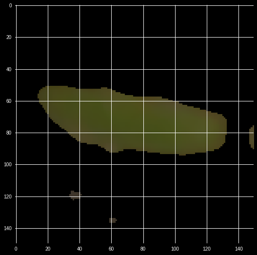

You can see how everything that is not leafy green has been removed. There are a few artifacts left but the shape of the leaf is now easier to detect than it was before.

Note that rule based image augmentation can be very powerful. However, you need to make sure that the augmentation process can also be run in production. Otherwise you trained the model on something that it does not encounter in real life.

## Random image augmentation

A general problem in machine learning is that no matter how much data we have, more data would be better. More data prevents overfitting and allows our model to deal with a larger variety of inputs. It is therefore common to apply random augmentation to images, for example a rotation or a random crop. The idea is to get many different images out of one image so that the model is less likely to overfit. For many image augumentation purposes, we can just use keras `ImageDataGenerator`. More advanced augumentation can be done with OpenCV.

### Augumentation with `ImageDataGenerator`
When using an augmenting data generator we usually use it only for training. The validation generator should not use the augmentation features. The reason for this is that when we validate our model we want an estimate on how well it is doing on unseen, actual data, not augmented data. This is different from rule based augmentation where we try to create images that are easier to classify. For this reason, we need to create two `ImageDataGenerator`, one for training and one for validation. 

```Python 
train_datagen = ImageDataGenerator(
  rescale = 1/255,
  rotation_range=90,
  width_shift_range=0.2,
  height_shift_range=0.2,
  shear_range=0.2,
  zoom_range=0.1,
  horizontal_flip=True,
  fill_mode='nearest')
```

This training data generator makes use of a few built in augmentation techniques. There are more available in Keras, for a full list refer to the Keras documentation. But these are commonly used:

- `rescale` scales the values in the image. We used it before and will also use it for validation. 
- `rotation_range` is a range (0 to 180 degrees) in which to randomly rotate the image. 
- `width_shift_range` and `height_shift_range` are ranges (relative to the image size, so here 20%), in which to randomly stretch images horizontally or vertically.
- `shear_range` is a range (again, relative to the image) in which to randomly apply sheer.
- `zoom_range` is the range in which to randomly zoom into a picture.
- `horizontal_flip` specifies whether to randomly flip the image. 
- `fill_mode` specifies how to fill empty spaces created by e.g. rotation. 

We can check out what the generator does by running one image through it multiple times. First, we import Keras image tools and specify an image path (this one was chosen at random).
```Python 
from keras.preprocessing import image
fname = 'train/Charlock/270209308.png'
```

We then load the image and convert it to a numpy array.
```Python 
img = image.load_img(fname, target_size=(150, 150))
img = image.img_to_array(img)
```
As before, we have to add a batch size dimension to the image:

```Python 
img = np.expand_dims(img,axis=0)
```
We then use the `ImageDataGenerator` we just created, but instead of using `flow_from_directory` we use `flow` which allows us to pass the data directly into the generator. We then pass that one image we want to use.

```Python 
gen = train_datagen.flow(img, batch_size=1)
```
In a loop, we then call `next` on our generator 4 times:
```Python 
for i in range(4):
    plt.figure(i)
    batch = next(gen)
    imgplot = plt.imshow(image.array_to_img(batch[0]))
    
plt.show()
```
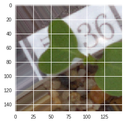
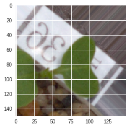
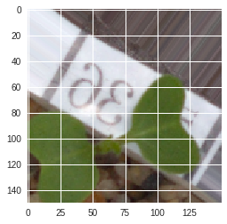


### Image augmentation with OpenCV & imgaug
Need more augmentation? OpenCV offers a wide range of tools. Luckily we do not have to implement all of them ourselves. Alexander Jung, Assistant Professor of Computer Science at Aalto University has written a useful library that wraps the OpenCV tools into an easy to use augmenter. You can install it from his GitHub repository with 
```
pip install git+https://github.com/aleju/imgaug
``` 
Image augmentation is a sequential process. The filters are applied sequentially and the effect often comes from not just the use of certain filters but also the combination of filters. We can create a sequential image augmenter like this:
``` Python
from imgaug import augmenters as iaa 
seq = iaa.Sequential([
    iaa.Fliplr(0.5), 
    iaa.Crop(percent=(0, 0.1)), 
    
    iaa.Sometimes(0.5,
        iaa.GaussianBlur(sigma=(0, 0.5))
    ),
    
    iaa.ContrastNormalization((0.75, 1.5)),
    
    iaa.AdditiveGaussianNoise(loc=0, scale=(0.0, 0.05*255), per_channel=0.5),
    
    iaa.Multiply((0.8, 1.2), per_channel=0.2),
    
], random_order=True) 

``` 
`iaa.Sequential` takes in a list of augmenters. Lets take a look at the augmenters in here:

- `Fliplr` flips images horizontally with a specified likelihood, here 50%
- `Crop` randomly crops images, here between 0% and 10%
- `Sometimes` can be wrapped around another augmenter. This augmenter is executed only with the specified probability, here `GaussianBlur` is only applied to 50% of all images.
- `GaussianBlur` adds gaussian blur with a random sigma, speak strength, between 0 and 0.5
- `ContrastNormalization` changes the contrast of the image, randomly between reducing it by a quarter and adding 50%.
- `AdditiveGaussianNoise` adds noise between 0 and 5% of the maximum pixel value (255). In 50% of all cases this is done per channel, meaning that not only the pixel brightness changes, but also the pixel color.
- `Multiply` multiplies the image values by values between 0.8, making it darker, and 1.2 making it brighter. In 20% of cases, this operation is done per channel, changing the color of the image. 

All these augmenters get passed to the sequential augmenter. Since `random_order` is set to `True`, the augmenters are not always executed in the same order, but randomly. To use this augmenter, we call `seq.augment_images(img)` where `img` is a list of images or a numpy array with a batch of images.

To try out the augmenter, we load the image as before, and then run it through the augmenter a few times.
```Python 
from keras.preprocessing import image
fname = 'train/Charlock/270209308.png'

img = image.load_img(fname, target_size=(150, 150))
img = image.img_to_array(img)
img = np.expand_dims(img,axis=0)

for i in range(4):
    plt.figure(i)
    batch = seq.augment_images(img)
    imgplot = plt.imshow(image.array_to_img(batch[0]))
    
plt.show()
``` 

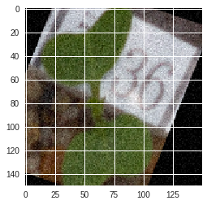
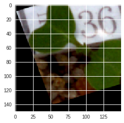
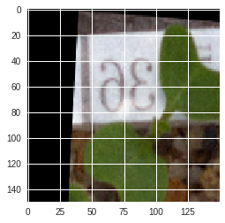
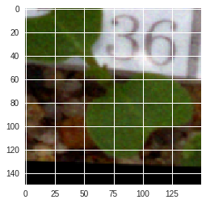

To use this augmenter in a generator, we can apply it in the last step of the generator we used before.

```Python 
def ocv_imgen_aug(root_dir,batch_size = 32, 
                  rescale = 1/255, 
                  target_size = (150,150)):
  
  dirs = os.listdir(root_dir)
  paths = []
  targets = []
  for dir in dirs:
    path = os.path.join(root_dir,dir)
    for file in os.listdir(path):
      paths.append(os.path.join(path,file))
      targets.append(dir)
   
  nclasses = len(np.unique(targets))
  nitems = len(targets)
  
  labelenc = LabelEncoder()
  int_targets = labelenc.fit_transform(targets)
  onehot_enc = OneHotEncoder(sparse=False)
  int_targets = int_targets.reshape(len(int_targets), 1)
  onehot_targets = onehot_enc.fit_transform(int_targets)
  
  indices = np.arange(len(paths))
  np.random.shuffle(indices)
  while True:
    image_stack = []
    target_stack = []
    for index in indices:
      path = paths[index]
      target = onehot_targets[index]
      
      img = cv2.imread(path)
      img = cv2.resize(img, target_size)
      
  
      
      image_stack.append(img)
      target_stack.append(target)
      if len(image_stack) == batch_size:
        images = np.stack(image_stack)
        
        images = seq.augment_images(images)
        
        images = np.divide(images,rescale)
        yield images, np.stack(target_stack)
        image_stack = []
        target_stack = []
```

# Understanding what ConvNets learn
Before we close this chapter, let's take a bit to think about what ConvNets learn. Neural networks in general are hard to interpret. In contrast to many classic predictive modeling techniques out of statistics or econometrics, we still lack rigorous quantitative analysis tools to figure out what exactly happens in a neural network. For computer vision applications however, there are some early promising approaches to peek inside the network. 

In this section, we will train the _input_ of a the VGG network to maximize the activations in a certain filter or network output. By finding the input that most activates a certain part of the network, we can see what the part is looking for.  

## Visualizing filters

First, we will visualize some of the convolutional filters of the network. We will use the VGG16 model again. We will have to write some advances neural network code here. We can access the backend of Keras, the tensorflow library, as a module in Keras. This makes working in tensorflow easier and we do not have to write tensorflow code directly.

```Python
import numpy as np

from keras.applications.vgg16 import VGG16
from keras import backend as K 
``` 

Next we need to load VGG16. This time, we will load the entire model.
```Python 
model = VGG16(weights='imagenet')
model.summary()
```
```
out: 
_________________________________________________________________
Layer (type)                 Output Shape              Param #   
=================================================================
input_2 (InputLayer)         (None, 224, 224, 3)       0         
_________________________________________________________________
block1_conv1 (Conv2D)        (None, 224, 224, 64)      1792      
_________________________________________________________________
block1_conv2 (Conv2D)        (None, 224, 224, 64)      36928     
_________________________________________________________________
block1_pool (MaxPooling2D)   (None, 112, 112, 64)      0         
_________________________________________________________________
block2_conv1 (Conv2D)        (None, 112, 112, 128)     73856     
_________________________________________________________________
block2_conv2 (Conv2D)        (None, 112, 112, 128)     147584    
_________________________________________________________________
block2_pool (MaxPooling2D)   (None, 56, 56, 128)       0         
_________________________________________________________________
block3_conv1 (Conv2D)        (None, 56, 56, 256)       295168    
_________________________________________________________________
block3_conv2 (Conv2D)        (None, 56, 56, 256)       590080    
_________________________________________________________________
block3_conv3 (Conv2D)        (None, 56, 56, 256)       590080    
_________________________________________________________________
block3_pool (MaxPooling2D)   (None, 28, 28, 256)       0         
_________________________________________________________________
block4_conv1 (Conv2D)        (None, 28, 28, 512)       1180160   
_________________________________________________________________
block4_conv2 (Conv2D)        (None, 28, 28, 512)       2359808   
_________________________________________________________________
block4_conv3 (Conv2D)        (None, 28, 28, 512)       2359808   
_________________________________________________________________
block4_pool (MaxPooling2D)   (None, 14, 14, 512)       0         
_________________________________________________________________
block5_conv1 (Conv2D)        (None, 14, 14, 512)       2359808   
_________________________________________________________________
block5_conv2 (Conv2D)        (None, 14, 14, 512)       2359808   
_________________________________________________________________
block5_conv3 (Conv2D)        (None, 14, 14, 512)       2359808   
_________________________________________________________________
block5_pool (MaxPooling2D)   (None, 7, 7, 512)         0         
_________________________________________________________________
flatten (Flatten)            (None, 25088)             0         
_________________________________________________________________
fc1 (Dense)                  (None, 4096)              102764544 
_________________________________________________________________
fc2 (Dense)                  (None, 4096)              16781312  
_________________________________________________________________
predictions (Dense)          (None, 1000)              4097000   
=================================================================
Total params: 138,357,544
Trainable params: 138,357,544
Non-trainable params: 0
_________________________________________________________________
```
Note that the layers in VGG16 have names like `block1_conv1`. We can later identify the layers we want to work with by these names. Also notice that the output of the model has 1000 dimensions. This is because the model was trained on image net, and in image net, there are 1000 classes.

From the VGG model we can create a dictionary so we can easily access the layers by name.
```Python 
layer_dict = dict([(layer.name, layer) for layer in model.layers[1:]])
```

Next, we have to specify our constants. We want our input image to be 224 by 224 pixels, which is the size of an input size our model expects. To begin with, we want to visualize the layer called `'block2_conv1'`. Since each convolutional layer consists of multiple convolutional filters, we also have to decide which filter we want to visualize.
```Python
img_width = 224
img_height = 224


layer_name = 'block5_conv1'
filter_index = 110
``` 

We now have to build a loss function. The loss function is the activation of the filter we want to visualize. This allows us to produce a gradient for the activation of the filter. We can then perform _gradient ascent_, which is basically the same as gradient descent, except that we want to _increase_ the loss.

```Python 
layer_output = layer_dict[layer_name].output
loss = K.mean(layer_output[:, :, :, filter_index])
```
We first get the output of the layer that we want, and then compute the mean activation of the filter we are interested in. We do this with Tensorflow so that we can get the gradients of this process in the next step. 

```Python
input_img = model.input

grads = K.gradients(loss, input_img)[0]
```
In order to compute the gradients, we first need to create a placeholder for the input. We can then get the gradients through Tensorflow. Note that we do not actually compute the gradients here yet. We merely set up the 'computational graph' through which we will run operations later. 

It has been shown that layer visualization works much better if the gradients are normalized. In order to normalize gradients, we divide them through the mean absolute value. `K.epsilon()` is a very small constant to avoid divisions by zero. Again, we are using Tensorflow to set up a graph.

```Python 
def normalize(x):
    
    return x / (K.sqrt(K.mean(K.square(x))) + K.epsilon())
    
grads = normalize(grads)
```

Now we come to the point were we get to use all these graphs! Since we have defined the computational graph that takes an input image and produces a loss and gradient, we can now define a function which accepts an actual immage and produces loss and gradient. The function automatically uses Tensorflow and the GPU.

```Python
iterate = K.function([input_img], [loss, grads])
```

The actual training work like this. We first initialize an image with random values:
```Python 
input_img_data = np.random.rand(1,img_height,img_width,3)
```
We set a learning rate alpha much like for gradient descent.
```Python 
alpha = 0.1
```
In a loop we then run the input image through our graph and obtain loss and gradients. We update our image along the gradients. Note that we do not update them with the negative gradients as with gradient descent in chapter one but with the positive gradients. This is called gradient ascent.
```Python 
for i in range(500):
    loss_value, grads_value = iterate([input_img_data])
    input_img_data += grads_value * alpha

    print('Current loss value:', loss_value)
```

Before we can visualize the image now we first have to convert into something we can actually render, speak an RGB image. 

```Python 
def deprocess_image(x):
    
    x -= x.mean()
    x /= (x.std() + K.epsilon())
    x *= 0.1

    
    x += 0.5
    x = np.clip(x, 0, 1)

    
    x *= 255
    
    x = np.clip(x, 0, 255).astype('uint8')
    return x
```
In the first step, we ensure the mean of the image data is zero and the standard deviation is 0.1. In the next step we move the mean to 0.5 and clip all values between zero and one. We then multiply all values with 255. Finally, we clip values at zero and 255 and convert them to integers. This ensures we have integer values between zero and 255 just as RGB prescribes.

Our optimized input still has a batch size dimension, we can remove this dimension by passing only the first (and only) element along this dimension in the deprocessing function.

```Python 
img = deprocess_image(input_img_data[0])
```
Finally, we can render the output image with matplotlib.

```Python 
import matplotlib.pyplot as plt

plt.style.use(['dark_background'])
fig = plt.figure(figsize=(10,10))
ax = fig.add_subplot(111) 

plt.imshow(img)
ax.grid(False)
```

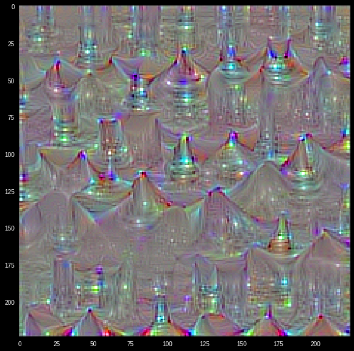

This layer clearly responds to some pretty complex color and shape patterns. While it is hard to interpret it might be some kind of animal ear. For contrast, consider the first filter in the first layer, `'block1_conv1'`. You can render this image by running the same code only modifying two lines: 

```Python 
layer_name = 'block1_conv1'
filter_index = 0
```

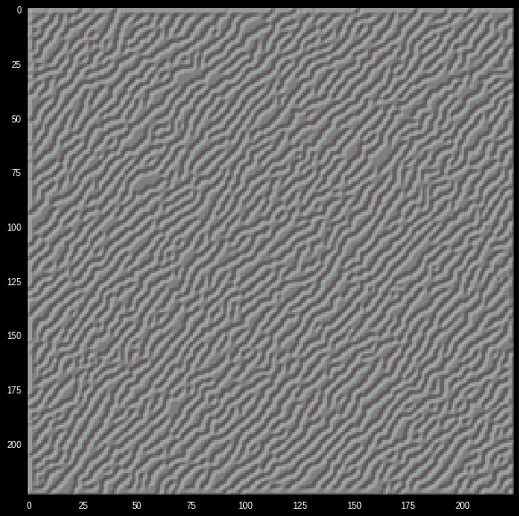


This filter seems to respond too much simpler structures, diagonal lines to be precise. In general, deeper layers respond to more complex features. 
## Visualizing outputs
To visualize what triggers a certain output we can use the same method. We have to specify which output index we want to maximize. In this case we choose 184, which is the class 'Irish Terrier' in image net. 

```Python 
img_width = 224
img_height = 224

output_index = 184
```

We can use the same VGG model.
```Python 
model = VGG16(weights='imagenet')
```

Only this time our loss is not the activation of a filter but the activation of the output we want to visualize

```Python 
loss = K.mean(model.output[:, output_index])
```
Our gradient computation stays the same.

```Python
input_img = model.input
grads = K.gradients(loss, input_img)[0]
grads = normalize(grads)
iterate = K.function([input_img], [loss, grads])
```
We again start with a random image and perform gradient ascent. For output layers a smaller learning rate produces better results.

```Python
input_img_data = np.random.rand(1,img_height,img_width,3)

alpha = 0.01

for i in range(500):
    loss_value, grads_value = iterate([input_img_data])
    input_img_data += grads_value * alpha
```
We can reuse our deprocessing method we used above.

```Python 
img = deprocess_image(input_img_data[0])

plt.style.use(['dark_background'])
fig = plt.figure(figsize=(10,10))
ax = fig.add_subplot(111) 
plt.imshow(img)
ax.grid(False)
```

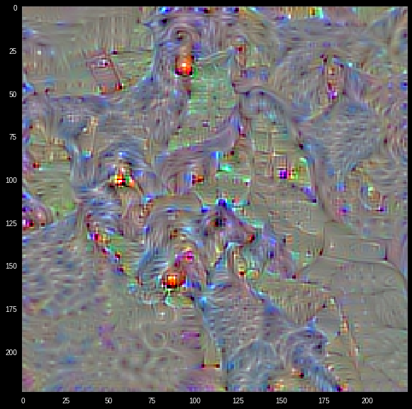

This image represents the prototypical terrier in the eyes of VGG16. If you squint you can recognize some elements of a terrier. There is an eye, a nose, fluffy ears, etc. But it becomes clear that the model does not really know what a terrier _is_. It only has a statistical representation of what terriers look like. These statistical representations are why neural networks are a form of 'representation learning'. They learn the statistical representation of lines, curves, up to ears and finally the whole dog. This can also be used against them. Since this image is the ultimate representation of a terrier for the network, it could be overlaid on another image and the network would classify that image as a terrier. It has been shown that these attacks can be done with just faint overlays or a few pixels. It has also been shown that representations should be semantically interpretable for good network performance. The network should learn something that makes sense to humans.

# Exercises
1. Visit the State Farm Distracted Driver Challenge on Kaggle. Build a model that can classify distracted drivers. Can you use some rulebased preprocessing? Which augmenters aid robustness the most?
2. Use the stacked VGG model from earlier and train it on the seedlings dataset. Then visualize the outputs by backpropagating to the input. What is the ultimate representation of Maize?
3. Visit the 'Planet: Understanding the Amazon from Space' competition on Kaggle. Can you use pretrained models for statelites? Try using `model.pop()` to remove some convolutional layers from VGG16 and replace them with your own.

# Summary 
In this chapter you have learned about computer vision. From simple ConvNets on MNIST to visualizing through backprop to the input. An impressive feat! Images are still quite rarely used in finance. But an increasing number of firms incorporates image based datasources in their decision making. In the next chapter we will take a look at the most common kind of data in finance: Time series.