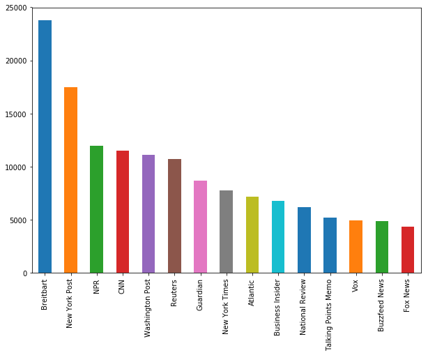
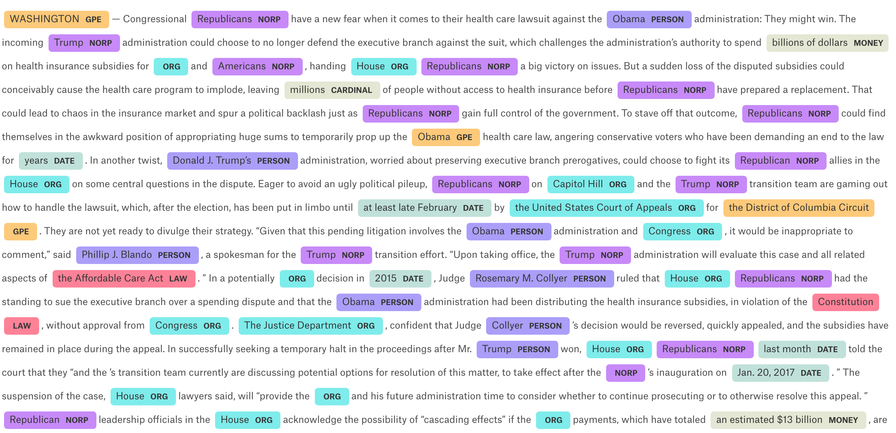
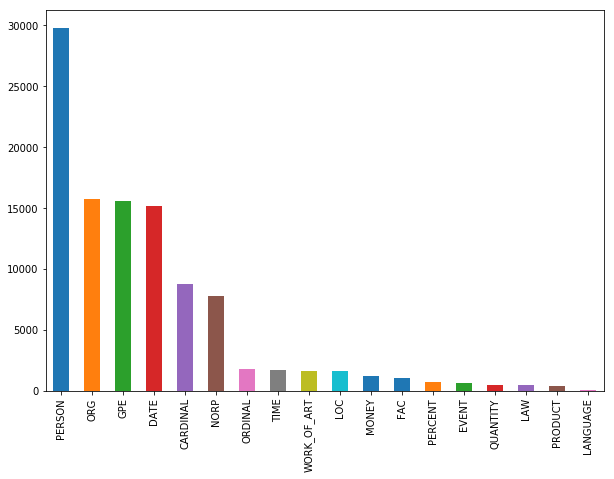
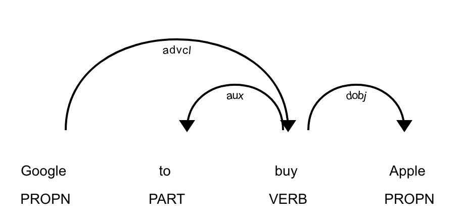
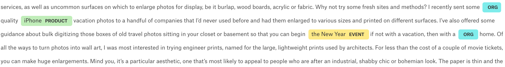
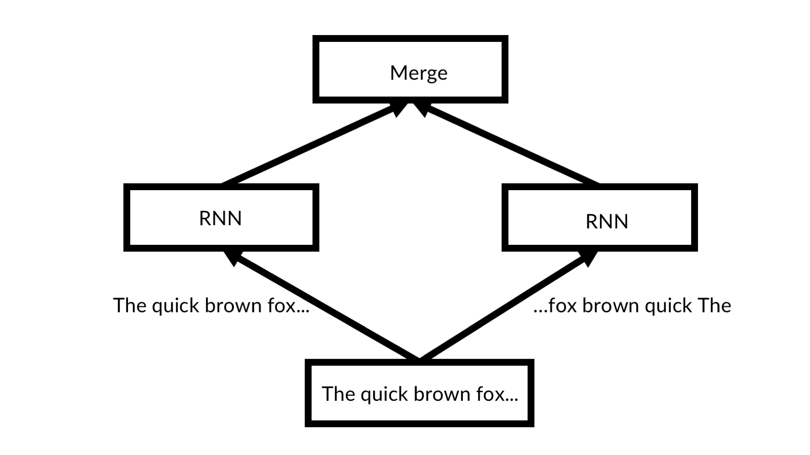
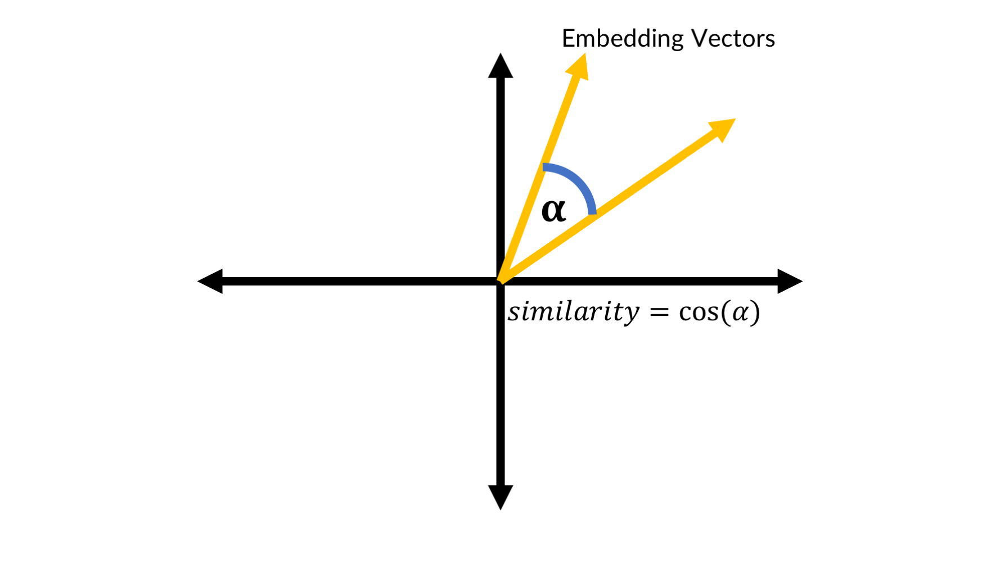

# Chapter 5 - Natural Language processing

It is no accident that Peter Brown, Co-CEO of Renaissance Technologies, one of the most successful quantitative hedge-funds of all time, previously worked at IBM applying machine learning to natural language problems. Information drives finance, and the most important source of information is written or spoken language. Ask any professional what they are actually spending time on and you will find that a significant part of finance is about reading. Headlines on tickers, Form-10Ks, the financial press, analyst reports, the list goes on and on. Automatically processing this information can increase speed of trades and increase the breath of information considered for trades while at the same time reducing costs.

But natural language processing (NLP) is also making inroads into finance in other areas. Insurances increasingly look to process claims automatically, retail banks try streamline their customer service and offer better products to their clients. Understanding text is increasingly becoming the go-to application of machine learning in finance.

Historically, NLP relied on hand crafted rules by linguists. Today, the linguists are getting replaced by neural networks that can learn the complex and often hard to codify rules of language. In this chapter, we will learn how to build powerful natural language models with Keras as well as how to use the SpaCy NLP library.

# A quick guide to SpaCy
SpaCy is a library for advanced natural language processing. It comes with a range of useful tools and pre-trained models that make NLP easier and more reliable. It is also pretty fast. To use SpaCy locally, you will need to install the library, and download its pre trained models separately:

```bash
$ pip install -U spacy

$ python -m spacy download en
```
In Kaggle, SpacCy is pre installed including the models.

This chapter makes use of the english language models, but more are available. Most features are available in English, German, Spanish, Portuguese, French, Italian and Dutch. Entity recognition is available for many more languages through the multi-language model.

The core of SpaCy are the `Doc` and `Vocab` classes. A `Doc` instance contains one document, including its text, tokenized version, recognized entities, etc. The `Vocab` class keeps track of all common information across documents. SpaCy is useful for its pipeline features, that contain many pieces needed for NLP. If this all seems a bit abstract right now, don't worry. This section will show you how to use SpaCy for many practical tasks. 

The data for the first section we use a collection of 143,000 articles from 15 American publications. The data is spread out over three excel files. We can load them separately, merge them into one large dataframe and then delete the individual dataframes to save memory.

```Python 
a1 = pd.read_csv('../input/articles1.csv',index_col=0)
a2 = pd.read_csv('../input/articles2.csv',index_col=0)
a3 = pd.read_csv('../input/articles3.csv',index_col=0)

df = pd.concat([a1,a2,a3])

del a1, a2, a3
```

The data looks like this:

|id|title|publication|author|date|year|month|url|content|
|--|-----|-----------|------|----|----|-----|---|-------|
|17283|House Republicans Fret...|New York Times|Carl Hulse|2016-12-31|2016.0|12.0|NaN|WASHINGTON — Congressional Republicans...|

We can plot the distribution of publishers to get an idea of what kind of news we are dealing with:
```Python 
import matplotlib.pyplot as plt
plt.figure(figsize=(10,7))
df.publication.value_counts().plot(kind='bar')
```



The dataset contains no articles from classical financial news media but mostly articles from mainstream publications and politically oriented publications. 

# Named entity recognition
A common task in natural language processing is named entity recognition (NER). NER is about finding things the text explicitly refers to. Before discussing more about what is going on, lets jump right in and do some NER on the first article in our dataset.

First we need to load SpaCy as well as the model for english language processing. 
```Python 
import spacy
nlp = spacy.load('en')
```

We then select the text of the article from our data.
```Python 
text = df.loc[0,'content']
```

And now we run this piece of text through the english language model pipeline. This will create a `Doc` instance mentioned earlier. The instance holds a lot of information, including the named entities.
```Python 
doc = nlp(text)
```

SpaCy comes with a handy visualizer called `displacy` which we can use to show the named entities in text.
```Python 
from spacy import displacy
displacy.render(doc, #1
                style='ent', #2
                jupyter=True) #3
```
\#1 We pass the document.

\#2 We specify that we would like to render entities

\#3 We need to let `displacy` know that we are running this in a jupyter notebook so that rendering works correctly.



And voila! As you can see, there are a few mishaps, such as blank spaces being classified as organizations or 'Obama' being classified as a place. This is because the tagging is done by a neural network and neural networks strongly dependent on the data they were trained on. You might need to fine tune the tagging model for your own purposes, and we will see in a minute how that works. You can also see that the NER offers a wide range of tags, some of which come with strange abbreviations. We will examine a full list of tags a bit later. For now, let's answer a different question: Which organizations do the news write about?

To make this exercise run faster, we will create a new pipeline in which we disable everything but NER.
```Python 
nlp = spacy.load('en',
                 disable=['parser', 
                          'tagger',
                          'textcat'])
``` 

Now we loop over the first 1000 articles from our dataset.
```Python 
from tqdm import tqdm_notebook

frames = []
for i in tqdm_notebook(range(1000)):
    doc = df.loc[i,'content'] #1
    text_id = df.loc[i,'id'] #2
    doc = nlp(doc) #3
    ents = [(e.text, e.start_char, e.end_char, e.label_) #4
            for e in doc.ents 
            if len(e.text.strip(' -—')) > 0]
    frame = pd.DataFrame(ents) #5
    frame['id'] = text_id #6
    frames.append(frame) #7
    
npf = pd.concat(frames) #8

npf.columns = ['Text','Start','Stop','Type','id'] #9   
```

\#1 We get the article content of the article at row `i`.

\#2 We get the id of the article.

\#3 We run the article through the pipeline.

\#4 For all entities found, we save the text, index of the first and last character as well as the label, but only if the tag consists of more than white spaces and dashes. This removes some of the mishaps of the classification in which empty segments or delimiters are tagged.

\#5 We create a pandas data frame out of the array of tuples created above

\#6 We add the id of the article to all records of our named entities.

\#7 We add the data frame containing all the tagged entities of one document to a list. This way we can build a collection of tagged entities over a larger number of articles.

\#7 We concatenate all data frames in the list, meaning that we create one big table with all tags.

Now we can plot the distribution of the types of entities that we found.
```Python 
npf.Type.value_counts().plot(kind='bar')
```



The english language NER that comes with SpaCy is a neural network trained on the OntoNotes 5.0 corpus. It can thus recognize the following categories:

- `PERSON`: People, including fictional characters.
- `ORG`: Companies, agencies, institutions.
- `GPE`: Places including countries, cities & states.
- `DATE`: Absolute (e.g. 'January 2017') or relative dates (e.g. 'two weeks')
- `CARDINAL`: Numerals that are not covered by other types
- `NORP`: Nationalities or religious or political groups.
- `ORDINAL`: 'first', 'second', etc...
- `TIME`: Times shorter than a day (e.g. 'two hours')
- `WORK_OF_ART`: Titles of books, songs, etc.
- `LOC`: Locations that are not `GPE`s, e.g. mountain ranges or streams
- `MONEY`: Monetary values 
- `FAC`: Facilities such as airports, highways or bridges
- `PERCENT`: Percentages
- `EVENT`: Named hurricanes, battles, sporting events, etc.
- `QUANTITY`: Measurements such as weights or distance.
- `LAW`: Named documents that are laws.
- `PRODUCT`: Objects, vehicles, food, etc.
- `LANGUAGE`: Any named language. 

Next, we will have a look at the 15 most frequently named organizations:

```Python 
orgs = npf[npf.Type == 'ORG']
orgs.Text.value_counts()[:15].plot(kind='bar')
```


As you can see, political institutions such as the senate are most frequently named in our news dataset. But some companies that were in the center of media attention are found as well. Also notice how 'the White House' and 'White House' are listed as two separate organizations. Depending in your needs you might want to do some post processing such as removing 'the' from organization names. Also note how 'Trump' is shown as an organization here. If you look at the tagged text above, you will also see that 'Trump' is tagged as a NORP, speak a political organization several times. This is because the NER infers the type of tag from context. Since Trump is U.S. president, his name often gets used in the same context as (political) organizations are. 

From here, you could conduct all kinds of other investigations. The pre-trained NER gives a powerful tool that solves many common NLP tasks.

## Fine tuning the NER
https://github.com/explosion/spacy/blob/master/examples/training/train_ner.py

Many times, you will find that the pre trained NER does not do well enough on the specific kind of text that you want to work with. To solve this problem, you will have to fine tune the NER model by training it with custom data. 

Your training data should be in a form like this:
```Python 
TRAIN_DATA = [
    ('Who is Shaka Khan?', {
        'entities': [(7, 17, 'PERSON')]
    }),
    ('I like London and Berlin.', {
        'entities': [(7, 13, 'LOC'), (18, 24, 'LOC')]
    })
]
```
You provide a list of tuples of the string together with the start and end points as well as types of entities you want to tag. Data like this is usually collected through manual tagging, often on platforms like Amazon Mechanical Turk. The company behind SpaCy also made a (paid) data tagging system called prodigy which allows for efficient data collection.

Once you have collected enough data, you can either fine tune a pre trained model or initialize a completely new model. 

To load and finetune a model, use the `load()` function:
```Python 
nlp = spacy.load('en')
```

To create a new model from scratch, use the `blank` function:
```Python 
nlp = spacy.blank('en')
```
This creates an empty model ready for the english language. 

Either way, we need to get access to the NER component. If you have created a blank model, you need to create a NER pipeline component and add it to the model. If you have loaded an existing model, you can just access its existing NER.
```Python 
if 'ner' not in nlp.pipe_names:
    ner = nlp.create_pipe('ner')
    nlp.add_pipe(ner, last=True)
else:
    ner = nlp.get_pipe('ner')
```

Next, we need to ensure that our NER can recognize the labels we have. Imagine our data contained a new type of named entity like `ANIMAL`. With the `add_label` function we can add a label type to an NER.

```Python 
for _, annotations in TRAIN_DATA:
    for ent in annotations.get('entities'):
        ner.add_label(ent[2])
```

```Python 
import random

#1
other_pipes = [pipe for pipe in nlp.pipe_names if pipe != 'ner']

with nlp.disable_pipes(*other_pipes):
    optimizer = nlp._optimizer #2
    if not nlp._optimizer:
        optimizer = nlp.begin_training()
    for itn in range(5): #3
        random.shuffle(TRAIN_DATA) #4
        losses = {} #5
        for text, annotations in TRAIN_DATA: #6
            nlp.update( #7
                [text],  
                [annotations],  
                drop=0.5,  #8
                sgd=optimizer,  #9
                losses=losses) #10
        print(losses)
```
\#1 We disable all pipeline components that are not the NER by first getting a list of all components that are not the NER and then disabling them for training. 

\#2 Pre trained models come with an optimizer. If you have a blank model, you will need to create a new optimizer. Note that this also resets the model weights.

\#3 We now train for a number of epochs, in this case 5.

\#4 At the beginning of each epoch, we shuffle the training data using Pythons built in `random` module, which we imported above.

\#5 We create an empty dictionary to keep track of the losses.

\#6 Now we loop over the text and anonations in the training data.

\#7 `nlp.update` performs one forward and backward pass and updates the neural network weights. We need to supply text and annotations and the function will figure out how to train a network from it.

\#8 We can manually specify the dropout rate we want to use while training.

\#9 We pass a stochastic gradient descent optimizer that performs the model updates. Note that you can not just pass a Keras or TensorFlow optimizer here but that SpaCy has its own optimizers.

\#10 We can also pass a dictionary to write losses in which we print later to monitor progress.

Your output should look something like this: 
```
{'ner': 5.0091189558407585}
{'ner': 3.9693684224622108}
{'ner': 3.984836024903589}
{'ner': 3.457960373417813}
{'ner': 2.570318400714134}
```

# Part of speech tagging
On Tuesday, the 10th of October 2017, between 9:34 and 9:36, the Dow Jones newswire encountered a technical error that let it to post some strange headlines. One of them 'Google to buy Apple' sent apple stock up over two percent. While the algorithmic trading systems obviously failed to understand that such an acquisition would be impossible as Apple had a market capitalization of $800bn at the time and the move would likely not find regulatory approval, it is also a form of success. How did these algorithms find out who was doing what to whom? 

The answer is part of speech (POS) tagging . It allows to understand which words take over which function in a sentence and how the words relate to each other.

SpaCy comes with a handy, pre trained POS tagger:
```Python 
import spacy
from spacy import displacy
nlp = spacy.load('en')

doc = 'Google to buy Apple'
doc = nlp(doc)
displacy.render(doc,style='dep',jupyter=True, options={'distance':120})
```
Again, we load the pretrained english model and run our sentence through it. Then we use `displacy` just as we did for NER. To make the graphic fit better in a book, we set the `'distance'` option to something shorter than the default so that words get displayed closer together.



As you can see, the POS tagger identified 'buy' as a verb and 'Google' and 'Apple' as the the nouns in the sentence. It also identified that 'Apple' is the object the action is applied to and that 'Google' is applying the action. 

We can access this information for nouns like this:
```Python 
for chunk in doc.noun_chunks:
    print(chunk.text, chunk.root.text, chunk.root.dep_,
          chunk.root.head.text)        
```

Text  |Root Text|Root dep|Root Head Text
------|--------|------|-------
Google | Google | ROOT | Google
Apple | Apple | dobj | buy

'Google' is the root of the sentence, while 'Apple' is the object of the sentence. The verb applied to 'Apple' is 'buy'. From there it is only a hard coded model of price developments under and acquisition (demand for the target stock goes up, and with it the price) and a stock lookup table to a simple event driven trading algorithm. Making these algorithm understand context and plausibility is another story however.


# Rule based matching
https://spacy.io/usage/linguistic-features#section-rule-based-matching

Before deep learning and statistical modeling took over, natural language processing was all about rules. And rule based systems are not dead! They are often easy to set up and do simple tasks pretty well. Imagine you would want to find all mentions of 'Google' in a text. Would you really train a neural network based named entity recognizer, run all text through the neural network and then look for 'Google' in the entity texts, or would you just search for text that exactly matches 'Google' with a classic search algorithm? SpaCy comes with an easy to use rule based matcher.

Before we start this section, make sure you reload a the english laguage model and import the matcher.
```Python 
import spacy
from spacy.matcher import Matcher

nlp = spacy.load('en')
```

The matcher searchers for patterns which we encode as a list of dictionaries. It operates token by token, that is word for word, except for punctuation and numbers, where a single symbol can be a token. As a starting example, lets search for the phrase 'Hallo, world'. We would define a pattern as follows:
```Python 
pattern = [{'LOWER': 'hello'}, {'IS_PUNCT': True}, {'LOWER': 'world'}]
``` 
This pattern is fulfilled, if the lower case first token is 'hallo'. That means, if the actual token text is 'Hallo' or 'HALLO' it would also fulfil the requirement. The second token has to be punctuation, so the phrase 'hallo. world' or 'hallo! world' would both work, but not 'hallo world'. The lower case of the third token has to be 'world', so 'WoRlD' would also be fine.

The possible attributes for a token can be:
- `'ORTH'`: The token text has to match exactly.
- `'LOWER'`: The lower case of the token has to match.
- `'LENGTH'`: The length of the token text has to match.
- `'IS_ALPHA'`, `'IS_ASCII'`,`'IS_DIGIT'`: The token text has to consist of alphanumeric characters, ASCII symbols or digits.
- `'IS_LOWER'`, `'IS_UPPER'`,`'IS_TITLE'`: The token text has to be lower case, upper case or title case.
- `'IS_PUNCT'`, `'IS_SPACE'`,`'IS_STOP'`: Token text has to be punctuation, white space, or a stop word.
- `'LIKE_NUM'`, `'LIKE_URL'`,`'LIKE_EMAIL'`: Token has to resemble a number, URL or email.
- `'POS'`, `'TAG'`, `'DEP'`, `'LEMMA'`, `'SHAPE'`: The tokens position, tag, dependency, lemma or shape has to match. 
- `'ENT_TYPE'`: The tokens entity type from NER has to match.

SpaCys lemmatization is extremely useful. A lemma is the base version of a word. 'Was' for example is a version of 'be' so 'be' is the lemma for 'was' but also for 'is'. SpaCy can lemmatize words in context, meaning it uses the surrounding words to determine what the actual base version of a word is.
To create a matcher, we have to pass on the vocabulary the matcher works on. In this case, we can just pass the vocabulary of our english language model:

```Python 
matcher = Matcher(nlp.vocab)
```

To add the required attributes to our matcher we call:

```Python 
matcher.add('HelloWorld', None, pattern)
```
The `add` function expects three arguments: A name of the pattern, in this case 'HalloWorld', so that we can keep track of the patterns we added. A function that can process matches once found. We pass `None`, here, meaning no function will be applied. But we will use this tool later. Finally, we need to pass the list of token attributes we want to search for.


To use our matcher, we can simply call `matcher(doc)`. This will give us back all the matches the matcher found.
```Python
doc = nlp(u'Hello, world! Hello world!')
matches = matcher(doc)
``` 

If we print out the matches, we can see the structure:
```Python 
matches
```
```
[(15578876784678163569, 0, 3)]
```
The fist thing in a match is the hash of the string found. This is just to clearly identify what was found internally and we won't use it here. The next two numbers indicate the range in which the matcher found something, here tokens 0 to 3:

We can get the text back by indexing the original document:
``` 
doc[0:3]
```
``` 
Hello, world
```

## Add custom functions to matchers
Lets move on to a more complex case. We know that the iPhone is a product. The neural network based matcher however, often classifies it as an organization. This happens because the word 'iPhone' gets used a lot in similar context as organizations, like in 'The iPhone offers ...' or 'The iPhone sold ...'. Lets build a rule based matcher that always classifies the word 'iPhone' as a product entity.

First, we have to get the hash of the word 'PRODUCT'. Words in SpaCy can be uniquely identified by their hash. Entity types also get identified by their hash. To set an entity of the product type, we have to be able to provide the hash for the entity name. 

We can get the name from the language models vocabulary:
```Python 
PRODUCT = nlp.vocab.strings['PRODUCT']
```

Next, we need to define an `on_match` rule. This function will be called every time the matcher finds a match. `on_match` rules get passed four arguments:
- `matcher`: The matcher that made the match. 
- `doc`: The document the match was made in.
- `i`: The index of a mach. The first match in a document would have index zero, the second would have index one and so on.
- `matches`: A list of all matches made.

There are two things happening in our `on_match` rule:
```Python 
def add_product_ent(matcher, doc, i, matches):
    match_id, start, end = matches[i] #1
    doc.ents += ((PRODUCT, start, end),) #2
``` 
\#1 We index all matches to find our match at index `i`. One match is a tuple of a match id, the start of the match and the end of the match. 

\#2 We add a new entity to the documents named entities. An entity is a tuple of the hash of the type of entity (the hash of the word 'PRODUCT' here), the start of the entity and the end of the entity. To append an entity, we have to nest it in another tuple. Tuples that contain only one value need to include a comma at the end. It is important to not overwrite `doc.ents`, as we otherwise would remove all the entities we already found.

Now that we have a `on_match` rule we can define our matcher. 

Note that matchers allow us to add multiple patterns, so we can add a matcher for just the word 'iPhone' and another pattern for the word iPhone together with a version number like 'iPhone 5':

```Python 
pattern1 = [{'LOWER': 'iphone'}] #1
pattern2 = [{'ORTH': 'iPhone'}, {'IS_DIGIT': True}] #2

matcher = Matcher(nlp.vocab) #3
matcher.add('iPhone', add_product_ent,pattern1, pattern2) #3
```
\#1 We define the fist pattern.

\#2 We define the second pattern.

\#3 We create a new empty matcher.

\#4 We add the patterns to the matcher. Both will fall under the rule called 'iPhone', and both will call our `on_match` rule called `add_product_ent`.

We will now pass one of the news articles through the matcher.

```Python 
doc = nlp(df.content.iloc[14]) #1
matches = matcher(doc) #2
```
\#1 We run the text through the pipeline to create an annonated document.
\#2 We run the document through the matcher. This modifies the document created in the step before. We do not care as much about the matches but about how the `on_match` methods adds the matches as entities to our documents.

And boom, all mentions of the word 'iPhone' (case independent), are now tagged as named entities of the type product. You can validate this by displaying the entities with `displacy`

```Python 
displacy.render(doc,style='ent',jupyter=True)
``` 



## Adding the matcher to the pipeline

Calling the matcher seperately is somewhat cumbersome. To add it to the pipeline, we have to wrap it into a function: 

```Python 
def matcher_component(doc):
    matches = matcher(doc)
    return doc
```
The SpaCy pipeline calls the components of the pipeline as functions and alway expects the anonated document to be returned. Returning anything else might break the pipeline. We can then add the matcher to the main pipeline like this: 

```Python 
nlp.add_pipe(matcher_component,last=True)
```
The matcher is now the last piece of the pipeline and iPhones get tagged based on the matchers rules.

## Combining rule based and learning based systems
One especially interesting aspect of SpaCy's pipeline system is that it is relatively easy to combine different aspects. We can for example combine the neural network based named entity recognition with a rule based matcher to find something like executive compensation information.

Executive compensation is often reported in the press but hard to find in aggregate. One possible rule based matching pattern for executive compensation could look like this:

```Python 
pattern = [{'ENT_TYPE':'PERSON'}, 
            {'LEMMA':'receive'}, 
            {'ENT_TYPE':'MONEY'}]
``` 

A matcher looking for this pattern would pick up any combination of a Persons name (e.g. 'John Appleseed', or 'Daniel'), any version of the word receive ('received', 'receives', etc.) followed by any expression of money (e.g. '$4 Million'). This matcher could be run over a large text corpus with the `on_match` rule handily saving the found snippets into a database. A machine learning approach for naming entities as well as a rule based approach go seamlessly hand in hand. Since there is much more training data available with annotations for names and money rather than statements about executive education, it is much easier to combine the NER with a rule based method rather than training a new NER.

# Regular expressions 
Regular expressions, or regex, are a powerful form of rule based matching. Invented in the 1950s they were the most useful way to find things in text for a very long time, and proponents argue they still are. No chapter on NLP would be complete without mentioning them. This section is by no means a complete regex tutorial. It just introduces the general idea and shows how regex can be used in Python, pandas and SpaCy. 

A very simple regex pattern could be `'a.'` Which would only find instances of the lower case letter a followed by a dot. But regex also allows to add ranges of patterns, for example `'[a-z].'` would find any lower case letter followed by a dot, and `'[xy].'` would find only the letters x or y followed by a dot. Regex patterns are case sensitive, so `'[A-Z]'` captures only upper case letters. This is useful if we are searching for expressions in which spelling is frequently different, for example the pattern `'seriali[sz]e'` would catch the British as well as American english version of the word. The same goes for numbers, `'[0-9]'` captures all numbers from 0 to 9. To find repetitions, you can use the `'*'` which captures zero or more occurrences, or the `'+'` which captures one or more occurrences. E.g. `'[0-9]+'` would capture any series of numbers, which might be useful when looking for years. `'[A-Z][a-z]+ [0-9]+'` for example would find all words starting with a capital letter followed by one or more digit, like 'March 2018' but also 'Jaws 2'. Curly brackets can be used to define the number of repetitions, `'[0-9]{4}'` would find number sequences with exactly four digits. As you can see, regex does not make any attempt to understand what is in the text, but rather offers a clever method of finding text that matches patterns. 

A practical use case in the financial industry is finding the VAT number of companies in invoices. These follow a pretty strict pattern in most countries that can easily be encoded. VAT numbers in the Netherlands for example follow this regex pattern: `'NL[0-9]{9}B[0-9]{2}'`.

## Using Python's regex module 
Python has a built in tool for regex called re. It does not need to be installed as it is part of Python itself. 

```Python 
import re
```
Imagine we are working on an automatic invoice processor, and we want to find to find the VAT number of the company that sent us the invoice. For simplicity's sake, we only deal with Dutch VAT numbers. We know the pattern for a dutch VAT number:

```Python 
pattern = 'NL[0-9]{9}B[0-9]{2}'
```

A string that we want to search the BTW in might look like this:

```Python 
my_string = 'ING Bank N.V. BTW:NL003028112B01'
```

To find all occurrences of a BTW number in the string, we can call `re.findall`, which will return a list of all strings matching the pattern found. 

``` Python 
re.findall(pattern,my_string)
``` 
```
['NL003028112B01']
```

`re` also allows to pass flags to make development of regex patterns a bit easier.

To ignore the case of letters when matchin a regular expression for exaple we can add a `re.IGNORECASE` flag.
``` Python 
re.findall(pattern,my_string, flags=re.IGNORECASE)
``` 

Often, we are interested in a bit more information around our matches. To this end, there is a `match` object. `re.search` yields a `match` object for the first match found:

```Python 
match = re.search(pattern,my_string)
```

We can get more information out of this object, such as the location of our match: 
```Python 
match.span()
```
```
(18, 32)
```
The span, the start and the end, of our match are the characters 18 to 32.

## Regex in pandas
Data for NLP problems often comes in pandas dataframes. Luckily, pandas natively supports regex. If for example we want to find out if any of the articles in our news dataset contains a dutch BTW number, we can pass:

```Python 
df[df.content.str.contains(pattern)]
```
This would yield all articles which include a Dutch btw, but unsurprisingly no articles do.

## When to use regex and when not to
Regex is a powerful tool and this very short introduction does not do it justice. In fact, there are several books longer than this one written purely on regex. Regex works well on simple, clear to define patterns. VAT numbers are the perfect examples, and email addresses or phone numbers are very popular use cases. However, regex fails when the pattern is hard to define or can only be inferred from context. It is not possible to create a rule based named entity recognizer that can spot that a word refers to the name of a person, because names follow no clear distinguishing pattern. So, next time you are looking to find something that is easy to spot for a human but hard to describe in rules, use a machine learning based solution. Next time you are looking for something clearly encoded, like a VAT number, use regex.

# A text classification task
https://www.figure-eight.com/data-for-everyone/

A common NLP task is to classify text. The most common text classification is done in sentiment analysis, where texts are classified as positive or negative. In this section, we will consider a slightly harder problem: Classifying whether a tweet is about an actual disaster happening or not. Today, investors have developed a number of ways to gain information from tweets. Twitter users are often faster than news outlets to report disasters, such as a fire or a flood. This speed advantage can be used for event driven trading strategies for instance. Yet, not all tweets that contain words associated with disasters are actually about disasters. A tweet like: 'California forests on fire near San-Francisco' is a tweet that should be taken into consideration while: 'California this weekend was fire, good times in San-Francisco' can be safely ignored. 

The goal of this task is to build a classifier that separates the tweets about real disasters from irrelevant tweets. The dataset consists of hand labeled tweets that were obtained by searching twitter for words common to disaster tweets like 'ablaze' or 'fire'.

# Preparing the data
https://blog.insightdatascience.com/how-to-solve-90-of-nlp-problems-a-step-by-step-guide-fda605278e4e 

Preparing text task of its own, because real world text is often messy and can not be fixed with a few simple scaling operations. People make typos, they add unnecessary characters, they use text encodings we can not read, etc. NLP involves its own set of data cleaning challenges and techniques. 

## Sanitizing characters 
To store text, computers need to encode the characters into bits. There are several different ways to do this and not all of them can deal with all characters. It is good practice to keep all text files in one encoding scheme, usually utf-8, but of course that does not always happen. Files might also be corrupted, meaning that a few bits are off rendering some characters unreadable. Therefore we need to sanitize our inputs first.

Python offers a helpful `codecs` library that allows us to deal with different encodings. Our data is utf-8 encoded, but there are a few special characters in there that can not be read easily. Therefore, we have to sanitize our text of these special characters.
```Python 
import codecs
input_file = codecs.open('../input/socialmedia-disaster-tweets-DFE.csv',
                          'r',
                          encoding='utf-8', 
                          errors='replace')
```
`codecs.open` acts as a stand in replacement for pythons standard file opening function. It returns a file object which we can later read line by line. We specify the input path, that we want to read the file (with `'r'`), the expected encoding and what to do with errors. In this case we will replace errors with a special unreadable character marker.

To write to the output file, we can just use Pythons standard `open()` function. This function will create a file at the specified file path we can write to. 
```Python                         
output_file = open('clean_socialmedia-disaster.csv', 'w')
```
Now, all we have to do is loop over the lines in our input file that we read with our `codecs` reader and save it as a regular csv file again.
```Python
for line in input_file:
    out = line
    output_file.write(line)

```
It is good practice that we close the file objects afterwards.
```Python
input_file.close()
output_file.close()
```

Now we can read the sanitized csv file with pandas.
```Python 
df = pd.read_csv('clean_socialmedia-disaster.csv')
```


## Lemmatization

Lemmas have already made several appearances in this chapter. A lemma in the field of linguistics, also called headword, is the word under which the set of related words or forms appears in a dictionary. 'Was' and 'is' appear under 'be', 'mice' appears under 'mouse' and so on. Often times, the specific form of a word does not matter very much, so it can be a good idea to convert all text into it's lemma form.

SpaCy offers a handy way to lemmatize text, so once again, we load a SpaCy pipeline. Only that in this case we don't need any pipeline module but the tokenizer. The tokenizer splits text into separate words, usually by spaces. These individual words, or tokens, can then be used to look up their lemma. 
```Python 
import spacy
nlp = spacy.load('en',disable=['tagger','parser','ner'])
```

Lemmatization can be slow, so for big files it makes sense to track progress. `tqdm` allows to show progress pars on the pandas `apply` function. All we have to do is to import `tqdm` as well as the notebook component for pretty rendering in our work environment. Then we have to tell `tqdm` we would like to use it with pandas.
```Python 
from tqdm import tqdm, tqdm_notebook
tqdm.pandas(tqdm_notebook)
```
We can now run `progress_apply` on a data frame just as we would use the standard `apply` method, but it has a progress bar. 

For each row, we loop over the words in the 'text' column and save the lemma of the word in a new 'lemmas' column.
```Python 
df['lemmas'] = df["text"].progress_apply(lambda row: 
                                         [w.lemma_ for w in nlp(row)])
```
Our 'lemmas' column is a full of lists now, so to turn the lists back into texts, we join all elements of the lists with a space as a separator.

```Python 
df['joint_lemmas'] = df['lemmas'].progress_apply(lambda row: ' '.join(row))
```

## Preparing the target 
There are several possible prediction target in this dataset. Humans were asked to rate a tweet, and apparently the were given three options:
```Python 
df.choose_one.unique()
```

```
array(['Relevant', 'Not Relevant', "Can't Decide"], dtype=object)
```
Tweets for which humans can not decide whether it is about a real disaster or not are not interesting to us here. So we will just remove that category:

```Python 
df = df[df.choose_one != "Can't Decide"]
```

We are also only interested in mapping text to relevance, so we can drop all other metadata and just keep these two columns.
```Python 
df = df[['text','choose_one']]
``` 
Finally, we convert the target into numbers. This is a binary classification task as there are only two categories. So we map 'Relevant' to 1 and 'Not Relevant' to zero:
```Python 
f['relevant'] = df.choose_one.map({'Relevant':1,'Not Relevant':0})
```

## Preparing train and test set 
Before we start building models, lets split our data in train and test set:
```Python 
from sklearn.model_selection import train_test_split
X_train, X_test, y_train, y_test = train_test_split(df['joint_lemmas'], 
                                                    df['relevant'], 
                                                    test_size=0.2,
                                                    random_state=42)
```

# Bag of words
https://stackoverflow.com/questions/21107505/word-count-from-a-txt-file-program
A simple, yet effective way of classifying text is to see text as a bag of words. That means, we do not care for the order in which words appear in the text, but only about which words appear in the text.
## Count vectors
One way of doing bag of words classification is by simply counting the occurrences of different words in a text. This is done with a so called count vector. Each word has an index, and for each text, the value of the count vector at that index is the number of occurrences of the word that belongs to the index. 

A count vector for the text 'I see cats and dogs and elephants' could look like this:

|i|see|cats|and|dogs|elephants|
|-|---|---|---|---|--------|
|1|1|1|2|1|1|

In reality, count vectors are pretty sparse. There are about 23,000 different words in our text corpus. It makes sense to limit the amount of words we want to include in our count vectors. Rare words are often just gibberish or typos with no meaning. Keeping all rare words can be a source of overfitting. 

We are using `sklearn`'s built in count vectorizer. By setting `max_features` we can control how many words we want to consider. In this case, we will only consider the 10,000 most frequent words: 
```Python 
from sklearn.feature_extraction.text import CountVectorizer

count_vectorizer = CountVectorizer(max_features=10000)
```
Our count vectorizer can now transform texts into count vectors. Each count vector will have 10,000 dimensions. 
```Python 
X_train_counts = count_vectorizer.fit_transform(X_train)
X_test_counts = count_vectorizer.transform(X_test)
```
Once we have obtained our count vectors, we can perform simple logistic regression on them. While we could use Keras for logistic regression as we did in chapter 1, it is often easier to just use the logistic regression class from sklearn:
```Python 
from sklearn.linear_model import LogisticRegression
clf = LogisticRegression()

clf.fit(X_train_counts, y_train)

y_predicted = clf.predict(X_test_counts)
```
Now that we have predictions from our logistic regressor, we can measure its accuracy with `sklearn`:

```Python 
from sklearn.metrics import accuracy_score
accuracy_score(y_test, y_predicted)
```

``` 
0.8011049723756906
``` 
80% accuracy is pretty decent for such a simple method. A simple count vector based classification is useful as a baseline for more advanced methods which we will discuss later.

## TF-IDF
https://stevenloria.com/tf-idf/
TF-IDF stands for 'Term Frequency, Inverse Document Frequency' and it aims to address a problem of simple word counting: Words that appear frequently in a text are important but words that appear in _all_ texts are not important. 

The TF component is just like a count vector, except that TF divides the counts by the total number of words in a text. 

The IDF component is the logarithm of the total number of texts in the entire corpus divided by the number of texts that include a specific word.

TF-IDF is the product of these two measurements. TF-IDF vectors are like count vectors, except they contain the TF-IDF scores instead of the counts for words contain 

 Words that appear frequently in one text but are rare across the entire corpus have a high score in the TF-IDF vector. We create TF-IDF vectors just as we created count vectors with `sklearn`:

```Python 
from sklearn.feature_extraction.text import TfidfVectorizer
tfidf_vectorizer = TfidfVectorizer()

X_train_tfidf = tfidf_vectorizer.fit_transform(X_train)
X_test_tfidf = tfidf_vectorizer.transform(X_test)
```

Once we have the TF-IDF vectors, we can train a logistic regressor on them just like we did for count vectors:

```Python 
clf_tfidf = LogisticRegression()
clf_tfidf.fit(X_train_tfidf, y_train)

y_predicted = clf_tfidf.predict(X_test_tfidf)
```

In this case, TF-IDF does slightly worse than count vectors. The performance difference is very small though so that it might be attributable to chance in this case:

```Python
accuracy_score(y_pred=y_predicted, y_true=y_test)
```

```
0.7978821362799263
```

# Word embeddings
The order of words in a text matters. Therefore, we can expect higher performance if we do not just look at texts in aggregate but see them as a sequence. The next sections make use of a lot of the techniques discussed in the last chapter but they add a critical ingredient: Word Vectors.

Words and word tokens are categorical features. As such, we can not directly feed them into a neural net. Previously, we have dealt with categorical data by turning it into one hot encoded vectors. But for words, this is impractical. Since our vocabulary is 10,000 words, each vector would contain 10,000 numbers which are all zeros except for one. This is highly inefficient. Instead we will use an embedding.

In practice, embeddings work like a look up table. For each token, they store a vector. When the token is given to the embedding layer, it returns the vector for that token and passes it through the neural network. As the network trains, the embeddings get optimized as well. Remember that neural networks work by calculating the derivative of the loss function with respect to the parameters (weights) of the model. Through back propagation we can also calculate the derivative of the loss function with respect to the input of the model. Thus we can optimize the embeddings to deliver ideal inputs that help our model.

VECTOR IMAGE GOES HERE

## Preprocessing for training with word vectors 
Before we start with training word embeddings though, we need to do some preprocessing steps. Namely, we need to assign each word token a number and create a numpy array full of sequences. 

Assigning numbers to tokens makes the training process smoother and decouples the tokenization process from the word vectors. Keras has a `Tokenizer` class that can create numeric tokens for words. By default, this tokenizer splits text by spaces. This works mostly fine in english, but in other languages it can be problematic. It is better to tokenize the text with SpaCy first, as we already did for our two previous methods, and then assign numeric tokens with Keras. 

The Tokenizer also allows us to specify how many words we want to consider, so once again we will only use the 10,000 most used words.
```Python
from keras.preprocessing.text import Tokenizer
import numpy as np

max_words = 10000
```

The tokenizer works a lot like the `CountVectorizer` from `sklearn`. First we create a new tokenizer object. Then we fit the tokenizer, and finally, we can transform the text to tokenized sequences.
``` Python 
tokenizer = Tokenizer(num_words=max_words)
tokenizer.fit_on_texts(df['joint_lemmas']) 
sequences = tokenizer.texts_to_sequences(df['joint_lemmas'])
```

The `sequences` variable now holds all of our texts as numeric tokens. We can look up the mapping of words to numbers from the tokenizers word index: 
```Python 
word_index = tokenizer.word_index
print('Token for "the"',word_index['the'])
print('Token for "Movie"',word_index['movie'])
```
``` 
Token for "the" 4
Token for "Movie" 333
```
As you can see, frequently used words like 'the' have lower token numbers than less frequent words like 'movie'. You can also see that the `word_index` is a dictionary. If you are using your model in production, you can save this dictionary to disk to convert words to tokens later.

Finally, we need to turn our sequences into sequences of equal length. This is not always nessecary, some model types can deal with sequences of different lengths, but it usually makes sense and is often required. We will examine which models need equal length sequences in the next section on building custom NLP models.

Keras `pad_sequences` function allows to easily bring all sequences to the same length by either cutting off sequences or adding zeros at the end. We will bring all tweets to a length of 140 characters, which for a long time was the maximum lenght tweets could have.
```Python 
from keras.preprocessing.sequence import pad_sequences

maxlen = 140

data = pad_sequences(sequences, maxlen=maxlen)
```

Finally, we split our data in a training and validation set.

```Python 
from sklearn.model_selection import train_test_split
X_train, X_test, y_train, y_test = train_test_split(data,
                                                    df['relevant'],
                                                    test_size = 0.2, 
                                                    shuffle=True, 
                                                    random_state = 42)
```

Now we are ready to train our own word vectors.
## Training your own word vectors 

Embeddings are a their own layer type in Keras. To use them, we have to specify how large we want the word vectors to be. A 50 dimensional vector is able to capture good embeddings even for quite large vocabularies. We also have to specify for how many words we want embeddings and how long our sequences are. Our model is now a simple logistic regressor which trains its own embeddings.
```Python 
from keras.models import Sequential
from keras.layers import Embedding, Flatten, Dense

embedding_dim = 50

model = Sequential()
model.add(Embedding(max_words, embedding_dim, input_length=maxlen))
model.add(Flatten())
model.add(Dense(1, activation='sigmoid'))
```

Notice how we do not have to specify an input shape as usual. Even specifying the input length is only necessary if the following layers require knowledge of the input length. `Dense` layers require knowledge about the input size. Since we are using a dense layers directly, we need to specify the input length here.

Word embeddings have _many_ parameters. You can see this if you are printing out the models summary:
```Python 
model.summary()
```
```
_________________________________________________________________
Layer (type)                 Output Shape              Param #   
=================================================================
embedding_2 (Embedding)      (None, 140, 50)           500000    
_________________________________________________________________
flatten_2 (Flatten)          (None, 7000)              0         
_________________________________________________________________
dense_3 (Dense)              (None, 1)                 7001      
=================================================================
Total params: 507,001
Trainable params: 507,001
Non-trainable params: 0
_________________________________________________________________
```
The embedding layer has 50 parameters for 10,000 words equalling 500,000 parameters in total. This makes training slower and can increase the chance of overfitting.

We can now compile and train our model as usual. 
```Python 
model.compile(optimizer='adam',
              loss='binary_crossentropy',
              metrics=['acc'])
              
history = model.fit(X_train, y_train,
                    epochs=10,
                    batch_size=32,
                    validation_data=(X_test, y_test))
```

This model achieves about 76% accuracy on the test set but over 90% accuracy on the training set. The many parameters in the custom embeddings lead to overfitting. To avoid overfitting and reduce training time, you are often better off using pre trained word embeddings.

## Loading pre trained word vectors 
Like in computer vision, NLP models can benefit from using pre trained pieces of other models. In this case, we will use the pre trained GloVe vectors. GloVe stands for Global Vectors for Word Representation, and is a project of the Stanford NLP group. GloVe provides different sets of vectors trained on different texts. We will use word embeddings trained on wikipedia texts as well as the Gigaword dataset. In total, the vectors were trained on a text of 6 billion tokens. An alternative to GloVe is Word2Vec, a similar set of word vectors that you might try out. GloVe and Word2Vec are relatively similar although the training method for them was different. They each have their strengths and weaknesses and in practice it is often worth trying out both.

A nice feature of GloVe vectors is that they encode word meanings in vector space so that 'word algebra' becomes possible. The vector for 'king' minus the vector for 'man' plus the vector for 'woman' for example results in a vector pretty close to 'queen'. This means the differences between the vectors for 'man' and 'woman' are the same as the differences for the vectors of 'king' and 'queen' as the differentiating features for both are nearly the same.

Equally, swords describing similar things such as 'frog' and 'toad' are very close to each other in the GloVe vector space. Encoding semantic meanings in vectors offers a range of other exciting opportunities for document similarity and topic modeling as we will see later in this chapter. But the semantic vectors are also pretty useful to serve for a wide range of NLP tasks, such as our text classification problem.

The actual GloVe vectors are in a text file. We will use the 50 dimensional embeddings trained on 6 billion tokens. First we need to open the file:
```Python
import os
glove_dir = '../input/glove6b50d'
f = open(os.path.join(glove_dir, 'glove.6B.50d.txt'))
```
Then we create an empty dictionary which will later map words to embeddings.
```Python 
embeddings_index = {}
```

In the dataset, each line represents a new word embedding. The line starts with the word and the embedding values follow. We can read out the embeddings like this:
```Python 
for line in f: #1
    values = line.split() #2
    word = values[0] #3
    embedding = np.asarray(values[1:], dtype='float32') #4
    embeddings_index[word] = embedding dictionary #5
f.close() #6
```
\#1 We loop over all lines in the file. Each line contains a word and embedding. 
\#2 We split the line by whitespace.
\#3 The first thing in the line is always the word.
\#4 Then come the embedding values. We immediately transform them into a numpy array and make sure there are all floating point numbers, that is decimals.
\#5 We then save the embedding vector in our embedding dictionary.
\#6 Once we are done with it we close the file.

Now we have a dictionary mapping words to their embeddings:
```Python 
print('Found %s word vectors.' % len(embeddings_index))
``` 
```
Found 400000 word vectors.
```
This version of GloVe has vectors for 400,000 words. Which should be enough to cover most words we will encounter. However, there might be some words, for which we still do not have a vector. For these words we will just create random vectors. To make sure these vectors are not too much off, it is a good idea to use the same mean and standard deviation for the random vectors as from the trained vectors. To this end we need to calculate mean and standard deviation for the GloVe vectors.

```Python 
all_embs = np.stack(embeddings_index.values())
emb_mean = all_embs.mean()
emb_std = all_embs.std()
``` 

Our embedding layer will be a matrix with a row for each word and a column for each element of the embedding. Therefore, we need to specify how many dimensions one embedding has. The version of GloVe we loaded earlier has 50 dimensional vectors.

```Python 
embedding_dim = 50
```

Next, we need to find out how many words we actually have. Although we have set the maximum to 10,000, there might be fewer words in our corpus. At this point we also retrieve the word index from the tokenizer, which we will use later.
```Python 
word_index = tokenizer.word_index
nb_words = min(max_words, len(word_index))
```
To create our embedding matrix, we first create a random matrix with the same mean and std as the embeddings.

```Python 
embedding_matrix = np.random.normal(emb_mean, 
                                    emb_std, 
                                    (nb_words, embedding_dim))
```

Embedding vectors need to be in the same position as their token number. A word with token 1 needs to be in row 1 (rows start with zero) and so on. We can now replace the random embeddings for the words for which we do have trained embeddings with trained embeddings.

```Python 
for word, i in word_index.items(): #1
    if i >= max_words: #2
        continue  
    embedding_vector = embeddings_index.get(word) #3
    if embedding_vector is not None: #4
        embedding_matrix[i] = embedding_vector
```
\#1 Loop over all words in the word index.
\#2 If we are above the amount of words we want to use we do nothing.
\#3 Get the embedding vector for the word. This operation might return none if there is no embedding for this word.
\#4 If there is an embedding vector, put it in the embedding matrix

To use the pre trained embeddings, we just have to set the weights in the embedding layer to the embedding matrix we just created. To make sure the carefully created weights are not destroyed we set the layer to not trainable. 
```Python 
model = Sequential()
model.add(Embedding(max_words, 
                    embedding_dim, 
                    input_length=maxlen, 
                    weights = [embedding_matrix], 
                    trainable = False))
                    
model.add(Flatten())
model.add(Dense(1, activation='sigmoid'))
```
This model can be compiled and trained just like any other Keras model. You will notice that it trains much faster than the model in which we trained our own embeddings and suffers less from overfitting. Its overall performance on the test set is roughly the same however.

Word embeddings are pretty cool in reducing training time and helping to build accurate models. However, semantic embeddings go further. They can for example be used to measure how similar two texts are semantically, even if they include different words.

## Time series models with word vectors.
Text is a time series. Different words follow each other and the order in which they do matters. Therefore, every neural network based technique from last chapter can also be used for NLP. In addition there are some building blocks that were not introduced in the last chapter that are useful for NLP.

Let's start with an LSTM. All you have to change from the implementation in the last chapter is that the first layer of the network should be an embedding layer. This example uses a `CuDNNLSTM` layer which trains much faster than a regular `LSTM` layer but is otherwise the same. If you do not have a GPU, replace `CuDNNLSTM` with `LSTM`.
```Python 
from keras.layers import CuDNNLSTM
model = Sequential()
model.add(Embedding(max_words, 
                    embedding_dim, 
                    input_length=maxlen, 
                    weights = [embedding_matrix], trainable = False))
model.add(CuDNNLSTM(32))
model.add(Dense(1, activation='sigmoid'))
``` 

One technique used frequently in NLP but less frequently in time series forecasting is a bidirectional RNN. 

A bidirectional RNN is basically just two recurrent neural networks. One gets fed the sequence forward, the other one backward. 


In Keras, there is a `Bidirectional` layer in which we can wrap any recurrent neural network layer, such as an `LSTM`:
```Python 
from keras.layers import Bidirectional
model = Sequential()
model.add(Embedding(max_words, 
                    embedding_dim, 
                    input_length=maxlen, 
                    weights = [embedding_matrix], trainable = False))
model.add(Bidirectional(CuDNNLSTM(32)))
model.add(Dense(1, activation='sigmoid'))
```

Word embeddings enrich neural networks. They are a space efficient and powerful method to transform words into numbers a neural network can work with. But there are more advantages of encoding semantics as vectors. We can perform vector math on them! This is useful if we want to measure the similarity between two texts for instance.

# Document similarity with word embeddings
Practical use case of word vectors is to compare the semantic similarity between documents. If you are a retail bank, insurance company or any other company that sells to end users, you will have to deal with support requests. Many customers have similar requests. By finding out how similar texts are semantically, previous answers to similar requests can be reused and service can be improved.

SpaCy has a built in function to measure the similarity between two sentences. It also comes with pre trained vectors, from the Word2Vec model which is similar to GloVe. This methods works by averaging the embedding vectors of all words in a text and then measuring the cosine of the angle between the average vectors. Two vectors pointing in roughly the same direction will have a high similarity score, vectors pointing in different directions will have a low similarity score.



```Python 
sup1 = nlp('I would like to open a new checking account')
sup2 = nlp('How do I open a checking account?')
```
As you can see, these requests are pretty similar:
```Python 
sup1.similarity(sup2)
```
```
0.7079433112862716
```
And indeed their similarity score is quite high. This simple averaging method works pretty decently. It is not however able to capture things like negations well as a single deviating vector might not influence the average too much. E.g. 'I would like to close a checking account' has a semantically different meaning than 'I would like to open a checking account' but the model sees them as pretty similar. Yet, this approach is still useful and a good illustration of the advantages of representing semantics as vectors.


# Topic modeling
http://nbviewer.jupyter.org/github/skipgram/modern-nlp-in-python/blob/master/executable/Modern_NLP_in_Python.ipynb 

# A quick tour of the Keras functional API
https://keras.io/getting-started/functional-api-guide/


# Seq2Seq models
https://blog.keras.io/a-ten-minute-introduction-to-sequence-to-sequence-learning-in-keras.html


# Attention
https://github.com/philipperemy/keras-attention-mechanism/blob/master/attention_lstm.py


