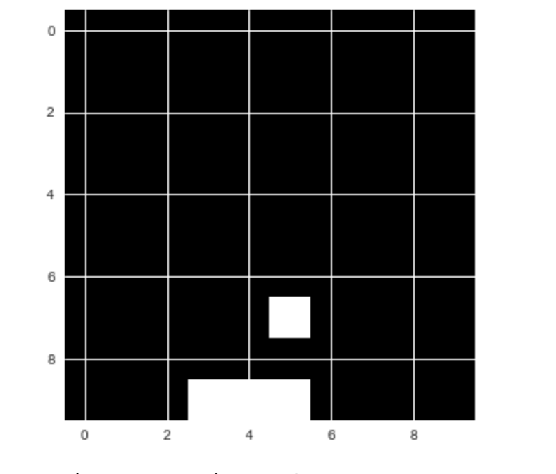

# Chapter 6

Humans do not learn with million of labeled examples. Instead, we often learn from positive or negative experiences that we associate with our actions. Children that touch the hot stove once never touch it again. Learning from experiences and associated rewards or punishments is the core idea behind reinforcement learning (RL). RL allows us to learn sophisticated decision making rules with no data at all. This approach powered several high profile breakthroughs in AI, such as AlphaGo, which beat the world Go champion in 2016.

In finance, reinforcement learning is making inroads as well. In its 2017 report "Machine learning in investment management", MAN AHL outlined a reinforcement system for order routing in the FX and futures market. Order routing is a classic problem in quantitative finance. When placing an order, funds can usually choose from different brokers and place their orders at different times. The goal is to fill the order as cheaply as possible. This also means minimizing the market impact, as large orders can lift prices of stocks. Traditional algorithms with colorful names as 'Sniper or 'Guerilla' rely on statistics from historical data and clever engineering. The RL based routing system learned an optimal routing policy by itself. The advantage is that this system can adapt to changing markets and outperforms traditional methods in data rich markets as the FX market. 

But RL can do more. Researchers at OpenAI have used RL to predict when agents will collaborate or fight. Researchers at Deepmind have used RL to yield new insights into the workings of the frontal cortex in the brain and the role of the dopamine hormone.

This chapter will start with an intuitive introduction to RL using a simple 'catch the fruit game'. We will then dive into the underlying theory and more advanced RL applications.

introduction
http://www.wildml.com/2018/02/introduction-to-learning-to-trade-with-reinforcement-learning/

MAN AHL using RL for order routing 
https://www.ahl.com/the-rise-of-machine-learning

# Catch! - A quick guide to reinforcement learning 

Catch is a very simple arcade game, which you might have played as a child. Fruits fall from the top of the screen, and the player has to catch them with a basket. For every fruit caught, the player scores a point. For every fruit lost, the player loses a point.

The goal here is to let the computer play Catch by itself. We will use a simplified version to make the task easier:



While playing Catch, the player decides between three possible actions. They can move the basket to the left, to the right, or stay put.

The basis for this decision is the current state of the game. In other words: the positions of the falling fruit and of the basket.

Our goal is to create a model, which, given the content of the game screen, chooses the action which leads to the highest score possible.

This task can be seen as a simple classification problem. We could ask expert human players to play the game many times and record their actions. Then, we could train a model to choose the ‘correct’ action that mirrors the expert players.

But this is not how humans learn. Humans can learn a game like Catch by themselves, without guidance. This is very useful. Imagine if you had to hire a bunch of experts to perform a task thousands of times every time you wanted to learn something as simple as Catch It would be expensive and slow.

In reinforcement learning, the model trains from experience, rather than labeled data.

Instead of providing the model with ‘correct’ actions, we provide it with rewards and punishments. The model receives information about the current state of the environment (e.g. the computer game screen). It then outputs an action, like a joystick movement. The environment reacts to this action and provides the next state, alongside with any rewards.

RL SCHEME IMAGE

The model then learns to find actions that lead to maximum rewards.

There are many ways this can work in practice. Here, we are going to look at Q-Learning. Q-Learning made a splash when it was used to train a computer to play Atari games. Today, it is still a relevant concept. Most modern RL algorithms are some adaptation of Q-Learning.

A good way to understand Q-learning is to compare playing Catch with playing chess.

In both games you are given a state, $S$. With chess, this is the positions of the figures on the board. In Catch, this is the location of the fruit and the basket.

The player then has to take an action, $A$. In chess, this is moving a figure. In Catch, this is to move the basket left or right, or remain in the current position.

As a result, there will be some reward $R$, and a new state $S’$.

The problem with both Catch and chess is that the rewards do not appear immediately after the action.

In Catch, you only earn rewards when the fruits hit the basket or fall on the floor, and in chess you only earn a reward when you win or lose the game. This means that rewards are sparsely distributed. Most of the time, $R$ will be zero.

When there is a reward, it is not always a result of the action taken immediately before. Some action taken long before might have caused the victory. Figuring out which action is responsible for the reward is often referred to as the credit assignment problem.

Because rewards are delayed, good chess players do not choose their plays only by the immediate reward. Instead, they choose by the expected future reward.

For example, they do not only think about whether they can eliminate an opponent’s figure in the next move. They also consider how taking a certain action now will help them in the long run.

In Q-learning, we choose our action based on the highest expected future reward. We use a “Q-function” to calculate this. This is a math function that takes two arguments: the current state of the game, and a given action.

We can write this as: $Q(state, action)$

While in state $S$, we estimate the future reward for each possible action $A$. We assume that after we have taken action $A$ and moved to the next state $S’$, everything works out perfectly.

The expected future reward $Q(S,A)$ for a given a state $S$ and action $A$ is calculated as the immediate reward $R$, plus the expected future reward thereafter $Q(S',A')$. We assume the next action $A'$ is optimal.

Because there is uncertainty about the future, we discount $Q(S’,A’)$ by the factor gamma $\gamma$. We therefore arrive at an expected reward of:

$$Q(S,A) = R + \gamma * \max Q(S’,A’)$$

Note: We discount future rewards in RL for the same reason we discount future returns in finance. They are uncertain. Our choice of $\gamma$ reflects how much we value future returns.

Good chess players are very good at estimating future rewards in their head. In other words, their Q-function $Q(S,A)$ is very precise.

Most chess practice revolves around developing a better Q-function. Players peruse many old games to learn how specific moves played out in the past, and how likely a given action is to lead to victory.

But how can a machine estimate a good Q-function? This is where neural networks come into play.

## Q-Learning turns RL into supervised learning
When playing a game, we generate lots of “experiences”. These experiences consist of:
- The initial state, $S$
- The action taken, $A$
- The reward earned, $R$
- And the state that followed, $S’$

These experiences are our training data. We can frame the problem of estimating $Q(S,A)$ as a regression problem. To solve this, we can use a neural network.

Given an input vector consisting of $S$ and $A$, the neural net is supposed to predict the value of $Q(S,A)$ equal to the target: $R + γ * max Q(S’,A’)$. If we are good at predicting $Q(S,A)$ for different states $S$ and actions $A$, we have a good approximation of the Q-function. 

Note: We estimate $Q(S’,A’)$ through the same neural net as $Q(S,A)$. This leads to some instability as our targets now change as the networks learn. Just as with GANs.

Given a batch of experiences $<S, A, R, S’>$, the training process then looks as follows:

1. For each possible action $A’$ (left, right, stay), predict the expected future reward $Q(S’,A’)$ using the neural net.

2. Choose the highest value of the three predictions as max $Q(S’,A’)$.

3. Calculate $r + γ * max Q(S’,A’)$. This is the target value for the neural net.

4. Train the neural net using a loss function. This is a function that calculates how near or far the predicted value is from the target value. Here, we will use $0.5 * (predicted_Q(S,A) — target)^2$ as the loss function.

During gameplay, all the experiences are stored in a replay memory. This acts like a simple buffer in which we store $< S, A, R, S’ >$ pairs. The experience replay class also handles preparing the data for training. Check out the code below:

```Python 
class ExperienceReplay(object): #1
    def __init__(self, max_memory=100, discount=.9):
        #2
        self.max_memory = max_memory
        self.memory = []
        self.discount = discount

    def remember(self, states, game_over): #3
        self.memory.append([states, game_over])
        if len(self.memory) > self.max_memory:
            del self.memory[0]

    def get_batch(self, model, batch_size=10): #4
        #5
        len_memory = len(self.memory)
        num_actions = model.output_shape[-1]
        env_dim = self.memory[0][0][0].shape[1]
        
        #6
        inputs = np.zeros((min(len_memory, batch_size), env_dim))
        targets = np.zeros((inputs.shape[0], num_actions))
        
        #7
        for i, idx in enumerate(np.random.randint(0, len_memory,
                                                  size=inputs.shape[0])):
            #8
            state_t, action_t, reward_t, state_tp1 = self.memory[idx][0]
            game_over = self.memory[idx][1]

            #9
            inputs[i:i+1] = state_t
            
            #10
            targets[i] = model.predict(state_t)[0]
            
            #11
            Q_sa = np.max(model.predict(state_tp1)[0])
            
            #12
            if game_over:  
                targets[i, action_t] = reward_t
            else:
                targets[i, action_t] = reward_t + self.discount * Q_sa
        return inputs, targets
```
\#1 We implement the experience replay buffer as a Python class. A replay buffer object is responsible for storing experiences and generating training data. It therefore has to implement some of the most important pieces of the Q-Learning algorithm.

\#2 To initialize a replay object we need to let it know how large its buffer should be and what the discount rate $\gamma$ is. The replay memory itself is a list of lists following the scheme 
```
[...
[experience, game_over]
[experience, game_over]
...]
```
where `experience` is a tuple holding the experience information and `game_over` is a binary boolean value indicating if the game was over after this step. 

\#3 When we want to remember a new experience, we add it to our list of experiences. Since we can not store infinite experiences, we delete the oldest experience if our buffer exceeds its maxumum length.

\#4 With the `get_batch` function we can obtain a single batch of training data. To calculate $Q(S’,A’)$, we need a neural network as well, so we need to pass a Keras model to use the function.

\#5 Before we start generating a batch, we need to know how many experiences we have stored in our replay buffer, how many possible actions there are and how many dimensions a game state has. 

\#6 Next we need to set up placeholder arrays for the inputs and targets we want to train the neural network on.

\#7 Finally, we loop over the experience replay in random order untill we have either sampled all stored experiences or filled the batch.

\#8 We load the experience data as well as the `game_over` indicator from the replay buffer.

\#9 We add the state $S$ to the input matrix. Later the model will train to map from this state to the expected reward.

\#10 Next, we fill the expected reward for all actions with the expected reward calculated by the current model. This ensures that our model only trains on the action that was actually taken since the loss for all other actions is zero.

\#11 Next we calculate $Q(S', A')$. We simply assume that for the next state $S'$ or `state_tp1` in code, the neural network will estimate the expected reward perfectly. As the network trains, this assumption slowly becomes true.

\#12 If the game ended after state $S$, the expected reward from the action $A$ should be the received reward $R$. If it did not end, then the expected reward should be the received reward as well as the discounted expected future reward.

## Defining the Q-Learning model
Now it is time to define the model that will learn a Q-function for Catch. It turns out that already a relatively simple model can learn the function well. 

We need to define the number of possible actions as well as the grid size. There are three possible actions (move left, stay, move right), and the game is being played on a 10 by 10 pixel grid.
```Python
num_actions = 3
grid_size = 10
```

As this is a regression problem, the final layer has no activation function and the loss is a mean squared error loss. We optimize the network using stochastic gradient descent without momentum or any other bells and whistles.
``` Python 
model = Sequential()
model.add(Dense(100, input_shape=(grid_size**2,), activation='relu'))
model.add(Dense(100, activation='relu'))
model.add(Dense(num_actions))
model.compile(optimizer='sgd', loss='mse')
```

## Training to play Catch 
A final ingredient to Q-Learning is exploration.

Everyday life shows that sometimes you have to do something weird and/or random to find out whether there is something better than your daily trot.

The same goes for Q-Learning. Always choosing the best option means you might miss out on some unexplored paths. To avoid this, the learner will sometimes choose a random option, and not necessarily the best.

Now we can define the training method:

```Python 
def train(model,epochs):
    #1
    win_cnt = 0

    win_hist = []

    for e in range(epochs): #2
        loss = 0.
        env.reset()
        game_over = False
        input_t = env.observe()
        
        while not game_over: #3
            #4
            input_tm1 = input_t
            
            if np.random.rand() <= epsilon: #5
                action = np.random.randint(0, num_actions, size=1)
            else:
                q = model.predict(input_tm1) #6
                action = np.argmax(q[0])

            #7
            input_t, reward, game_over = env.act(action)
            if reward == 1:
                win_cnt += 1        

            #8
            exp_replay.remember([input_tm1, action, reward, input_t],
                                game_over)    

            #9
            inputs, targets = exp_replay.get_batch(model,
                                                  batch_size=batch_size)

            batch_loss = model.train_on_batch(inputs, targets)

            loss += batch_loss
            
        win_hist.append(win_cnt)
    return win_hist
``` 
\#1 We want to keep track of the progress of our Q-Learner, so we count the wins of the model over time.

\#2 We now play for a number of games, specified by the `epoch` argument. At the beginning of a game, we first reset the game, set the `game_over` indicator to `False`, and observe the initial state of the game.

\#3 We will then be playing frame by frame until the game is over.

\#4 At the start of a frame cycle, we save the previously observed input as `input_tm1`, input at time t minus one.

\#5 Now comes the exploration part. We draw a random number between zero and one. If the number is smaller than `epsilon`, we pick a random action. This technique is also called 'epsilon-greedy' as we pick a random action with a probability of epsilon and greedily choose the action promising the highest rewards otherwise.

\#6 If we choose a non random action, we let the neural network predict the expected rewards for all actions. We then pick the action with the highest expected reward.

\#7 We now act with our chosen or random action and observe a new state, a reward and information about whether the game is over. The game gives a reward of one if we win, so we eventually have to increase our win counter.

\#8 We store the new experience in our experience replay buffer.

\#9 We then sample a new training batch from the experience replay and train on that batch.

# Markov processes and the bellman equation - A more formal introduction to RL 
http://www.ecmlpkdd2013.org/wp-content/uploads/2013/09/Multiagent-Reinforcement-Learning.pdf

# A market example
Blog post
https://hackernoon.com/the-self-learning-quant-d3329fcc9915
Code 
https://github.com/danielzak/sl-quant

https://github.com/deependersingla/deep_trader/blob/master/deep_thoughts.md

https://github.com/talolard/MarketVectors

https://launchpad.ai/blog/trading-bitcoin

# Actor Critic models

# Policy gradients

# RL + Monte Carlo Tree search = <3

# Evolutionary strategies and genetic algorithms

# Multi agent RL 
https://github.com/crazymuse/snakegame-numpy

# Many agent RL 
https://github.com/geek-ai/MAgent

# Stability in RL 
http://www.offconvex.org/2016/03/14/stability/