# Chapter 6 Generative models

Generative models generate new data. In a way, they are the exact opposite of the models we dealt with before. While an image classifier takes in a high dimensional input, the image, and outputs a low dimensional output such as the content of the image, a generative model goes exactly the other way around. It might for example draw images from the description of what is in them. So far, generative models are mostly used in image applications and they are still very experimental. Yet, there already have been several applications which caused uproar. In 2017, so called "DeepFakes" appeared on the internet. So called Generative Adversarial Models (GANs) which we will cover later in this chapter were used to generate pornographic videos featuring famous celebrities. The year before, researchers demoed a system in which they could generate videos of politicians saying anything the researcher wanted them to say, complete with realistic mouth movements and facial expressions. But there are positive applications as well. Generative models are especially useful if data is sparse. They can generate realistic data other models can train on. They can "translate" images, for example from satellite images to street maps. They can generate code from website screenshots. They can even be used to combat unfairness and discrimination in machine learning models. 

In the field of finance, data is frequently sparse. Think about the fraud case from chapter 2. There were not that many frauds in the dataset, so the model had a hard time detecting frauds. Usually, engineers would create synthetic data, by thinking about how fraud could be done. Machine learning models can do this themselves however. And in the process, they might even discover some useful features for fraud detection.

In algorithmic trading, data is frequently generated in simulators. Want to know how your algorithm would do in a global selloff? There are not that many global selloffs thankfully, so engineers at quant firms spend a lot of time creating simulations of selloffs. These simulators are often biased by the engineers experience and their feelings about what a selloff should look like. But what if models could learn what a selloff fundamentally looks like, and then create data describing an infinite amount of selloffs?

# Understanding autoencoders
Technically, autoencoders are not generative models since they can not create completely new kinds of data. Yet, variational autoencoders, a minor tweak to vanilla autonecoders, can. So it makes sense to first understand autoencoders by themselves, before adding the generative element. Autoencoders by themselves also have some interesting properties which can be exploited for applications like detecting credit card fraud. 

Given an input $x$, an autoencoder learns how to output $x$. It aims to find a function $f$ so that:

$$x = f(x)$$

This might sound trivial at first, but the trick is that autoencoders have a bottleneck. The middle hidden layer size is smaller than the size of the input $x$. Therefore, the model has to learn a compressed representation that captures all important elements of $x$ in a smaller vector. 

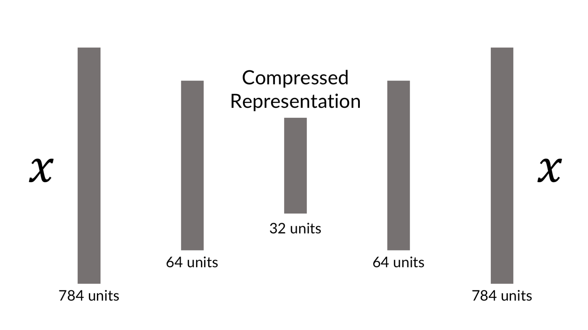
Caption: Autoencoder Scheme

This compressed representation aims to capture the 'essence' of the input. And that turns out to be useful. We might for example want to capture, what essentially distinguishes a fraudulent from a genuine transaction. Vanilla autoencoders accomplish something to standard principal component analysis (PCA): They allow us to reduce the dimensionality of our data and focus on what matters. But in contrast to PCA, autoencoders can be extended to generate more data of a certain type. They can better deal with image or video data since they can make use of the spatiality of data using convolutional layers. In this section, we will build two autoencoders. The first for hand written digits from the MNIST dataset. Generative models are easier to debug and understand for visual data because humans are intuitively good ad judging if two pictures show something similar, but less good at judging abstract data. We will then use the same autoencoder for a fraud detection task.

## Autoencoder for MNIST 
Lets start with a simple autoencoder for the MNIST dataset of hand drawn digits. An MNIST image is 28 by 28 pixels and can be flattened into a vector of 784 (equals 28 * 28) elements. We will compress this into a vector with only 32 elements by using an autoencoder.

You can find the code for the MNIST autoencoder and variational autoencoder under the following URL:
https://www.kaggle.com/jannesklaas/mnist-autoencoder-vae

We set the encoding dimensionality hyperparameter now so we can use it later:

```Python 
encoding_dim = 32 
```

We construct the autoecoder using Keras functional API. While a simple autencoder could be constructed using the sequential API, it is a good refresher on how the functional API works.

First, we import the `Model` class that allows us to create functional API models. We also need to import `Input` and `Dense` layers. Remember that the functional API needs a separate input layer while the sequential API does not need one.
```Python 
from keras.models import Model
from keras.layers import Input, Dense
```

Now we are chaining up the autoencoder's layers: An `Input` layer, followed by a `Dense` layer which encodes the image to a smaller representation. This is followed by a decoding `Dense` layer which aims to reconstruct the original image.
```Python 
input_img = Input(shape=(784,))

encoded = Dense(encoding_dim, activation='relu')(input_img)

decoded = Dense(784, activation='sigmoid')(encoded)
``` 

After we have created and chained up the layers, we create a model which maps from the input to the decoded image.

```Python 
autoencoder = Model(input_img, decoded)
``` 

To get a better idea of what is going on, we can plot a visualization of the resulting autoencoder model. As of writing this code snippet will not work in Kaggle, but future versions of the Kaggle Kernels editor might change this

```Python 
from keras.utils import plot_model
plot_model(autoencoder, to_file='model.png', show_shapes=True)
```

This is our autencoder:

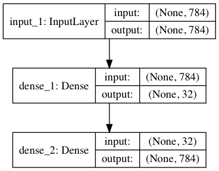

```Python 
autoencoder.compile(optimizer='adadelta', loss='binary_crossentropy')
```
Caption: A simple autoencoder for MNIST

To train this autoencoder, we use the X values as input and output:
```Python 
autoencoder.fit(X_train_flat, X_train_flat,
                epochs=50,
                batch_size=256,
                shuffle=True,
                validation_data=(X_test_flat, X_test_flat))
```
After we train this autoencoder, we can visually inspect how well it is doing. We first extract a single image from the test set. We need to add a batch dimension to this image to run it through the model, which is what we use `np.expand_dims` for. 

```Python 
original = np.expand_dims(X_test_flat[0],0)
```
Now, we run the original image through the autoencoder. The original image shows a seven, so we should hope that the output of our autoencoder shows a seven as well:
```Python 
seven = autoencoder.predict(original)
```

We now reshape both the autoencoder output as well as the original image back into 28 by 28 pixel images.
```Python 
seven = seven.reshape(1,28,28)
original = original.reshape(1,28,28)
```

We plot the original and reconstructed image next to each other. `matplotlib` does not allow the image to have a batch dimension, so we need to pass an array without it. By indexing the images with `[0,:,:]` we pass only the first item in the batch with all pixels. This first item has no batch dimension anymore.
```Python 
fig = plt.figure(figsize=(7, 10))
a=fig.add_subplot(1,2,1)
a.set_title('Original')
imgplot = plt.imshow(original[0,:,:])

b=fig.add_subplot(1,2,2)
b.set_title('Autoencoder')
imgplot = plt.imshow(seven[0,:,:])
```

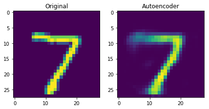

As you can see, the reconstructed seven is still a seven, so the autoencoder did manage to capture the general idea of what a seven is. It is a bit blurry around the edges, especially in the top left. It seems as the autoencoder is unsure about the length of the dashes, but it has a strongly encoded representation that there are two dashes for a seven and the general direction they follow. 

An autoencoder like this basically performs principal component analysis (PCA). It learns which components matter most for a seven to be a seven. Being able to learn this representation is useful not only for images. In credit card fraud detection for example, such principal components make for good features another classifier can work with. In the next section we will apply an autoencoder to the credit card fraud problem.

## Auto encoder for credit cards

In this section, we will once again deal with the problem of credit card fraud. This time, we will use a slightly different dataset from that in chapter 1. The new dataset contains records of actual credit card transactions with anonymized features. The dataset does not lend itself to much feature engineering. We will have to rely on end to end learning methods to build a good fraud detector. 

You can find the dataset under the following URL:
https://www.kaggle.com/mlg-ulb/creditcardfraud

And the notebook with an implementation of an autoencoder and variational autoencoder under this URL:
https://www.kaggle.com/jannesklaas/credit-vae

As usual, we first load the data. The time feature shows the absolute time of the transaction which makes it a bit hard to deal with here. So we will just drop it.
```Python 
df = pd.read_csv('../input/creditcard.csv')
df = df.drop('Time',axis=1)
``` 

We separate the X data on the tansaction from the classification of the transaction and extract the numpy array that underlies the pandas dataframe.

```Python
X = df.drop('Class',axis=1).values 
y = df['Class'].values
```

Now we need to scale the features. Feature scaling makes it easier for our model to learn a good representation of the data. This time around, we employ a slightly different method of feature scaling than before: We scale all features to be in between zero and one, as opposed to having mean zero and a standard deviation of one. This ensures that there are no very high or very low values in the dataset. But beware, that this method is susceptible to outliers influencing the result. For each column, we first subtract the minimum value, so that the new minimum value becomes zero. We then divide by the maximum value so that the new maximum value becomes one. By specifying `axis=0` we perform the scaling column wise.

```Python 
X -= X.min(axis=0)
X /= X.max(axis=0)
```

Finally, we split our data:
```Python
from sklearn.model_selection import train_test_split
X_train, X_test, y_train,y_test = train_test_split(X,y,test_size=0.1)
```

We we create the exact same autoencoder as we did before, just with different dimensions. Our input now has 29 dimensions, which we compress down to 12 dimensions before aiming to restore the original 29 dimensional output.
```Python 
from keras.models import Model
from keras.layers import Input, Dense
```

You will notice that we are using the sigmoid activation function in the end. This is only possible because we scaled the data to have values between zero and one. We are also using a tanh activation of the encoded layer. This is just a style choice that worked well in experiements and ensures that encoded values are all between minus one and one. You might use different activations functions depending on your need. If you are working with images or deeper networks, a relu activation is usually a good choice. If you are working with a more shallow network as we are doing here, a tanh activation often works well.
```Python 
data_in = Input(shape=(29,))
encoded = Dense(12,activation='tanh')(data_in)
decoded = Dense(29,activation='sigmoid')(encoded)
autoencoder = Model(data_in,decoded)
```

We use a mean squared error loss. This is a bit of an unusual choice at first, using a sigmoid activation with a mean squared error loss, yet it makes sense. Most people think that sigmoid activations have to be used with a crossentropy loss. But crossentropy loss encourages values to be either zero or one and works well for classification tasks where this is the case. But in our credit card example, most values will be around 0.5. Mean squared error is better at dealing with values where the target is not binary, but on a spectrum.
```Python
autoencoder.compile(optimizer='adam',loss='mean_squared_error')
```

After training, the autoencoder converges to a low loss. 
```Python
autoencoder.fit(X_train,
                X_train,
                epochs = 20, 
                batch_size=128, 
                validation_data=(X_test,X_test))
```

The reconstruction loss is low, but how do we know if our autoecoder is doing good? Once again, visual inspection to the rescue. Humans are very good at judging things visually, but not very good at judging abstract numbers. 

We will first make some predictions, in which we run a subset of our test set through the autoencoder. 
```Python 
pred = autoencoder.predict(X_test[0:10])
```

We can then plot indivdual samples. The code below produces an overlaid barchart comparing the original transaction data with the reconstructed transaction data.
```Python 
import matplotlib.pyplot as plt
import numpy as np

width = 0.8

prediction   = pred[9]
true_value    = X_test[9]

indices = np.arange(len(prediction))

fig = plt.figure(figsize=(10,7))

plt.bar(indices, prediction, width=width, 
        color='b', label='Predicted Value')

plt.bar([i+0.25*width for i in indices], true_value, 
        width=0.5*width, color='r', alpha=0.5, label='True Value')

plt.xticks(indices+width/2., 
           ['V{}'.format(i) for i in range(len(prediction))] )

plt.legend()

plt.show()
```

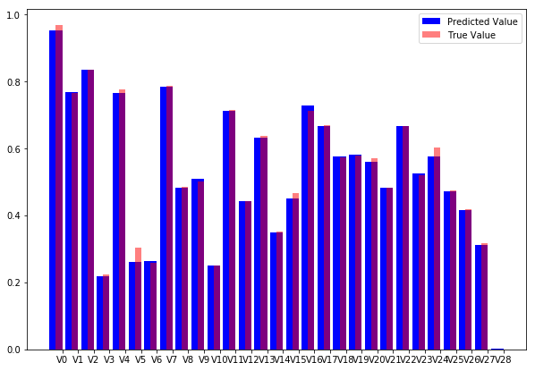

Caption: Autoncoder reconstruction vs original data.

As you can see, our model does a fine job at reconstructing the original values. The visual inspection gives more insight than the abstract number.

# Visualizing latent spaces with t-SNE 
We now have a neural network that takes in a credit card transaction, and outputs a credit card transaction that looks more or less the same. But that is of course not why we built the autoecoder. The main advantage of an autoencoder is that we can now encode the transaction into a lower dimensional representation which captures the main elements of the transaction. To create the encoder model, all we have to do is to define a new Keras model, that maps from the input to the encoded state: 

```Python 
encoder = Model(data_in,encoded)
```

Note that you don't need to train this model again. The layers keep the weights from the autoencoder which we have trained before. 

To encode our data, we now use the encoder model:

```Python 
enc = encoder.predict(X_test)
```

But how would we know if these encodings contain any meaningful information about fraud? Once again, visual representation is key. While our encodings are lower dimensional than the input data, they still have twelve dimensions. It is impossible for humans to think about twelve dimensional space, so we need to draw our encodings in a lower dimensional space while still preserving the characteristics we care about. 

In our case, the characteristic we care about is _proximity_. We want points that are close to each other in the twelve dimensional space to be close to each other in the two dimensional plot. More precisely, we care about neighborhood, we want that the points that are closest to each other in the high dimensional space are also closest to each other in the low dimensional space. 

Preserving neighborhood is relevant because we want to find clusters of fraud. If we find that fraudulent transactions form a cluster in our high dimensional encodings, we can use a simple check for if a new transaction falls into the fraud cluster to flag a transaction as fraudulent. 

A popular method to project high dimensional data into low dimensional plots while preserving neighborhoods is called t-distributed stochastic neighbor embedding, or t-SNE. 

In a nutshell, t-SNE aims to faithfully represent the probability that two points are neighbors in a random sample of all points. That is, it tries to find a low dimensional representation of the data in which points in a random sample have the same probability of being closest neighbors than in the high dimensional data. 


Caption: How t-SNE measures similarity

The t-SNE algorithm follows these steps:
1. Calculate the _gaussian similarity_ between all points. This is done by calculating the euclidean (spatial) distance between points and the calculate the value of a gaussian curve at that distance, see graphic. The gaussian similarity for all points $j$ from point $i$ can be calculated as:

$$p_{i|j} = \frac{exp(-||x_i-x_j||^2/2\sigma^2_i)}
{\sum_{k \neq i} exp(-||x_i-x_k||^2/2\sigma^2_i)}$$

Where $\sigma_i$ is the variance of the gaussian distribution. We will look at how to determine this variance later. Note that since the similarity between points $i$ and $j$ is scaled by the sum of distances between $i$ and all other points (expressed as $k$), the similarity between $i$ and $j$ ,$p_{i|j}$, can be different than the similarity between $j$ and $i$, $p_{j|i}$. Therefore, we average the two similarities to gain the final similarity which we work with going forward:

$$p_{ij} = \frac{p_{i|j} + p_{j,i}}{2n}$$

Where n is the number of datapoints.

2. Randomly position the data points in the lower dimensional space.

3. Calculate the _t-similarity_ between all points in the lower dimensional space. 

$$q_{ij} = \frac{(1+||y_i - y_j||^2)^{-1}}
{\sum_{k \neq l}(1+||y_k - y_l||^2)^{-1}}$$

4. Just like in training neural networks, we will optimize the positions of the data points in the lower dimensional space by following the gradient of a loss function. The loss function in this case is the Kullback–Leibler (KL) divergence between the similarities in the higher and lower dimensional space. We will give the KL divergence a closer look in the section on variational autoencoders. For now, just think of it as a way to measure the difference between two distributions. The derivative of the loss function with respect to the position $y_i$ of a datapoint $i$ in the lower dimensional space is:

$$\frac{d L}{dy_i} = 4 \sum{(p_{ij} − q_{ij})(y_i − y_j)}
(1 + ||y_i − y_j||^2)^{-1}$$


5. Adjust the data points in the lower dimensional space by using gradient descent. Moving points that were close in the high dimensional data closer together and moving points that were further away further from each other.

$$y^{(t)} = y^{(t-1)} + \frac{d L}{dy} + \alpha(t) (y^{(t-1)} - y^{(t-2)})$$

You will recognize this as a form of gradient descent with momentum, as the previous gradient is incorporated into the position update.

The t-distribution used always has one degree of freedom. The choice of one degree of freedom leads to a simpler formula as well as some nice numerical properties that lead to faster computation and more useful charts.

 The standard deviation of the gaussian distribution can be influenced by the user with a _perplexity_ hyperparameter. Perplexity can be interpreted as the number of neighbors we expect a point to have. A low perplexity value emphasizes local proximities while a large perplexity value emphasizes global perplexity values. Mathematically, perplexity can be calculated as 
 
 $$Perp(P_i) = 2^{H(P_i)}$$

Where $P_i$ is a probability distribution over the position of all data points in the dataset and $H(P_i)$ is the Shanon entropy of this distribution calculated as: 
$$H(P_i) = - \sum{p_{j|i} log_2 p_{j|i}}$$

While the details of this formula are not very relevant to using t-SNE, it is important to know that t-SNE performs a search over values of the standard deviation $\sigma$ so that it finds a global distribution $P_i$ for which the entropy over our data is our desired perplexity. In other words, you need to specify the perplexity by hand, but what that perplexity means for your dataset also depends on the dataset. 

Van Maarten and Hinton, the inventors of t-SNE, report that the algorithm is relatively robust to choices of perplexity between five and 50. The default value in most libraries is 30, which is a fine value for most datasets. If you find that your visualizations are not satisfactory, tuning the perplexity value is probably the first thing you want to do.

For all the math involved, using t-SNE is suprisingly simple. Scikit Learn has a handy t-SNE implementation which we can use just like any algorithm in scikit. We first import the `TSNE` class. Then we create a new `TSNE` instance. We define that we want to train for 5000 epochs, use the default perplexity of 30 and the default learning rate of 200. We also specify that we would like output during the training process. We then just call `fit_transform` which transforms our twelve dimensional encodings into two dimensional projections.

```Python 
from sklearn.manifold import TSNE
tsne = TSNE(verbose=1,n_iter=5000)
res = tsne.fit_transform(enc)
```

As a word of warning, t-SNE is quite slow as it needs to compute the distances between all the points. By default, sklearn uses a faster version of t-SNE called Barnes Hut approximation, which is not as precise but significantly faster already. 

There is a faster python implementation of t-SNE which can be used as a drop in replacement of sklearn's implementation. It is not as well documented however and has fewer features. You can find the faster implementation with installation instructions under the following URL:
https://github.com/DmitryUlyanov/Multicore-TSNE 

We can plot our t-SNE results as a scatter plot. For illustration, we will distinguish frauds from non frauds by color, with frauds being plotted in red and non frauds being plotted in blue. Since the actual values of t-SNE do not matter as much we will hide the axis.
```Python 
fig = plt.figure(figsize=(10,7))
scatter =plt.scatter(res[:,0],res[:,1],c=y_test, cmap='coolwarm', s=0.6)
scatter.axes.get_xaxis().set_visible(False)
scatter.axes.get_yaxis().set_visible(False)
```

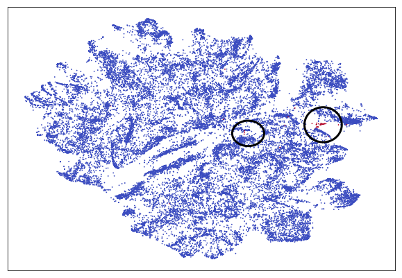

For easier spotting the cluster containing most frauds is marked with a circle. You can see that the frauds nicely separate from the rest of the transactions. Clearly, our autoencoder has found a way to distinguish frauds from genuine transaction without being given labels. This is a form of unsupervised learning. In fact, plain autoencoders perform an approximation of PCA, which is useful for unsupervised learning. In the chart you can see a few more clusters which are clearly separate from the other transactions but which are not frauds. Using autoencoders and unsupervised learning it is possible to separate and group our data in ways we did not even think about as much before. For example we might be able to cluster transactions by purchase type.

Using our autoencoder, we could now use the encoded information as features for a classifier. But even better, with only a slight modification of the autoencoder, we can generate more data that has the underlying properties of a fraud case while having different features. This is done with a variational autoencoder which we will look at in the next section.

# Variational Autoencoders
Autoencoders are basically an approximation for PCA. However, they can be extended to become generative models. Given an input, variational autoencoders (VAEs) can create encoding _distributions_. This means, that for a fraud case, the encoder would produce a distribution of possible encodings which all represent the most important characteristics of the transaction so that the decoder could turn all encodings back into the original transaction. This is useful, since it allows us to generate data about transactions. One 'problem' of fraud detection is that there are not all that many fraudulent transactions. Using a variational autoencoder, we can sample any amount of transaction encodings and train our classifier with more fraud transaction data.

How do VAEs do it? Instead of having just one compressed representation vector, a VAE has two: One for the mean encoding $\mu$ and one for the standard deviation of this encoding $\sigma$.

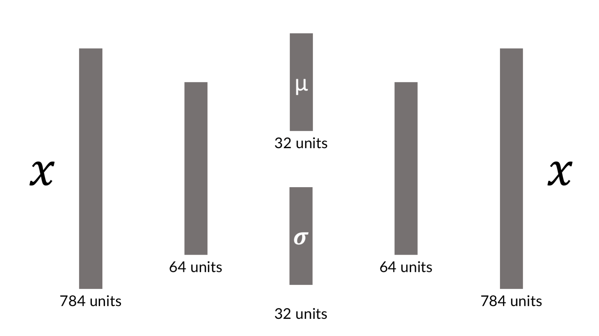

Both mean and standard deviation are vectors just like the encoding vector we used for the vanilla autoencoder. However, to create the actual encoding we then sample by adding random noise with the standard deviation $\sigma$ to our encoding vector. 

To achieve a broad distribution of values, our network trains with a combination of two losses: The reconstruction loss you know from the vanilla autoencoder as well as a KL divergence loss between the encoding distribution and a standard gaussian distribution with a standard deviation of one.

## KL Divergence 
Kullback–Leibler divergence, or KL divergence for short, is one of the metrics machine learning inherited from information theory, just like crossentropy. It is used frequently but many struggle understanding it. 

KL divergence measures how much information is lost when a distribution $p$ is approximated with a distribution $q$.

Imagine you were working on some financial model and have collected data on returns of a security. Your financial modeling tools all assume a normal distribution of returns. The chart below shows the actual distribution of returns versus an approximation using a normal distribution. For the sake of this example, lets assume there are only discrete returns. We will cover continuous distributions later.

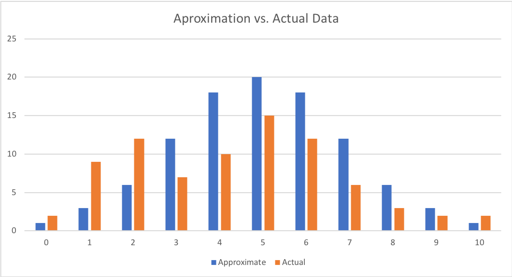

Of course the returns in your data are not exactly normally distributed. But just how much information about returns would you loose if you did loose the approximation?

This is exactly what KL divergence is measuring. 

$$D_{KL}(p||q) = \sum_{i=1}^Np(x_i) \cdot (log\ p(x_i) - log\ q(x_i))$$

Where $p(x_i)$ and $q(x_i)$ are the probabilities that $x$, in this case the return, has some value $i$, say 5%. The formula above effectively expresses the expected difference in the logarithm of probabilities of the distribution $p$ and $q$.

$$D_{KL} = E[log\ p(x) - log\ q(x)]$$

This expected difference of log probabilities is the same as the average information lost if you approximate distribution $p$ with distribution $q$.

Since 
$$log\ a - log\ b = log\frac{a}{b}$$

KL divergence is usually written out as 

$$D_{KL}(p||q) = \sum_{i=1}^N p(x_i) \cdot log\ \frac{ p(x_i)}{q(x_i)}$$

Or in its continuous form as

$$D_{KL}(p||q) = 
\int_{-\infty}^{\infty} p(x_i) \cdot log\ \frac{ p(x_i)}{q(x_i)}$$

For variational autoencoders, we want the distribution of encodings to be a normal gaussian distribution with mean zero and a standard deviation of one.

When $p$ is substituted with the normal gaussian distribution $\mathcal{N}(0,1)$, and the approximation $q$ is a normal distribution with mean $\mu$ and standard deviation $\sigma$, $\mathcal{N}(\mu,\sigma)$, the KL divergence simplifies to

$$D_{KL} = -0.5 * (1+ log(\sigma) - \mu^2 - \sigma)$$

The partial derivatives to our mean and standard deviation vectors are therefore:

$$\frac{dD_{KL}}{d\mu} = \mu$$

and

$$\frac{dD_{KL}}{d\sigma} = -0.5 * \frac{(\sigma - 1)}{\sigma}$$


You can see that the derivative with respect to $\mu$ is zero if $\mu$ is zero and the derivative with respect to $\sigma$ is zero if $\sigma$ is one. This loss term is added to the reconstruction loss.

## MNIST Example 
Now on to our first VAE. This VAE will work with the MNIST dataset, which makes it easier to form an intuition about how VAEs work. In the next section we will build the same VAE for credit card fraud detection.

First we need to do some imports:
```Python
from keras.models import Model

from keras.layers import Input, Dense, Lambda
from keras import backend as K
from keras import metrics
```

Notice two new imports: The `Lamba` layer and the `metrics` module. The `metrics` module provides metrics, like the crossentropy loss which we will use to build our custom loss function. The `Lambda` layer allows us to use Python functions as layers, which we will use to sample from the encoding distribution. We will see just how the `Lambda` layer works in a bit, but first we need to set up the rest of the neural network.


First we define a few hyperparameters. Our data has an original dimensionality of 784, which we compress into a latent vector with 32 dimensions. Our network has an intermediate layer between the input and latent vector which has 256 dimensions. We will train for 50 epochs with a batch size of 100. 
```Python 
batch_size = 100
original_dim = 784
latent_dim = 32
intermediate_dim = 256
epochs = 50
``` 

For computational reasons, it is easier to learn the log of the standard deviation rather than the standard deviation itself. We create the first half of our network in which the input `x` maps to the intermediate layer `h`. From this layer our network splits into `z_mean` which expresses $\mu$ and `z_log_var` which expresses $log\ \sigma$.

```Python 
x = Input(shape=(original_dim,))
h = Dense(intermediate_dim, activation='relu')(x)
z_mean = Dense(latent_dim)(h)
z_log_var = Dense(latent_dim)(h)
```

## Using the Lambda layer 
The `Lambda` layer wraps an arbitrary expression, speak python function, as a Keras layer. Yet there are a few requirements. For backpropagation to work, the function needs to be differentiable. After all, we want to update the network weights by the gradient of the loss. Luckily, Keras comes with a number of functions in its `backend` module which are all differentiable. Simple python math, such as `y = x + 4` is fine as well. 

Additionally, a `Lambda` function can take only one input argument. If the layer we want to create, the input is just the previous layer's output tensor. In this case, we want to create a layer with two inputs, $\mu$ and $\sigma$. So we will wrap both into a tuple which we can then take apart. Below you can see the function for sampling.

```Python 
def sampling(args):
    z_mean, z_log_var = args #1
    epsilon = K.random_normal(shape=(K.shape(z_mean)[0], latent_dim), 
                              mean=0.,
                              stddev=1.0) #2
    return z_mean + K.exp(z_log_var / 2) * epsilon #3
```

\#1 We take apart the input tuple and have our two input tensors.
\#2 We create a tensor containing random, normally distributed noise with a mean of zero and a standard deviation of one. The tensor has the shape as our input tensors (batch_size, latent_dim).
\#4 Finally, we multiply the random noise with our standard deviation to give it the learned standard deviation and add the learned mean. Since we are learning the log standard deviation, we have to apply the exponent function to our learned tensor. 

All these operations are differentiable since we are using Keras backend functions. Now we can turn this function into a layer and connect it to the previous two layers with one line:

```Python 
z = Lambda(sampling)([z_mean, z_log_var])
```

And voila, we got a custom layer which samples from a normal distribution described by two tensors. Keras can automatically backpropagate through this layer and train the weights of the layers before it.

Now that we have encoded our data, we need to decode it as well. We do this with two `Dense` layers.
```Python 
decoder_h = Dense(intermediate_dim, activation='relu')(z)

x_decoded = Dense(original_dim, activation='sigmoid')decoder_mean(h_decoded)
```
Our network is now complete. It encodes any MNIST image into a mean and a standard deviation tensor from which the decoding part then reconstructs the image. The only thing missing is the custom loss incentivising the network to both reconstruct images and produce a normal gaussian distribution in its encodings.

## Creating a custom loss 
The VAE loss is a combination of two losses: A reconstruction loss incentivizing the model to reconstruct its input well, and a KL divergence loss, incentivizing the model to approximate a normal gaussian distribution with its encodings. To create this combined loss, we have to calculate the two loss components separately first before combining them.

The reconstruction loss is the same loss that we applied for the vanilla autoencoder. Binary crossentropy is an appropriate loss for MNIST reconstruction. Since Keras implementation of a binary crossentropy loss already takes the mean across the batch, an operation we only want to do later, we have to scale the loss back up, so we devide it by the output dimensionality.
```Python 
reconstruction_loss = original_dim * metrics.binary_crossentropy(x, x_decoded)
```

The KL divergence loss is the simplified versions od KL divergence discussed in the section on KL divergence:
$$D_{KL} = -0.5 * (1+ log(\sigma) - \mu^2 - \sigma)$$

Expressed in Python:
```Python 
kl_loss = - 0.5 * K.sum(1 + z_log_var - K.square(z_mean) 
                                      - K.exp(z_log_var), axis=-1)     
```

Our final loss is then the mean of the sum of the reconstruction loss and KL divergence loss. 
```Python 
vae_loss = K.mean(reconstruction_loss + kl_loss)
```

Since we have used Keras backend for all calculations, the resulting loss is a tensor which can be automatically differentiated. 

Now we create our model like usual:

```Python 
vae = Model(x, x_decoded)
```

Since we use a custom loss, we have the loss separately, and can't just add it in the compile statement:
```Python 
vae.add_loss(vae_loss)
```
Now we compile the model. Since our model already has a loss, we only have to specify the optimizer. 
```Python 
vae.compile(optimizer='rmsprop')
```

Another side effect of the custom loss is that it compares the output of the VAE with the _input_ of the VAE, which makes sense as we want to reconstruct the input. Therefore we do not have to specify y values, only specifying an input is enough.
```Python 
vae.fit(X_train_flat,
        shuffle=True,
        epochs=epochs,
        batch_size=batch_size,
        validation_data=(X_test_flat, None))
```

## Using a VAE to generate data 
So we got our autoencoder, how do we generate more data? We take an input, say a picture of a seven, and run it through the autoencoder multiple times. Since the autoencoder is randomly sampling from a distribution, the output will be slightly different at each run.

From our test data, we take a seven.
```Python 
one_seven = X_test_flat[0]
```

We add a batch dimension and repeat the seven across the batch four times. Now we have a batch of four, identical sevens.
```Python 
one_seven = np.expand_dims(one_seven,0)
one_seven = one_seven.repeat(4,axis=0)
```

We make a prediction on that batch. We get back the reconstructed sevens.
```Python 
s = vae.predict(one_seven)
```

We now reshape all the sevens back into image form.
```Python 
s= s.reshape(4,28,28)
```

And now we plot them:
```Python 
fig=plt.figure(figsize=(8, 8))
columns = 2
rows = 2
for i in range(1, columns*rows +1):
    img = s[i-1]
    fig.add_subplot(rows, columns, i)
    plt.imshow(img)
plt.show()
```

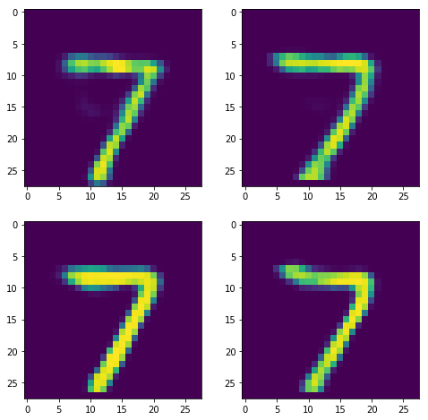

As you can see, all images show a seven. They look quite similar, but if you look closely you see there are distinct differences. The seven on the top left has a less pronounced stroke than the seven on the bottom left. The seven on the bottom right has a sight bow at the end. 

The VAE has created new data. Using this data for more training is not as good as using completely new real world data, but it is still very useful. While generative models like this one are nice for eye candy, we will now discuss how this technique can be used for credit card fraud detection.

## VAEs for end to end fraud detection
To transfer the VAE from an MNIST example to a real fraud detection problem, all we have to do is change a three hyperparameters: Input, intermediate and latent dimensionality of the credit card VAE are smaller than for the MNIST VAE. The rest stays the same.

```Python 
original_dim = 29
latent_dim = 6
intermediate_dim = 16
```
The visualization below shows the resulting VAE including input and output shapes:
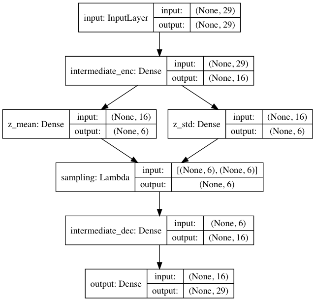
Caption: Overview of the credit VAE 

Armed with a VAE that can encode and generate credit card data, we can tackle the task of end to end fraud detection. More specifically, we are using the encoding part of the autoecoder as a feature extractor as well as a method to give us more data, where we need it. How exactly that works will be covered in the section on active learning. For now, let's take a little detour and look at how (variational) autoencoders work for time series.

# (Variational) autoencoders for time series
This section covers the how and why of time series (V)AEs, and gives a couple of examples where they have been used. Time series are such a big topic in finance that this book has a whole chapter about them. Autoencoders have found applications in connection to time series as they can encode a long time series in a single, descriptive vector. This vector can then for example be used to efficiently compare a time series to another time series, based on specific, and complex patterns that can not be captured with a simple correlation for instance. 

Consider the 2010 'Flash Crash'. On May 6 2010, starting at 2:32, US markets saw a major loss of value. The Dow Jones Industrial Average lost about 9%, a trillion dollars of value were wiped out in a couple of minutes. 36 minutes later the crash was over, most lost value was regained and people started wondering what on earth just happened. 

Five years later, a man named Navinder Singh Sarao was arrested for having in part caused the flash crash and having made $40 million in the process. Sarao engaged in a practice called 'spoofing' in which he used an automated bot which would place large sell orders which could not be filled in the market but would drive the price down. The bot would leave the orders in the order books of the stock exchange for only a short time before canceling them. In the meanwhile, Sarao would buy the stock at lower prices and profit of the stocks rebounding after the canceled sales orders. 

While Sarao was certainly not the only one responsible for the flash crash, practices like spoofing are now illegal and exchanges have to monitor and flag it. (If you dig back into old blog posts about high-frequency trading you will find that some traders working at large firms openly recommend spoofing or front running large orders, but that is a story for another time).

How would we detect someone engages in spoofing? One way is to use an autoencoder. Using large amounts of order book information, we can train an autoencoder to reconstruct 'normal' trading behavior. For traders whose trading patterns deviate a lot from normal trading, the reconstruction loss of the trained autoencoder for the transaction will be quite high. 

Another option is to train the autonecoder on different kinds of patterns (illegal or not) and then cluster patterns in the latent space, just as we did for the credit card transactions.

Recurrent neural networks by default take in a time series and output a single vector. They can also output sequences, if Keras `return_sequences` argument is set to `True`. Using recurrent neural networks such as `LSTM`'s, building an autoencoder for time series can be done as follows.

```Python 
from keras.models import Sequential
from keras.layers import LSTM, RepeatVector

model = Sequential() #1
model.add(LSTM(latent_dim, input_shape=(maxlen, nb_features))) #2
model.add(RepeatVector(maxlen)) #3
model.add(LSTM(nb_features, return_sequences=True)) #4
```

\#1 A simple autoencoder can be built using the `Sequential` API. 

\#2 We first feed our sequence length `maxlen` and with the number of features equal to `nb_features` into an `LSTM`. The `LSTM` will return only its last output, a single vector of dimension `latent_dim`. This vector is the encoding of our sequence. 

\#3 To decode the vector, we need to repeat it over the length of the time series. This is done by the `RepeatVector` layer.

\#4 Now we feed the sequence of repeated encodings into a decoding LSTM which this time returns the full sequence.

Variational autoencoders also find their way into trading. They can be used to augment backtesting by generating new, unseen data for testing. They can also be used to generate data about contracts where data is missing. But most interesting, they can be used to learn about the driving variables in limit order book markets for instance. 

It is reasonable to assume that just because two market days look a bit different, the same forces might be at work. Mathematically, we can assume that market data $\{x_k\}$ is sampled from a probability distribution $p(x)$ with a small number of latent variables $h$. Using an autoencoder, we can then approximate $p(h|x)$, the distribution of $h$ given $x$. This will allow us to analyze the driving forces $h$ in a market. 

This solves the problem that a standard maximum likehood model for this kind of problem is computationally intractable. Two other methods performing the same feat are e.g. Markov Chain Monte Carlo or Hamilton Monte Carlo methods. While both will not be covered in this book, it is worthwile to understand that variational autoencoders address longstanding problems in mathematical finance in a computationally tractable way.

But generative models can also be used to solve problems beyond the scope of traditional methods. The financial markets are fundamentally adversarial environments in which investors are trying to achieve something which is impossible in aggregate: Above average returns. Knowing that a company is doing well is not enough, if everyone knows the company does well, the stock price will be high and returns will be low. The key is to know the company is doing well while everyone else believes it is doing poorly. Markets are a zero-sum game theoretic environment. Generative adversarial networks (GANs), make use of these dynamics to generate realistic data.

# GANs 
Intuitively, GANs work a lot like an art forger and a museum curator. Every day, the art forger tries to sell some fake art to the museum. And every day the curator tries to distinguish if a certain piece is real and fake. The forger learns from his failures. By trying to fool the curator and observing success and failure, he becomes a better forger. But the curator learns too. By trying to stay ahead of the forger, she becomes a better curator. As time passes, the forgeries become better and the distinguishing process as well. After years of battle, the art forger is an expert that can draw just as well as Picasso and the curator is an expert that can distinguish a real painting by tiny details. 

Technically, a GAN consists of two neural networks:
- A _generator_ which produces data from a random latent vector
- A _discriminator_ which classifies data as 'real', that is stemming from the training set, or 'fake', that is stemming from the generator.

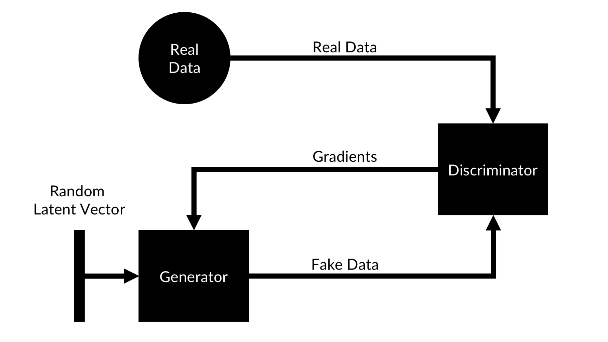

Once again, generative models are easier to understand when images are generated, so in this section we will refer to the data generated as images, although it could be all kinds of data.

The training process for a GAN works as follows:
1. A latent vector containing random numbers is created.
2. The latent vector is fed into the _generator_ which produces an image. 
3. A set of fake images from the generator is mixed with a set of real images from the training set. The discriminator is trained on binary classification of real and fake data.
4. After the discriminator was trained for a bit, we feed in the fake images again. This time, we set the label of the fake images to 'real'. We backpropagate through the discriminator, and obtain the loss gradient with respect to the _input_ of the discriminator. We do _not_ update the weights of the discriminator based on this information.
5. We now have gradients describing how we would have to change our fake image so that the discriminator would classify it as a real image. We use these gradients to backpropagate and train the _generator_.
6. With our new and improved generator, we once again create fake images, which get mixed with real images to train the discriminator and whose gradients are used to train the generator again.

Note: GAN training has a lot of similarities to the visualization of the network layers in chapter 3. Only that this time we do not just create one image that maximizes an activation function but we create a generative network that specializes in maximizing the activation function of another network. 

Mathematically, generator $G$ and discriminator $D$ play a mini-max two player game with the value function $V(G,D)$

$$
\min_G \ \max_D V(G,D) = 
\mathbb{E}_{x\sim p_{data}(x)} 
[\log \ D(x)] + 
\mathbb{E}_{z\sim p_{z}(z)}
[\log (1-D(G(z)))]
$$

Where $x$ is an item drawn from the distribution of real data $p_{data}$ and $z$ is a latent vector dawn from the latent vector space $p_z$. 

The output distribution of the generator is noted as $p_g$. It can be shown, that the global optimum of this game is $p_g = p_{data}$, that is, if the distribution of generated data is equal to the distribution of actual data. For a formal proof, see the original paper by Goodfellow et al. (2014).

GANs get optimized following a game theoretic value function. Solving this type of optimization problem with deep learning is an active area of research, and an area we will visit again in chapter 7 for reinforcement learning. The fact that deep learning can be used to solve mini max games is exciting news for the field of finance and economics, which features many of such problems.

## An MNIST GAN

Without much further ado, lets implement a GAN to generate MNIST characters. Before we start, we need to do some imports.

GANs are large models, in this section you will see how to combine `Sequential` and functional API models for easy model building.
```Python 
from keras.models import Model, Sequential
```

We will use a few new layer types:
```Python 
from keras.layers import Input, Dense, Dropout, Flatten
from keras.layers import LeakyReLU, Reshape
from keras.layers import Conv2D, UpSampling2D
```
- `LeakyReLU` is just like `ReLu`, except that the activation allows for small negative values. This prevents the gradient from becoming zero. This activation function works well for GANs, we will discuss the reasons for it in the next section.
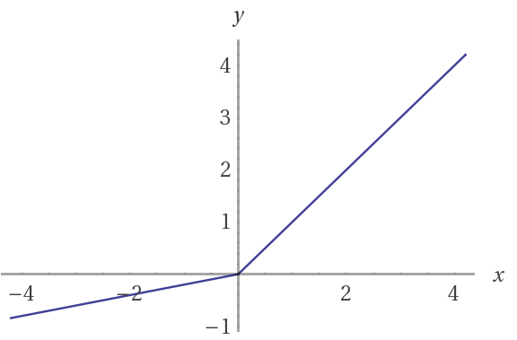

- Keras `Reshape` layer does the same as `np.reshape`: it brings a tensor into a new form.

- `UpSampling2D` scales a 2D feature map up, e.g. by a factor of 2, by repeating all numbers in the feature map. 

We will use an `Adam` optimizer as we often do.
```Python
from keras.optimizers import Adam
```

Neural network layers get initialized randomly. Usually, the random numbers are drawn from a distribution that supports learning well. For GANs it turns out a normal gaussian distribution is better. 
```Python 
from keras.initializers import RandomNormal
```

Now we build the generator model:
```Python 
generator = Sequential() #1 

generator.add(Dense(128*7*7, 
                    input_dim=latent_dim, 
                    kernel_initializer=RandomNormal(stddev=0.02))) #2

generator.add(LeakyReLU(0.2)) #3
generator.add(Reshape((128, 7, 7))) #4
generator.add(UpSampling2D(size=(2, 2))) #5

generator.add(Conv2D(64,kernel_size=(5, 5),padding='same')) #6

generator.add(LeakyReLU(0.2)) #7
generator.add(UpSampling2D(size=(2, 2))) #8

generator.add(Conv2D(1, kernel_size=(5, 5),
                        padding='same', 
                        activation='tanh')) #9
  
adam = Adam(lr=0.0002, beta_1=0.5)                      
generator.compile(loss='binary_crossentropy', optimizer=adam) #10
```

\#1 We construct the generator as a sequential model.

\#2 The first layer takes in the random latent vector and maps it to a vector with dimensions 128 * 7 * 7 = 6,272. It already significantly expands the dimensionality of our generated data. For this, fully connected layer, it is important to initialize weights from a normal gaussian distribution with a relatively small standard deviation. A gaussian distribution, as opposed to a uniform distribution, will have fewer extreme values, which makes training easier.

\#3 The activation function for the first layer is `LeakyReLU`. We need to specify how steep the slope for negative inputs is, in this case, negative inputs are multiplied with 0.2

\#4 Now we reshape our flat vector into a 3D tensor. This is the opposite to using a `Flatten` layer which we did in chapter 3. We now have a tensor with 128 channels in a 7 by 7 pixel image or feature map. 

\#5 Using `UpSampling2D` we enlarge this image to 14 by 14 pixels. The `size` argument specifies the multiplied factor for width and height.

\#6 Now we can apply a standard `Conv2D` layer. As opposed to most image classifiers we use a relatively large kernel size of 5 by 5 pixels.

\#7 The activation following the `Conv2D` layer is another `LeakyReLU` 

\#8 We upsample again, bringing the image to 28 by 28 pixels, the same dimensions as an MNIST image. 

\#9 The final convolutional layer of our generator outputs only a single channel image, as MNIST images are black and white only. Notice how the activation of this final layer is a `'tanh'` activation. Tanh squishes all values to between negative one and one. This might be unexpected as image data usually does not feature any values below zero. Empirically it turned out however, that `'tanh'` activations work much better for GANs than `'sigmoid'` activations.

\#10 Finally, we compile the generator to train with an `Adam` optimizer with a very small learning rate and smaller than usual momentum.

The discriminator is a relatively standard image classifier that classifies images as real or fake. There are only a few GAN specific modifications
```Python 
# Discriminator
discriminator = Sequential()
discriminator.add(Conv2D(64, kernel_size=(5, 5), 
                         strides=(2, 2), 
                         padding='same', 
                         input_shape=(1, 28, 28),
                         kernel_initializer=RandomNormal(stddev=0.02))) #1

discriminator.add(LeakyReLU(0.2))
discriminator.add(Dropout(0.3))
discriminator.add(Conv2D(128, kernel_size=(5, 5), 
                         strides=(2, 2), 
                         padding='same'))
discriminator.add(LeakyReLU(0.2))
discriminator.add(Dropout(0.3)) #2
discriminator.add(Flatten())
discriminator.add(Dense(1, activation='sigmoid'))
discriminator.compile(loss='binary_crossentropy', optimizer=adam)
```
\#1 As with the generator, the first layer of the discriminator should be initialized randomly from a gaussian distribution.

\#2 Dropout is commonly used in image classifiers. For GANs it should also be used just before the last layer.

Now we have a generator and a discriminator. To train the generator, we have to get the gradients from the discriminator to backpropagate through and train the generator. This is where the power of Keras modular design comes into play.

Note: Keras models can be treated just like Keras layers.

The code below creates a GAN model which can be used to train the generator from the discriminator gradients.
```Python 
discriminator.trainable = False #1
ganInput = Input(shape=(latent_dim,)) #2
x = generator(ganInput) #3
ganOutput = discriminator(x) #4
gan = Model(inputs=ganInput, outputs=ganOutput) #5
gan.compile(loss='binary_crossentropy', optimizer=adam) #6
```

\#1 When training the generator, we do not want to train the `discriminator`. When setting the `discriminator` to not trainable, the weights are frozen, only for the model that is compile with the non trainable weights. That is, we still can train the `discriminator` model on its own, but as soon as it becomes part of the GAN model which is compiled again, its weights are frozen.

\#2 We create a new input for our GAN which takes in the random latent vector.

\#3 We connect the generator model to the `ganInput` layer. The model can be used just as a layer under the functional API.

\#4 We now connect the discriminator with frozen weights to the generator. Again, we call the model just like we would a use a layer in the functional API.

\#5 We create a model which maps the `ganInput` to the output of the discriminator. 

\#6 We compile our GAN model. Since we call compile here, the weights of the discriminator model are frozen for as long as they are part of the GAN model. Keras will throw a warning on training time that the weights are not frozen for the actual discriminator model.

Training our GAN requires some customization of the training process and a couple of GAN specific tricks as well. More specifically, we have to write our own training loop which you can see below:
```Python 
epochs=50 
batchSize=128
batchCount = X_train.shape[0] // batchSize #1

for e in range(1, epochs+1): #2
    print('-'*15, 'Epoch %d' % e, '-'*15)
    for _ in tqdm(range(batchCount)): #3
      
        noise = np.random.normal(0, 1, size=[batchSize, latent_dim]) #4
        imageBatch = X_train[np.random.randint(0, 
                                              X_train.shape[0],
                                              size=batchSize)] #5

        
        generatedImages = generator.predict(noise) #6
        X = np.concatenate([imageBatch, generatedImages]) #7

        yDis = np.zeros(2*batchSize) #8
        yDis[:batchSize] = 0.9 
        
        labelNoise = np.random.random(yDis.shape) #9
        yDis += 0.05 * labelNoise + 0.05

        
        discriminator.trainable = True #10
        dloss = discriminator.train_on_batch(X, yDis) #11

        
        noise = np.random.normal(0, 1, size=[batchSize, latent_dim]) #12
        yGen = np.ones(batchSize) #13
        discriminator.trainable = False #14
        gloss = gan.train_on_batch(noise, yGen) #15

    #16
    dLosses.append(dloss)
    gLosses.append(gloss)        
```

\#1 We have to write a custom loop to loop over the batches. To know how many batches there are, we need to make an integer division of our dataset size by our batch size.

\#2 In the outer loop we iterate over the number of epochs we want to train.

\#3 In the inner loop we iterate over the number of batches we want to train on in each epoch. The `tqdm` tool is helping us keep track of progress within the batch.

\#4 We create a batch of random latent vectors.

\#5 We randomly sample a batch of real MNIST images.

\#6 We use the generator to generate a batch of fake MNIST images.

\#7 We stack the real and fake MNIST images together.

\#8 We create the target for our discriminator. Fake images are encoded with a zero, real images with a 0.9. This technique is called soft labels. Instead of hard labels (zero and one) we use something softer to not train the GAN too aggressively. This technique has been shown to make GAN training more stable.

\#9 On top of using soft labels, we add some noise to the labels. This, once again, will make the training more stable.

\#10 We make sure that the discriminator is trainable.

\#11 We train the discriminator on a batch of real and fake data.

\#12 We create some more random latent vectors for training the Generator.

\#13 The target for generator trainings is always one. We want the discriminator the give us the gradients that would have made the fake image look like a real one.

\#14 Just to be sure, we set the discriminator to not trainable, so that we can not break anything by accident.

\#15 We train the GAN model. We feed in a batch of random latent vectors and train the generator part of the GAN so that the discriminator part would classify the generated images as real.

\#16 We save the losses from training.


Below you can see some of the generated MNIST characters:

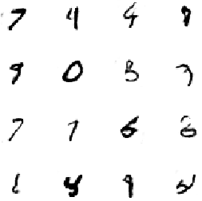

Caption: GAN generated MNIST characters

Most of these characters look like identifiable numbers, although some seem a bit off and there are some wired artifacts. 

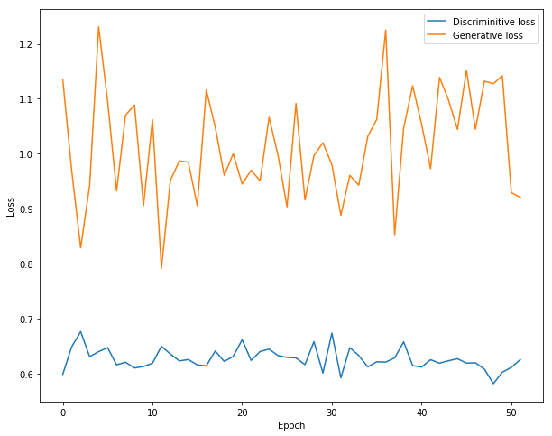
Caption: GAN training progress 
Note: The loss in GAN training is not interpretable as it is for supervised learning. The loss of a GAN will not decrease even as the GAN makes progress.

The loss of generator and discriminator is dependent on how well the other model does. If the generator gets better at fooling the discriminator, the discriminator loss will stay high. If one of the losses goes to zero, it means that the other model lost the race and can not fool or properly discriminate the other model anymore. This is one of the things that makes GAN training so hard: GANs don't converge to a low loss solution, they converge to an _equilibrium_ in which the generator fools the discriminator many times but not always. That equilibrium is not always stable. Part of the reason so much noise is added to labels and the networks themselves is that it increases the stability of the equilibrium.

As GANs are unstable and difficult yet useful, a number of empirical tricks have been developed over time that make GAN training more stable. Knowing these tricks can help you with your GAN building and save you countless hours, even though there is often no theoretical reason for why these tricks work.

## Understanding GAN latent vectors

For autoencoders, the latent space was a relatively straight forward approximation of principal component analysis. Variational autoencoders create a latent space of distributions, which is useful but still easy to imagine as a form of PCA. So what is the latent space of a GAN if we just sample randomly from it during training. As it turns out, GANs self structure the latent space. Using the latent space of a GAN, you would still be able to cluster MNIST images by the character they display. Research has shown that the latent space of GANs often has some surprising features, such as 'smile vectors' along which generated face images smile more or less. Researchers have also shown that GANs can be used for latent space algebra, where adding the latent representation of different objects creates realistic, new objects. Yet, research on the latent space of GANs is still in its infancy and drawing conclusions about the world from its latent space representations is an active field of research.

## GAN training tricks 
1. Normalize the inputs

Gans don't work well with extreme values so make sure you always have normalized inputs between -1 and 1. This is also the reason why you should use a `tanh` function as your generator output.


2. Don't use the theoretical correct loss function

If you read papers on GANs you will find that they give the generator optimization goal as: 
$$min\ log\ (1-D)$$

Where $D$ is the discriminator output. In practice it works better if the objective of the generator is:

$$max\ log\ D$$

In other words, instead of minimizing the negative discriminator output it is better to maximize the discriminator output. The reason is that the first objective often has vanishing gradients in the beginning of the GAN training process.

3. Sample from a normal gaussian distribution 

There is two reasons to sample from normal distributions instead of uniform distributions: First, GANs don't work well with extreme values and normal distributions have fewer extreme values than uniform distributions. Additionally, it has turned out that if the latent vectors are sampled from a normal distribution, the latent space becomes a sphere. The relationships between latent vectors in this sphere are easier to describe than latent vectors in a cube space.

4. Use Batch normalization

We already saw that GANs don't work well with extreme values since they are so fragile. Another way to reduce extreme values is to use batch normalization, discussed in chapter 3.

5. Use separate batches for real and fake data 

In the beginning, real and fake data might have very different distributions. As batch norm applies normalization over a batch, using the batches mean and standard deviation, it is more effective to keep the real and fake data separate. While this does lead to slightly less accurate gradient estimates, the gain from fewer extreme values is bigger.

6. Use Soft and Noisy Labels

GANs are fragile, the use of soft labels reduces the gradients and keeps the gradients from tipping over. Adding some random noise to labels also helps stabilizing the system.

7. Use basic GANs

There is now a wide range of GAN models. Many of them claim wild performance improvements, while in fact they do not work much better or often worse than a simple deep convolutional generative adversarial network or (DCGAN). That does not mean they have no justification for being, but for the bulk of tasks, more basic GANs do better. Another well working GAN is the adversarial autonecoder, which combines a VAE with a GAN by training the autocoder on the gradients of a discriminator.

8. Avoid ReLU and MaxPool 

ReLu activations and MaxPool layers are frequently used in deep learning, but they have the disadvantage of producing 'sparse gradients'. A ReLu activation will not have any gradient for negative inputs and a MaxPool layer will not have any gradients for all inputs that were not the maximum input. Since gradients are what the generator is being trained on, sparse gradients hurt generator training.

9. Use the ADAM Optimizer

This optimizer has been shown to work very well with GANs, while many other optimizers do not work well with them.

10. Track failures early

Sometimes, GANs fail for random reasons. Just choosing the 'wrong' random seed could set your training run up for failure. Usually, it is possible to see if a GAN goes completely off track by observing outputs. They should slowly become more like the real data. If the generator goes completely of track and produces only zeros for instance, you will be able to see it before spending days of GPU time on training that will go nowhere.

11. Don't balance loss via statistics

Keeping the balance between the generator and discriminator is a delicate task. Many practitioners therefore try to help the balance by training either the generator or discriminator a bit more depending on statistics. Usually, that does not work. GANs are very counterintuitive, and trying to help them with an intuitive approach usually makes matters worse. That is not to say there are no ways to help out GAN equilibriums. But the help should stem from a principled approach, such as 'train the generator while the generator loss is above X'.

12. If you have labels, use them

A slightly more sophisticated version of a GAN discriminator can not only classify data as real or fake, but also classify the class of the data. In the MNIST case, the discriminator would have 11 outputs, for the 10 real numbers as well as an output for fake. This allows us to create a GAN that can show more specific images. This is useful in the domain of semi-supervised learning which we will cover in the next section.

13. Add noise to inputs, reduce it over time

Noise adds stability to GAN training so it comes at no surprise that noisy inputs can help, especially in the early, unstable phases of training a GAN. Later however it can obfuscate too much and keep the GAN from generating realistic images. So we should reduce the noise applied to inputs over time.

14. Use Dropouts in G in both train and test phase

Some researchers find that using dropout on inference time leads to better results for the generated data. Why that is the case is still an open question.

15. Historical averaging

GANs tend to 'oscillate' with their weights moving rapidly around a mean during training. Historical averaging penelizes weights that are too far away from their historical average and reduces oscillation. It therefore increases the stability of GAN training.

16. Replay buffers

Replay buffers keep a number of older generated images so they can be reused for training the discriminator. This has a similar effect as historical averaging, reduces oscillation and increases stability. It also reduces the correlation between training data.

17. Target networks

Another 'anti-oscillation' trick is to use target networks. That is, to create copies of both the generator and discriminator, and then train the generator with a frozen copy of the discriminator and the discriminator with a frozen copy of the generator.

18. Entropy regularization

Entropy regularization means rewarding the network for outputting more different values. This can prevent the generator network from settling on a few things to produce, say, only the number seven. It is a regularization method as it prevents overfitting.

20. Use Dropout or noise layers

Noise is good for GANs. Keras does not only feature dropout layers, it also features a number of noise layers that add different kinds of noise to activations in a network. Read the documentation of these layers and see if they are helping for your specific GAN application: 
https://keras.io/layers/noise/


# Using less data: Active Learning
Part of the motivation for generative models, be it GANs or VAEs, was always that it would allow us to generate data and therefore use less data. As data is inherently sparse and we never have enough of it, generative models seems as they are the free lunch economists warn about. But even the best GAN works with _no_ data. In this section we will have a look at the different methods to bootstrap models with as little data as possible. This is also called active learning or semi-supervised learning.

Unsupervised learning uses no labels, but unlabeled data, to cluster this data in different ways. An example are autoencoders, where images can be transformed into learned, latent vectors which can then be clustered without the need for labels that describe the image.

Supervised learning uses data with labels. An example is the image classifier we built in chapter 3 or most other models we build in this book. 

Semi-supervised learning aims to perform tasks usually done by supervised models, but with less data by using unsupervised or generative methods. There is three ways this can work: First, by making smarter use of humans. Second, by making better use of unlabeled data. Third, by using generative models. 

## Let humans label frontier points
For all the talk about AI replacing humans, there are sure an awful lot of humans required to train AI systems. Although the numbers are not clear, it seems as there are between 500,000 and 750,000 registered 'Mechanical Turkers' on amazons Mechanical Turk (or MTurk) service. MTurk is a website that offers 'Human intelligence through an API', which in practice means that companies and researchers post simple jobs like filling out a survey or classifying an image and people all over the world perform these tasks for a few cents per task. For an AI to learn, humans need to provide labeled data. If the task is large scale, many companies hire MTurk to let humans do the labeling. If it is a small task you will often find the companies staff labeling data. 

Surprisingly little thought goes into what these humans label. Because not all labels are equally useful. The image below shows a linear classifier. As you can see, the frontier point, that is close to the frontier between the two classes, shapes where the decision boundary, while the points further in the back are not as relevant.

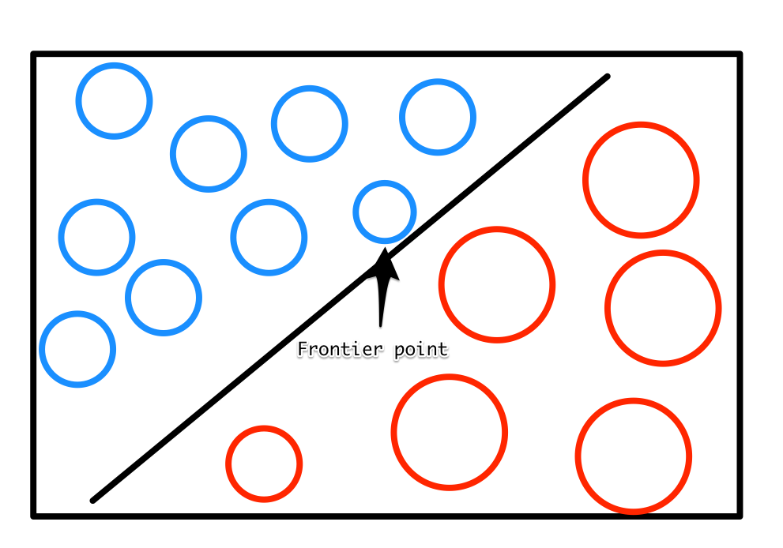
Caption: Frontier points are more valuable

Note: Frontier points close to the decision boundary are more valuable than points further away from it. You can train on less data by (1) labeling only a few images, (2) train a weak model (3) let that weak model make predictions for some unlabeled images, (4) label the images where the model is least confident about and add them to your training set, (5) repeat.

This process of labeling data is much more efficient than just randomly labeling data and can accelerate your efforts quite drastically.

## Leverage machines for human labeling
In labeling, many companies rely on excel. They have human labelers look at something to label, such as an image or a text, and then type in the label in an excel spreadsheet. This is incredibly inefficient and error prone, but common practice. Some slightly more advanced labeling operations build simple web apps that let the user see the item to label and directly click on the label or press a hot key. This can accelerate the labeling process quite substantially, but is still not the optimal if there are many label categories. A better way is to once again, label a few images and pre-train a weak model. On labeling time, the computer shows the labeler the data as well as a label. The labeler only has to decide if this label is correct. This can be done easily with hot keys and the time to label a single item goes down dramatically. If the label was wrong, the label interface can either bring up a list of possible options, sorted by the probability the model assigned to them, or just put the item back on the stack and display the next most likely label the next time. A great implementation of this technique is 'Prodigy', a labeling tool by the company that makes SpaCy, which we learned about in chapter 5.


Caption: Prodigy is a labeling tool that leverages machines. Source: https://prodi.gy/

Note: Better user interface design and smart use of weak models can greatly accelerate labeling.

## Pseudo labeling for unlabeled data
Often there is plenty of unlabeled data available, but only little labeled data. That unlabeled data can still be used. First, you train a model on the labeled data that you have. Then you let that model make predictions on your corpus of unlabeled data. You treat those predictions as if they were true labels and train your model on the full, pseudo labeled, dataset. However, actual true labels should be used more often than the pseudo labels. The exact sampling rate for pseudo labels can vary for different circumstances. This works under the condition that errors are random. If they are biased, your model will be biased as well. This simple method is surprisingly effective and can greatly reduce labeling efforts. 

## Using generative models
As it turns out, GANs extend quite naturally to semi supervised training. By giving the discriminator two outputs we can train it to be a classifier as well.

The first output of the discriminator only classifies data as real or fake, just as it did for the GAN above. The second head classifies the data by its class, say the digit an image represents, or an extra 'is fake' class. In the MNIST example the classifying head would have 11 classes, 10 digits plus the 'is fake class'. The trick is that the generator is one model and only the heads, that is the last layer, are different. This forces the 'real or not' classification to share weights with the 'which digit' classifier. The idea is that to determine if an image is real or fake, the classifier would have to figure out if it can classify this image into one class. If it can, the image is probably real. This approach, called semi-supervised generative adversarial network (SGAN) has been shown to generate more realistic data and improve deliver better results on limited data than standard supervised learning. Of course, GANs can be applied to more than just images. In the next section we will apply them to our fraud detection task.

# Semi-Supervised Generative Adversarial Networks for fraud detection
As a final applied project of this chapter, let's consider the credit card problem again. We will create an SGAN that looks as follows:


We will train this model on fewer than 1000 transactions and still recieve a decent fraud detector. You can find the code for the SGAN on Kaggle under this link:
https://www.kaggle.com/jannesklaas/semi-supervised-gan-for-fraud-detection/code

In this case, our data has 29 dimensions. We choose our latent vectors to have ten dimensions.
```Python 
latent_dim=10
data_dim=29
```

The generator model is constructed as a fully connected network with `LeakyReLU` activations and batch normalization. The output activation is a `tanh` activation.
```Python 
model = Sequential()
model.add(Dense(16, input_dim=latent_dim))
model.add(LeakyReLU(alpha=0.2))
model.add(BatchNormalization(momentum=0.8))
model.add(Dense(32, input_dim=latent_dim))
model.add(LeakyReLU(alpha=0.2))
model.add(BatchNormalization(momentum=0.8))
model.add(Dense(data_dim,activation='tanh'))
``` 

To later use the generator model better, we wrap the model we created into a functional API model that maps the noise vector to a generated transaction record. Since most GAN literature is about images, and 'transaction record' is a bit of a mouthful, we just name our transaction records 'images'.
```Python 
noise = Input(shape=(latent_dim,))
img = model(noise)
        
generator = Model(noise, img)
```

Just as the generator, we build the discriminator in the sequential API. As the discriminator has two heads, one for the classes, one for fake or no fake, we first only construct the base of the model.
```Python 
model = Sequential()
model.add(Dense(31,input_dim=data_dim))
model.add(LeakyReLU(alpha=0.2))
model.add(BatchNormalization(momentum=0.8))
model.add(Dropout(0.25))
model.add(Dense(16,input_dim=data_dim))
model.add(LeakyReLU(alpha=0.2))
```

Now we map the input of the discriminator to its two heads using the functional API.
```Python 
img = Input(shape=(data_dim,)) #1
features = model(img) #2
valid = Dense(1, activation="sigmoid")(features) #3
label = Dense(num_classes+1, activation="softmax")(features) #4

discriminator = Model(img, [valid, label]) #5
```
\#1 We create an input placeholder for the noise vector.

\#2 We get the feature tensor from the discriminator base model.

\#3 We create a `Dense` layer for classifying an transactions as real or not and map it to the feature vector.

\#4 We create a second `Dense` layer for classifying transactions as fraudulent, genuine or fake.

\#5 We create a model mapping the input to the two heads.


To compile the discriminator with two heads, we need to use a few advanced model compiling tricks:
```Python 
optimizer = Adam(0.0002, 0.5) #1
discriminator.compile(loss=['binary_crossentropy',
                            'categorical_crossentropy'], #2
                            loss_weights=[0.5, 0.5], #3
                            optimizer=optimizer, #4
                            metrics=['accuracy']) #5
```
\#1 We define an adam optimizer with a learning rate of 0.0002 and a momentum of 0.5

\#2 Since we have two model heads, we can specify two losses. Our 'fake or not' head is a binary classifier so we use `'binary_crossentropy'` for it. Our classifying head is a multi class classifier, so we use `'categorical_crossentropy'` for the second head.

\#3 We can specify how we want to weight the two different losses. In this case, we give all losses a 50% weight.

\#4 We optimize our pre-defined adam optimizer.

\#5 As long as we are not using soft labels, we can track progress using the accuracy metric.


Finally, we create our combined GAN model.
```Python 
noise = Input(shape=(latent_dim,)) #1
img = generator(noise) #2
discriminator.trainable = False #3
valid,_ = discriminator(img) #4
combined = Model(noise , valid) #5
combined.compile(loss=['binary_crossentropy'], #6
                        optimizer=optimizer)
```
\#1 We create a placeholder for the noise vector input.

\#2 We obtain a tensor representing the generated image by mapping the generator to the noise placeholder.

\#3 We make sure we do not destroy the discriminator by setting it to not trainable.

\#4 We only want the discriminator to believe the generated transactions are real, so we can discard the classification output tensor.

\#5 We map the noise input to the 'fake or not fake' output of the discriminator.

For training we define a train function that handles all the training for us:
```Python 
def train(X_train,y_train,
          X_test,y_test,
          generator,discriminator,
          combined,
          num_classes,
          epochs, 
          batch_size=128):
    
    f1_progress = [] #1
    half_batch = int(batch_size / 2) #2

    cw1 = {0: 1, 1: 1} #3
    cw2 = {i: num_classes / half_batch for i in range(num_classes)}
    cw2[num_classes] = 1 / half_batch

    for epoch in range(epochs):
      
        idx = np.random.randint(0, X_train.shape[0], half_batch) #4
        imgs = X_train[idx]

        noise = np.random.normal(0, 1, (half_batch, 10)) #5
        gen_imgs = generator.predict(noise)
        
        #6
        valid = np.ones((half_batch, 1))
        fake = np.zeros((half_batch, 1))
        
        #7
        labels = to_categorical(y_train[idx], num_classes=num_classes+1)
        
        #8
        fake_labels = np.full((half_batch, 1),num_classes)
        fake_labels = to_categorical(fake_labels,num_classes=num_classes+1)
        #9
        d_loss_real = discriminator.train_on_batch(imgs, 
                                                  [valid, labels],
                                                  class_weight=[cw1, cw2])
        #10
        d_loss_fake = discriminator.train_on_batch(gen_imgs, 
                                                    [fake, fake_labels],
                                                    class_weight=[cw1, cw2])
        #11
        d_loss = 0.5 * np.add(d_loss_real, d_loss_fake)

        #12
        noise = np.random.normal(0, 1, (batch_size, 10))
        validity = np.ones((batch_size, 1))
        #13
        g_loss = combined.train_on_batch(noise, 
                                          validity, 
                                          class_weight=[cw1, cw2])

        #14
        print ("%d [D loss: %f] [G loss: %f]" % (epoch, g_loss))
        
        #15
        if epoch % 10 == 0:
            _,y_pred = discriminator.predict(X_test,batch_size=batch_size)
            y_pred = np.argmax(y_pred[:,:-1],axis=1)
            
            f1 = f1_score(y_test,y_pred)
            print('Epoch: {}, F1: {:.5f}'.format(epoch,f1))
            f1_progress.append(f1)
            
    return f1_progress
``` 
\#1 We create an empty array to monitor the F1 Score of the discriminator on the test set.

\#2 Since we use separate batch training steps for real and fake data, we effectively use a half batch for each of the training steps.

\#3 The classification head of the discriminator has a class label for 'this is fake'. Since half of the images are fake, we want to give this class a higher weight.

\#4 We now draw a random sample of real data.

\#5 We generate some random noise vectors and use the generator to create some fake data.

\#6 For the 'fake or not head' we create labels. All real images have the label 1 (real), all fake images have the label 0 (fake).

\#7 We one hot encode the labels of our real data. By specifying that our data has one more classes than it actually has, we leave space for the 'is fake' class.

\#8 Our fake data all has the 'is fake' label. We create a vector of those labels and one hot encode them, too.

\#9 First, we train the discriminator on the real data.

\#10 Then we train the descriminator on the fake data.

\#11 total loss of the discriminator for this epoch is the mean of the loss from the real and fake data.

\#12 Now we train the generator. We generate a batch full of noise vectors as well as a batch full of labels saying 'this is real data'.

\#13 With this data in hand we train the generator.

\#14 To keep track of what is going on, we print out the progress. Remember that we do _not_ want the losses to go down, we want them to stay roughly constant. If either generator or discriminator becomes much better than the other the equilibrium breaks.

\#15 Finally, we calculate and output the F1 score of using the discriminator as a fraud detection classifier for the data. This time, we only care about the classification data and discard the 'real or fake' head. We classify the transactions by the highest value that is not the 'is real' class of the classifier.


Now that we have everything set up, we train our SGAN for 5,000 epochs. This takes about 5 minutes on a GPU, but could take much longer if you do not have a GPU.
```Python
f1_p = train(X_res,y_res,
             X_test,y_test,
             generator,discriminator,
             combined,
             num_classes=2,
             epochs=5000, 
             batch_size=128)
```
Finally, we plot the F1 score of our semi supervised fraud classifier over time:
```Python 
fig = plt.figure(figsize=(10,7))
plt.plot(f1_p)
plt.xlabel('10 Epochs')
plt.ylabel('F1 Score Validation')
```

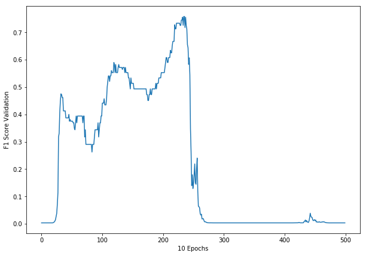

As you can see, the model learns pretty quickly at first, but then 'collapses' with its F1 score going to zero. This is a textbook example of a collapsing GAN. As mentioned above, GANs are unstable. If the delicate balance between the generator and discriminator breaks, performance quickly deteriorates. It is an active area of reasearch to make GANs more stable. So far, many practitioners just try many runs with different hyperparameters and random seeds and hope to get lucky. Another popular method is to just to save the model every couple of epochs. The model seems to be a pretty decent fraud detector at around epoch 150 despite being trained on less than 1000 transactions.

# Exercises
- Create an SGAN to train MNIST an image classifier. How few images can you use to achieve over 90% classification accuracy.

- Using LSTMs you can build an autoencoder for stock price movements. Using a dataset such as the DJIA stock prices, build an autoencoder that encodes stock movements. Then visualize what happens to the outputs as you move through the latent space. You can find the dataset here: https://www.kaggle.com/szrlee/stock-time-series-20050101-to-20171231

# Summary
In this chapter you have learned about the two most important types of generative models: Autoencoders and GANs. You have learned about latent spaces and the use they have for financial analysis. You also got a first impression on how machine learning can solve game-theoretic optimization problems. In the next chapter we will deep dive into exactly that type of optimization as we cover reinforcement learning. 


