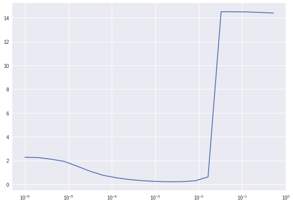
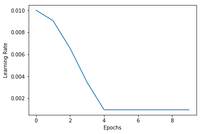

# Chapter 8 Debugging & Deployment
After the last seven chapters, you now have a large toolbox of machine learning algorithms you could use for your problem. But what if it does not work? Machine learning models fail in the worst way: They fail silently. In traditional software, a mistake usually leads to a crash in the program. While crashes are annoying for the user, they are helpful for the programmer. At least it is clear that the code failed and when it failed. Often, there even is a crash report that describes what went wrong. Sometimes, machine learning code crashes too, for example if the data we feed in has the wrong format or shape. These issues can usually be debugged by carefully tracking which shape the data had at what point. More often however, models that fail just output poor predictions. They give no signal that they have failed and you might not be aware that they failed at all. At other times, they might not train well, won't converge or won't achieve a low loss. This chapter is all about how you debug these silent fails.

The first step is to acknowledge that even good machine learning engineers fail frequently. There are many reasons why ML projects fail, and most have nothing to do with the skills of the engineers. But engineers can be on the watch for factors that often cause project failure. If spotted early, time and money can be saved. Even more, in high stakes environments, such as trading, aware engineers can pull the plug when they notice their model is failing. This should not be seen as a failure, but as a success to avoid problems.

# Debugging data
The first chapter of this book describes that models are a function of their training data. Bad data leads to bad models. Garbage in, garbage out. If your project is failing, your data is the most likely culprit. But even if you have a working model, the real world data coming in might not be up for the task. In this section we will learn how to find out if you have good data, what to do if you have been given not enough data, and how to test your data.

## How to find out if your data is up to the task

There is two aspects to knowing if your data is up to the task of training a good model: Does the data predict what you want to predict and do you have enough data. 

To find out if your model does contain predicting information, also called a signal, you can ask if a human could make a prediction given this data. This works well for data for which you have humans making predictions already. After all, the only reason we know intelligence is possible is because we observe it in humans. Humans are good at understanding written text, but if a human does not understand a text, chances are that your model won't make much sense of it either. A common pitfall to this test is that humans have context your model does not have. A human trader does not only consume financial data but might also have experienced the product of a company or seen the CEO on TV. This context flows into the traders decision, but is often forgotten when a model is built. Humans are also good at focusing on important data. A human trader will not consume all financial data there is, because most of it is irrelevant. Adding more inputs to your model won't make it better. It often makes it worse as the model overfits and gets distracted by the noise. On the other hand, humans are irrational, follow peer pressure and have a hard time making decisions in abstract and unfamiliar environments. Humans would struggle to find an optimal traffic light policy for instance, since the data that traffic lights operate on is not intuitive to us.

This brings us to the second sanity check: A human might not be able to make predictions, but there might be a causal (economic) rationale. There is a causal link between a company's profits and its share price, the traffic on a road and traffic jams, customer complaints and leaving customers and so on. And while humans might not have an intuitive gasp on these links, we can discover them by reasoning. There are some tasks, for which a causal link is required. For a long time, many quantitative trading firms insisted on their data having a causal link to the predicted outcomes of models for instance. Nowadays, the industry seems to have moved a bit away from that as it gets more confident in testing its algorithms. 

If humans can not make a prediction and there is no causal rationale for why your data is predictive, you might want to reconsider if your project is feasible. 

Once you have determined that your data contains enough signal, you need to ask yourself if you have enough data to train a model to extract the signal. There is no clear answer to how much is enough. Roughly, the amount needed depends on the complexity of the model you hope to create. There are a couple rules of thumb to follow however:

- For classification, you should have around 30 independent samples per class.
- You should have 10 times as many samples as there are features, especially for structured data problems.
- Your dataset should get bigger as the number of parameters in your model gets bigger.

Keep in mind these rules are only rules of thumb and might be very different for your specific application. If you can make use of transfer learning, you can drastically reduce the number of samples you need. This is why most computer vision applications use transfer learning. 

If you have any reasonable amount of data, say a few hundred samples, you can start building your model. Perhaps start with a simple model which you can deploy while you collect more data.

## What to do if you don't have enough data
Sometimes, you find yourself in a situation where you simply do not have enough data. Sometimes, this happens after you already begun your project. For example, the legal team might have changed its mind and decided that you can not use the data even though they green lit it earlier. In this case, you have multiple options:

Most of the time, you can **augment your data**. You have seen some data augmentation in chapter 3. Of course, you can augment all kinds of data. For example, you could slightly change some database entries. 

Taking augmentation a step further, you might be able to **generate your data**, for example in simulation. This is effectively how most reinforcement learning research gathers data. But it also works in other cases. The data we used for fraud detection in chapter two was obtained from simulation. Simulation requires you to be able to write down the rules of your environment in a program. Powerful learning algorithms tend to figure out these, often over simplistic, rules, so they might not generalize to the real world as well. Yet, simulated data can be a powerful addition to real data.

Often, you can **find external data**. Just because you have not tracked a certain datapoint, it does not mean that nobody else has. There is an astonishing amount of data available on the internet. Even if the data was not originally collected for your purpose, you can often retool data by either relabeling it or by using it for **transfer learning**. You might be able to train a model on a large dataset for a different task and then use that model as a basis for your task. Equally, you can find a model someone else has trained for a different task, and repurpose it.

Finally, you might be able to create a **simple model**, that does not capture the relationship in the data completely but is enough to ship a product. Random forests and other tree based methods often require much less data than neural networks. 

Remember, that for data, quality trumps quantity in the majority of cases. Getting a small, high quality dataset in and training a weak model is often your best shot to find problems with data early. You can always scale up data collection later. A mistake many practitioners make is that they spend huge amounts of time and money on getting a big dataset, only to find that they have the wrong kind of data.

## Unit testing data
If you build a model, you make assumptions about your data. For example, you assume that the data you feed into your time series model is actually a time series with dates that follow each other in order. You need to test your data to make sure this assumption is true. Especially live data that you receive once your model is already in production. Bad data might lead to poor model performance, which can be dangerous especially in a high stakes environment.

Additionally, you need to test if your data is clean from things like personal information. If you buy data from a vendor and the vendor forgot to delete social security numbers from the dataset, you might still be on the hook for using peoples data without consent.

Since monitoring data quality is important when trading based on many data sources, Two Sigma, a hedge-fund, has created and open sourced a library for data monitoring. It is called marbles, see https://github.com/twosigma/marbles and builds on Pythons `unittest` library. You can install it with 

```
pip install marbles
```

You can not run unit tests on Kaggle notebooks, so you need to install marbles and all dependencies like `pandas` or `numpy` on your local machine to try this example. You can find the example code as `7_marbles_test.py` in the GitHub repository of this book.

The code sample below shows a simple marbles unit test. Imagine you are gathering information about company CEOs to inform your investment decisions. You need to make sure that this data is sensible. In our case, we test to ensure that no CEO is unreasonably old.
```Python 
import marbles.core #1
from marbles.mixins import mixins

import pandas as pd #2
import numpy as np
from datetime import datetime, timedelta

class AgeTestCase(marbles.core.TestCase,mixins.DateTimeMixins): #3
    def setUp(self): #4
        self.df = pd.DataFrame({'ceo_name':['Jeff Bezos'],
                                'ceo_birth':[datetime(1800,1,1)],
                                'ceo_company':['Amazon']},
                                index=[0]) #5
        
    def tearDown(self): #6
        self.df = None
        
    def test_old_age(self): #7
        max_td = timedelta(365*130) #8
        today = datetime.today()
        earliest_birth = today-max_td
        
        self.assertDateTimesAfter(sequence=self.df.ceo_birth, #9
                                  target=earliest_birth,
                                  note = 'No CEO can be born \
                                  before {earliest_birth}')
        
if __name__ == '__main__':       
    marbles.core.main()
```
\#1 Marbles features two main components. The `core` module does the actual testing. The `mixins` module provides a number of useful tests for different types of data. This simplifies your test writing and gives you more readable and semantically interpretable tests.

\#2 You can use all libraries you usually use to handle and process data for testing.

\#3 Now it is time to define our test class. A new test class must inherit marbles `TestCase` class. This way, our test class is automatically set up to run as a marbles test. If you want to use a mixin, you also need to inherit the corresponding mixin class. In this example we are working with dates, so we need to inherit the `DateTimeMixins` class which gives us a number of time related tests. If you are coming from Java programming, the concept of multiple inheritance might strike you as wired, but in Python, classes can easily inherit multiple other classes. This is useful if you want your class to inherit two different capabilities, such as running a test and testing time related concepts.

\#4 The `setUp` function is a standard test function in which we can load the data and prepare for the test. In this case, we just define a pandas dataframe by hand. But you could also load a CSV file, load a web resource or do whatever it takes to get your data.

\#5 In our dataframe, we have only a single CEO, his company and his birthdate. But as you can see, there must be an error with the birthdate, Jeff Bezos is not over 200 years old yet. A marbles test will ensure this failure does not silently slip through but causes a crash.

\#6 The `tearDown` method is also a standard test method which allows us to clean up after our test is done. In this case we just free RAM, but you can also delete files or databases just created for testing.

\#7 Methods describing actual tests should start with `test_`. Marbles will automatically run all test methods after set up.

\#8 In our test, we want to ensure that no CEO is older than the oldest person alive. We need to first calculate what the earliest birth that we accept would be. Marbles reports the local variables defined for this calculation in the test report so we can inspect them later.

\#9 We assert that CEOs were born strictly after the earliest birthdate we allow using a handy mixin assertion written. You can also see that notes are format strings. We just need to write the variable name we want to include into our failure report in curly brackets and marbles will fill the value of this variable for us,

\#10 Finally, we set marbles up to run. You can not run a unit test in a Jupyter notebook, so you need to save the code in a file. The test for main  ensures this is only run if you run the script from the command line and not if you just import the file for example.

If you save or download this file as `7_marbles_test.py` you can run it by entering the following command in the command line:

```
python -m marbles 7_marbles_test.py
```

Of course, there are problems in our data. Luckily for us, our test ensure that this error does not get passed on to our model where it would cause a silent failure in the form of a bad prediction. Instead, the test will fail with the following error output. The comments were added to explain the output.

```
F #1
======================================================================
FAIL: test_old_age (Desktop.mlfin_code.7_marbles_test.AgeTestCase) #2
----------------------------------------------------------------------
marbles.core.marbles.ContextualAssertionError: 0   1800-01-01
Name: ceo_birth, dtype: datetime64[ns] is not strictly greater than 1888-07-02
11:31:21.274022 #3

Source (/Users/jannes/Desktop/mlfin_code/7_marbles_test.py): #4
     22 
 >   23 self.assertDateTimesAfter(sequence=self.df.ceo_birth,
     24                           target=earliest_birth,
     25                           note = 'No CEO can be born \
     26                           before {earliest_birth}')
     27 
Locals: #5
	max_td=47450 days, 0:00:00
	today=2018-06-01 11:31:21.274022
	earliest_birth=1888-07-02 11:31:21.274022
Note: #6
	No CEO can be born before 1888-07-02 11:31:21.274022


----------------------------------------------------------------------
Ran 1 test in 0.020s

FAILED (failures=1) #7
```

\#1 The top line shows the status of the entire test. In this case, there was only one test method, and it failed. Your test might have many test methods and marbles would display progress by showing how tests fail or pass.

\#2 The next couple of lines describe the failed test method. This line describes that the `test_old_age` method of the `AgeTestCase` class failed.

\#3 Marbles shows precisely how the test failed. The variable `ceo_birth` with value `1800-01-01` was not strictly greater than 1888-07-02 11:31:21.274022, the earliest accepted birth.

\#4 In addition to the actual failure, marbles displays a traceback showing the actual code where our test failed.

\#5 A special feature of marbles is the ability to display local variables. This way we can ensure that there was not problem with the setup of the test. It also helps us in getting context to see how exactly the test failed.

\#6 Finally, marbles displays our note with the earliest accepted birth. This note helps you, or whoever reads your tests, understand what is going on in the test.

\#7 As a summary, marbles displays that the test failed with one failure. Sometimes, you can accept data even though it failed some tests, but often you want to dig in and see what is going on.

The point of unit testing data is to make failures low and prevent data issues to give you bad predictions. A failure with an error message is much better than a failure without. Often, the failure is cause by your data vendor, testing all data you get from all vendors allows you to be aware when a vendor makes a mistake.

Unit testing data also help you ensure you have no data that you should not have, such as personal data. Vendors need to clean datasets of all personally identifying information, such as social security numbers, but of course they sometimes forget. Complying with ever stricter data privacy regulation is a big concern for many financial institutions engaging in machine learning. The next section therefore discusses how to preserve privacy while still gaining benefits from machine learning.
 
## Keeping data private

In recent years, consumers have woken up to the fact that their data is being harvested and analyzed in ways they can not control and that is sometimes against their own interest. Naturally, they are not happy about it and regulators have come up with some new data regulations. At the time of writing, the European Union introduced the General Data Protection Regulation (GDPR), but it is likely that other jurisdictions will develop stricter privacy protections, too. This text will not go in depth on how to comply with this law specifically. It will rather outline some principles of recent privacy legislation and some technological solutions to comply with these principles.

First, **delete what you don't need**. For a long time, companies have just stored all data they could get their hands on but this is a bad idea. Storing personal data is a liability for your business. It is owned by someone else and you are on the hook for taking care of it. The next time you hear a statement like 'We have 500,000 records in our database', think of it like 'We have 500,000 liabilities on our books'. It can be a good idea to take on liabilities, but only if there is an economic value that justifies these liabilities. Astonishingly often, you might collect personal data by accident. Say you are tracking device usage, but accidentally include the customer ID in records. You need practices in place that monitor and prevent such accidents.

**Be transparent and obtain consent**. Customers want good products and they understand how their data can make your product better for them. Rather than pursuing an adversarial approach in which you wrap all your practices in a very long agreement and then make users agree to it, it is usually more sensible to clearly tell users what you are doing, how their data is used, and how that improves the product. If you need personal data, you need consent. Being transparent will help you down the line as users trust you more, and can be used to improve your product through feedback.

**Remember that breaches happen to the best**. No matter how good your security is, there is a chance that you get hacked. So you should design your personal data storage under the assumption that the entire database might be dumped on the internet one day. This assumption helps you to create stronger privacy and avoid disaster once you actually get hacked.

**Be mindful about what can be inferred from data**. You might not be tracking personally identifying information in your database, but when combined with another database, your customers can still be individually identified. Say you went for coffee with a friend, paid by credit card and posted a picture of the coffee on instagram. The bank might collect anonymous credit card records, but if someone wen't to crosscheck the credit card records against the instagram pictures, there would be only one customer who bought a coffee and posted a picture of coffee at the same time in the same area. This way, all your credit card transactions were no longer anonymous. Consumers expect companies to be mindful of these effects.

One way to reduce the risk of crosschecking, is to **encrypt and obfuscate data**. Apple for instance collects phone data but adds random noise to the collected data. The noise renders each individual record incorrect, but in aggregate the records still give a picture of user behavior. There are a few caveats to this approach, for example you can only collect so many data-points from a user before the noise chancels out and the individual behavior is revealed. Similarly, recent research has shown that deep learning models can learn on homomorphically encrypted data. Homomorphic encryption is a method of encryption that preserves the underlying algebraic properties of the data. Mathematically this can be expressed as:

$$
E(m_1) + E(m_2) = E(m_1 + m_2)
$$

$$
D(E(m_1 + m_2)) = m_1 + m_2
$$

Where $E$ is an encryption function, $m$ is some plain text data and $D$ is a decryption function. As you can see, adding the encrypted data is the same as first adding the data and then encrypting it. Adding the data, encrypting it and then decrypting it is the same as just adding the data.

This means you can encrypt the data and still train a model on it. Homomorphic encryption is still in its infancy, but through approaches like this you can ensure that in case of a data breach, no sensitive individual information is leaked.

**Train locally, upload only a few gradients**. One way to avoid uploading user data is to train your model on the user's device. The user accumulates data on the device. You can then download your model on to the device, and perform a single forward and backward pass on the device. To avoid the possibility of inference of user data from the gradients, you only upload a few gradients at random. You can then apply the gradients to your master model. To further increase the overall privacy of the system, you do not download all newly update weights from the master model to the users device, but only a few. This way, you train your model asynchronously without ever accessing any data. If your database gets breached, no user data is lost. This only works if you have a large enough user base.

http://www.comp.nus.edu.sg/~reza/files/Shokri-CCS2015.pdf

## Preparing data for training
In earlier chapters, we have seen the benefits of normalizing and scaling features. In general, you should scale all numerical features. There are four ways of feature scaling.

**Standardization** ensures all data has a mean of zero and a standard deviation of one. It is computed by subtracting the mean and dividing by the standard deviation of the data.

$$x' = \frac{x-\mu}{\sigma}$$

This is probably the most common way of scaling features. It is especially useful if you suspect your data to contain outliers as it is quite robust. On the flip side, it does not ensure that your features are between zero and one, which is the range in which neural networks learn best.

**Min-Max** rescaling does exactly that. It scales all data between zero and one by first subtracting the minimum value and then dividing by the range of values.

$$x' = \frac{x-\min(x)}{\max(x)-\min(x)}$$

If you know for sure that your data contains no outliers, which is the case in images for instance, Min-Max scaling will give you a nice scaling of values between zero and one.

Similar to Min-Max, **mean normalization** ensures your data has values between minus one and one with a mean of zero by subtracting the mean and then dividing by the range of data:

$$x' = \frac{x-\mu}{\max(x)-\min(x)}$$ 

Mean normalization is done less frequently but depending on your application might be a good approach.

For some applications, it is better to not scale individual features, but vectors of features. In this case, you would apply **unit length scaling** by dividing each element in the vector by the total length of the vector:

$$x' = \frac{x}{||x||}$$ 

The length of the vector usually means the  L2 norm, of the vector, $\lVert x \lVert_2$,speak the square root of the sum of squares. For some applications, the vector length means the l1 norm of the vector, $\lVert x \lVert_1$, which is the sum of vector elements.

However you scale, it is important to only measure the scaling factors, mean and standard deviation, on the test set. These factors include some information about the data. If you measure them over your entire dataset, the algorithm might do better on the test set than it will in production, due to this information advantage.

Equally important, you should check that your production code has proper feature scaling as well. Over time, you should recalculate your feature distribution and adjust your scaling.

# Debugging your model  

## Hyperparameter search with Hyperas
Manually tuning the hyperparameters of a neural network can be a tedious task. And while you might have some intuition about what works and what does not, there are no hard rules to apply. This is why practitioners with lots of compute power on hand use automatic hyperparameter search. After all, hyperparameters form a search space just like the models parameters do. The difference is that we can not apply backpropagation to them and can not take derivatives off them. We can still apply all non-gradient based optimization algorithms to them. There are a number of different hyperparameter optimization tools, but for its ease of use we will look at hyperas. Hyperas is a wraper for hyperopt, a popular optimization library, made for working with Keras. You can find hyperas on GitHub: https://github.com/maxpumperla/hyperas

And install it with pip:
```
pip install hyperas
``` 

Depending on your setup, you might need to make a few adjustments to the installation. See hyperas GitHub page for more information.

Hyperas offers two optimization methods: Random Search and Tree of Parzen Estimators. Within a range of parameters we think are reasonable, random search will sample randomly and train a model with random hyperparameters. It will then pick the best performing model as the final solution. Random search is simple and robust and it can be scaled easily. It makes basically no assumption about the hyperparameters, their relation and the loss surface. On the flip side, it is relatively slow.

The Tree of Parzen (TPE) algorithm models the relation $P(x|y)$ where $x$ represents the hyperparameters and $y$ the associated performance. This is the exact opposite modeling of gaussian processes which model $P(y|x)$ and are popular with many researchers. Empirically, it turns out that TPE performs better. For the precise details see Bergstra et al. 2011 'Algorithms for Hyper-Parameter Optimization'. TPE is faster than random search but can get stuck in local minima and struggles with some difficult loss surfaces. As a rule of thumb, it makes sense to start with TPE, and if TPE struggles move to random search.

The following example will show how to use hyperas and hyperopt for an MNIST classifier. The code for this example can be found on Kaggle: https://www.kaggle.com/jannesklaas/hyperas

```Python 
from hyperopt import Trials, STATUS_OK, tpe #1
from hyperas import optim #2
from hyperas.distributions import choice, uniform 

```

\#1 As hyperas is built on hyperopt, we need to import some pieces directly from hyperopt. The `Trials` class runs the actual trials, `STATUS_OK` helps communicate that a test went well and `tpe` is an implementation of the TPE algorithm.

\#2 Hyperas provides a number of handy functions that make working with hyperopt easier. The `optim` function finds optimal hyperparameters and can be used just like keras `fit` function. `choice` and `uniform` can be used to choose between discrete and continuous hyperparameters respectively.


```Python 
def data(): #1
    import numpy as np #2
    from keras.utils import np_utils
    
    from keras.models import Sequential 
    from keras.layers import Dense, Activation, Dropout
    from keras.optimizers import RMSprop
    
    path = '../input/mnist.npz' #3
    with np.load(path) as f:
        X_train, y_train = f['x_train'], f['y_train']
        X_test, y_test = f['x_test'], f['y_test']

    X_train = X_train.reshape(60000, 784) #4
    X_test = X_test.reshape(10000, 784)
    X_train = X_train.astype('float32')
    X_test = X_test.astype('float32')
    X_train /= 255
    X_test /= 255
    nb_classes = 10
    y_train = np_utils.to_categorical(y_train, nb_classes)
    y_test = np_utils.to_categorical(y_test, nb_classes)
    
    return X_train, y_train, X_test, y_test #5
```

\#1 Hyperas expects a function which loads the data, we can not just pass on a dataset from memory.

\#2 To scale the search, hyperas creates a new runtime in which it does model creation and evaluation. This also means that imports we did in a notebook do not always transfer into the runtime. To be sure that all modules are available we need to do all imports in the data function. This is also true for modules which will only be used for the model.

\#3 We now load the data. Since Kaggle kernels do not have access to the internet, we need to load the MNIST data from disk.

\#4 The data function also needs to preprocess the data. We do the standard reshaping and scaling that we also did in when we worked with MNIST earlier.

\#5 Finally, we return the data. This data will be passed into the function that builds and evaluates the model.

```Python 
def model(X_train, y_train, X_test, y_test): #1
    model = Sequential() #2
    model.add(Dense(512, input_shape=(784,)))
    
    model.add(Activation('relu'))
    
    model.add(Dropout({{uniform(0, 0.5)}})) #3
    
    model.add(Dense({{choice([256, 512, 1024])}})) #4
    
    model.add(Activation({{choice(['relu','tanh'])}})) #5
    
    model.add(Dropout({{uniform(0, 0.5)}}))
    
    model.add(Dense(10))
    model.add(Activation('softmax'))

    rms = RMSprop()
    model.compile(loss='categorical_crossentropy', 
                  optimizer=rms, 
                  metrics=['accuracy'])

    model.fit(X_train, y_train, #6
              batch_size={{choice([64, 128])}},
              epochs=1,
              verbose=2,
              validation_data=(X_test, y_test))
    score, acc = model.evaluate(X_test, y_test, verbose=0) #7
    print('Test accuracy:', acc)
    return {'loss': -acc, 'status': STATUS_OK, 'model': model} #8
```

\#1 The `model` function both defines the model and evaluates it. Given a training dataset from the `data` function, it returns a set of quality metrics.

\#2 When fine tuning with Hyperas, we can define a Keras model just as we usually would. We only have to replace the hyperparameters we want to tune with hyperas functions.

\#3 To tune dropout for instance, we replace the dropout hyperparameter with `{{uniform(0, 0.5)}}`. Hyperas will automatically sample and evaluate dropout rates between 0 and 0.5, sampled from a uniform distribution.

\#4 To sample from discrete distributions, for instance the size of a hidden layer, we replace the hyperparameter with `{{choice([256, 512, 1024])}}`. Hyperas will choose from a hidden layer size of 256, 512 and 1024 now.

\#5 We can do the same to choose activation functions.

\#6 To evaluate the model, we need to compile and fit it. In this process, we can also choose between different batch sizes for instance. In this case we only train for one epoch, to keep the time needed for this example short. You could also run a whole trainings process with hyperas.

\#7 To get insight into how well the model is doing, we evaluate it on test data.

\#8 Finally, we return the models score, the model itself and an indicator that everything went okay. Hyperas tries to minimize a loss function. To maximize accuracy, we set the loss to be the negative accuracy. You could also pass the model loss here, depending on what the best optimization method is for your problem.

```Python
best_run, best_model = optim.minimize(model=model,
                                      data=data,
                                      algo=tpe.suggest,
                                      max_evals=5,
                                      trials=Trials(),
                                      notebook_name='__notebook_source__')
```

Finally, we run the optimization. We pass the model method and the data method, we specify how many trials we want to run and which class should govern the trials. Hyperopt also offers a distributed trials class in which workers communicate via MongoDB. When working in a Jupyter notebook we need to provide the name of the notebook we are working in. Kaggle notebooks all have the file name `'__notebook_source__'`, independent of the name you gave them.

After your run, hyperas returns the best performing model as well as the hyperparameters of the best model. If you print out `best_run` you should see output similar to this:
```
{'Activation': 1,
 'Dense': 1,
 'Dropout': 0.3462695171578595,
 'Dropout_1': 0.10640021656377913,
 'batch_size': 0}
```
For `choice` selections, hyperas shows the index. In this case, the activation function `tanh` was chosen.

We ran the hyperparemeter search only for a few trials. Usually you would run a few hundred or thousand trials. Automated hyperparameter search can be a great tool to improve model performance if you have enough compute power available. However, it won't get a model that does not work at all to work. Be sure to have a somewhat working aproach first before investing into hyperparameter search.


## Efficient learning rate search 

One of the most important hyperparameters is the learning rate. Finding a good learning rate is hard. Too small and your model might train so slow that you believe it is not training at all. Too large and it will overshoot and not reduce the loss as well. For finding a learning rate, standard hyperparameter search techniques are not the best choice. For the learning rate, it is better to perform a line search, and visualize the loss for different learning rates. This will give you an understanding of how the loss function behaves. 

When doing a line search, it is better to increase the learning rate exponentially. You are more likely to care about the region of smaller learning rates than about very large learning rates. In our example, we perform 20 evaluations, and double the learning rate in every evaluation.

```Python 
init_lr = 1e-6 #1
losses = [] 
lrs = []
for i in range(20): #2
    model = Sequential()
    model.add(Dense(512, input_shape=(784,)))
    model.add(Activation('relu')) 
    model.add(Dropout(0.2))
    model.add(Dense(512))
    model.add(Activation('relu'))
    model.add(Dropout(0.2))
    model.add(Dense(10))
    model.add(Activation('softmax'))

    opt = Adam(lr=init_lr*2**i) #3
    model.compile(loss='categorical_crossentropy',
                  optimizer=opt,
                  metrics=['acc'])


    hist = model.fit(X_train, Y_train, batch_size = 128, epochs=1) #4

    loss = hist.history['loss'][0] #5
    losses.append(loss)
    lrs.append(init_lr*2**i)
```

\#1 We specify a low, but still reasonable initial learning rate from which we start our search.

\#2 We then perform training 20 times with different learning rates. We need to set up the model from scratch each time.

\#3 We calculate our new learning rate. In our case we double the learning rate in each evaluation step. You could also use a smaller increase if you want a more fine grained picture.

\#4 We then fit the model with our new learning rate.

\#5 Finally we keep track of the loss.

If your dataset is very large, you can perform this learning rate search on a subset of the data. The interesting part comes from the visualization of learning rates:

```Python 
fig, ax = plt.subplots(figsize = (10,7))
plt.plot(lrs,losses)
ax.set_xscale('log')
```



As you can see, the loss is optimal between 1e-3 and 1e-2. We can also see that the loss surface is relatively flat in this area. This gives us insight that we should use a learning rate around 1e-3. To avoid overshooting, we select a learning rate somewhat lower than the optimum found by line search. 

## Learning rate scheduling
Why stop at using one learning rate? In the beginning, your model might be far away from the optimal solution, so you want to move as fast as possible. As you approach the minimum loss however you want to move slower to avoid overshooting. A popular method is to anneal the learning rate so that it represents a cosine function. To this end, we need to the fine a learning rate scheduling function, that given a time step t in epochs returns a learning rate. The learning rate becomes a function of t:

$$
\alpha(t) = \frac{\alpha_0}{2}\big (\cos \big( 
  \frac{\pi \mod(t-1,l)}{l}
  \big)\big)
$$

Where $l$ is the cycle length and $\alpha_0$ is the initial learning rate. We modify this function to ensure that t does not become larger than the cycle length.

```Python 
def cosine_anneal_schedule(t):
    lr_init = 1e-2 #1
    anneal_len = 5 
    if t >= anneal_len: t = anneal_len -1 #2
    cos_inner = np.pi * (t % (anneal_len))  #3
    cos_inner /= anneal_len
    cos_out = np.cos(cos_inner) + 1
    return float(lr_init / 2 * cos_out)
```

\#1 In our function, we need to set up a starting point from which we anneal. This can be a relatively large learning rate. We also need to specify over how many epochs we want to anneal.

\#2 A cosine function does not monotonically decrease, it goes back up after a cycle. We will use this property later, for now we will just make sure that the learning rate does not go back up.

\#3 Next, we calculate the new learning rate using the formula above. This is the new learning rate.


To get a better understanding of what the learning rate scheduling function does, we can plot the learning rate it would set over 10 epochs:
```Python 
srs = [cosine_anneal_schedule(t) for t in range(10)]
plt.plot(srs)
```



We can use this function to schedule learning rates with Keras `LearningRateScheduler` callback:
```Python 
from keras.callbacks import LearningRateScheduler
cb = LearningRateScheduler(cosine_anneal_schedule)
```

We now have a callback that Keras will call at the end of each epoch to get a new learning rate. We pass this callback to the `fit` method and voila, our model trains with a decreasing learning rate:
```Python
model.fit(x_train,y_train,batch_size=128,epochs=5,callbacks=[cb])
```


## Snapshot ensembles
https://github.com/titu1994/Snapshot-Ensembles


## Exploding and vanishing gradients

# You are solving the wrong problem 


# Debugging Overview
https://medium.com/machine-learning-world/how-to-debug-neural-networks-manual-dc2a200f10f2

https://engineering.semantics3.com/debugging-neural-networks-a-checklist-ca52e11151ec

https://www.quora.com/How-do-I-debug-an-artificial-neural-network-algorithm

https://blog.slavv.com/37-reasons-why-your-neural-network-is-not-working-4020854bd607

https://medium.com/@skyetetra/so-your-data-science-project-isnt-working-7bf57e3f12f1

# Interpretability
https://github.com/marcotcr/lime


# Deployment 


