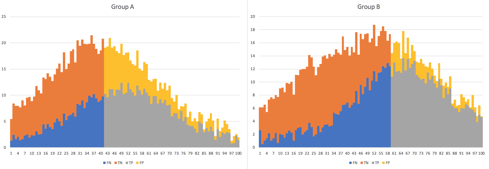
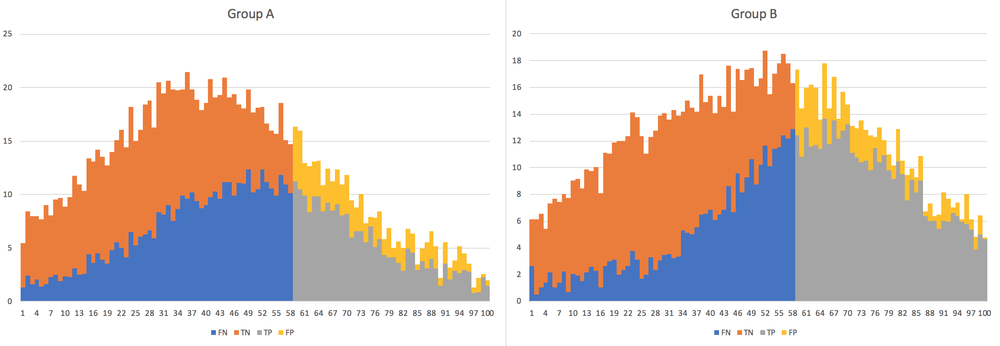
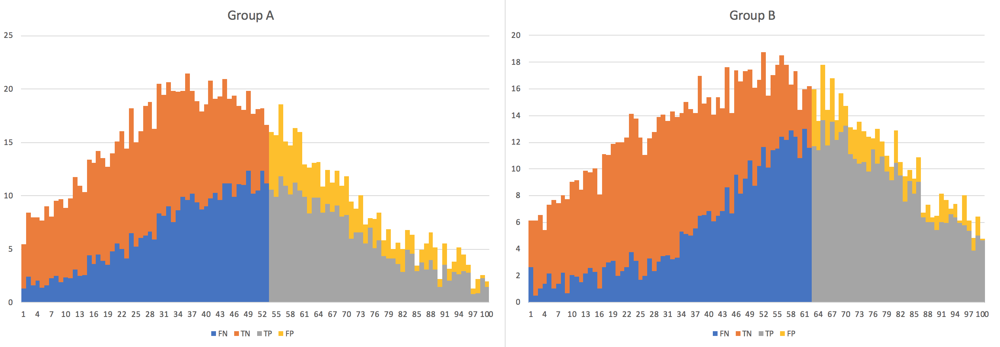
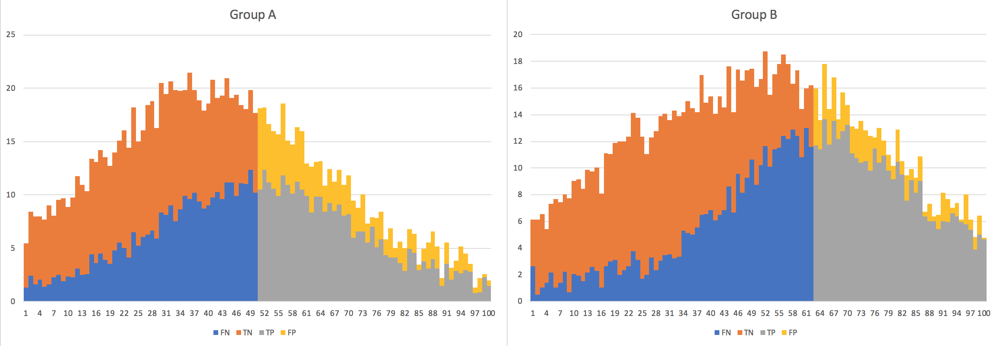
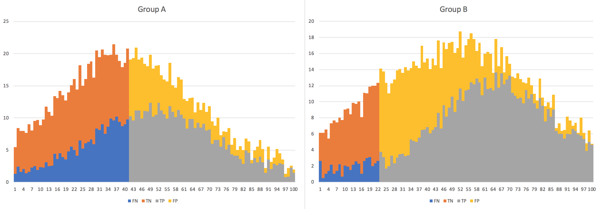
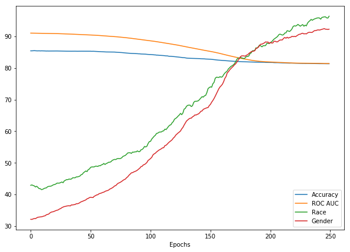
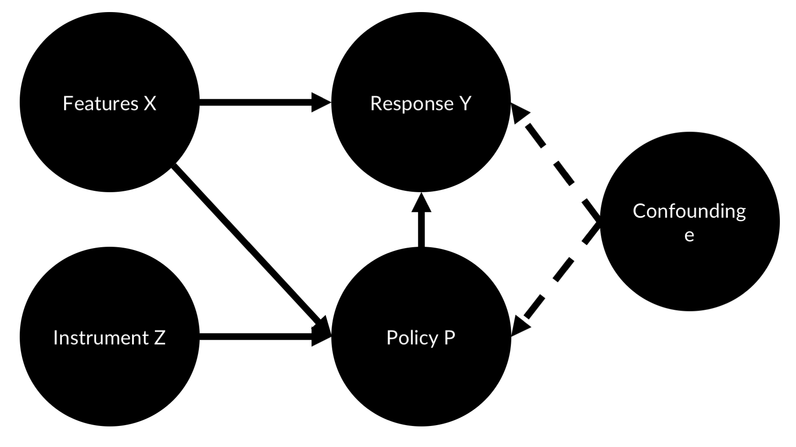
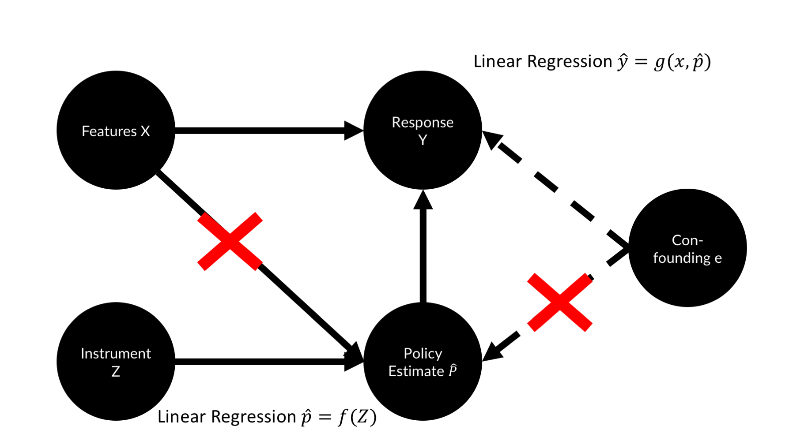
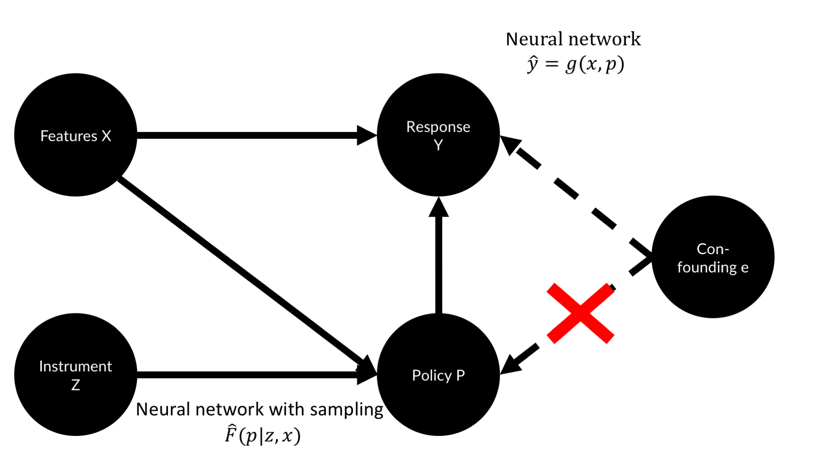

# Chapter 9 Fighting Bias

https://fairmlclass.github.io/

We like to think that machines are more rational than us. Heartless silicon applying cold logic to optimize some outcome. Thus, when automated decision making entered the economy, many hoped that computers would reduce prejudice and discrimination. But computers are made and trained by humans. Their data stems from an unjust world. And if we are not careful, they will amplify our biases.

In the financial industry, anti-discrimination is not only a matter of moral. Take for instance the Equal Credit Opportunity Act (ECOA) which came into force in 1974. It explicitly forbids creditors to discriminate applicants based on race, sex, marital status and a number of other attributes. It also requires creditors to inform applicants about the reasons for denial. 

The algorithms discussed in this books are discrimination machines. They will find the features on which best to discriminate to achieve a given objective. However, discrimination is **domain specific**. It is okay to target ads for books from a certain country to people who are also from that country. It is not okay to deny a loan to people from a certain country. In the financial domain, there are much stricter rules for discrimination than in book sales, because decisions in the financial domain have a much more severe impact on peoples lives. Equally, discrimination is **feature specific**. It is okay to discriminate loan applicants on their history of repaying loans, but not on their country of origin.

Equally, the algorithms discussed in this book are feature extraction algorithms. Even if regulated features are omitted, they might infer them from proxy features and then discriminate based on them anyway. Zip codes for instance can be used to predict race reasonably well in many cities in the United States. Omitting regulated features is not enough.

This chapter discusses where bias in machine comes from, its legal implications, and how it can be reduced.

# Sources of unfairness in ML

As discussed many times in this book, models are a function of the data they are trained on. Generally, more data leads to smaller errors. By definition, there is less data on minority groups, simply because there are fewer people in the group. This **disparate sample size** can lead to worse model performance for the minority group. This increased error is often a **systematic error**. The model might have overfit to majority group data, so that the relationships it found do not hold on the minority group data. Since there is little minority group data, this is not punished as much. Imagine you are training a credit scoring model, and the vast majority of your data comes from people living in lower manhattan and a small minority lives in rural areas. Manhattan housing is much more expensive, so the model might learn that you need a very high income to buy an apartment. Rural housing is much cheaper, but because the model is largely trained on manhattan data, it might deny loan applications to rural applicants because they also tend to have lower incomes than their manhattan peers.

Next to sample size issues, our data can be biased by itself. 'Raw Data' does not exist. Data does not appear naturally but is measured by humans using human made measurement protocols. These protocols can be biased in many ways. They can have **sampling biases**, like in the manhattan housing example. They can have **measurement biases**. Your measurement might not measure what it is intended to measure or discriminate against one group. One example are Eurocentric knowledge tests that ask about the tales of the brothers Grimm, but not about Indian fairy tales. And finally, there can be **pre-existing social biases**. These are visible in word vectors for instance. In Word2Vec, the vector mapping from father to doctor in latent space maps from mother to nurse. The vector from man to computer programmer maps from woman to homemaker. This is because sexisim is encoded in the written language of a sexist society. Until today, doctors are usually men and nurses are usually women. Tech-companies diversity statistics reveal that far more men are computer programmers. These biases get encoded in models, 

Intro
http://mrtz.org/nips17/#/11

# Legal perspectives
There are two doctrines in anti discrimination law, disparate treatment and disparate impact. **Disparate treatment** can be formal, that is if regulated features are explicitly used for discrimination, which is obviously not legal. But it can also be a problem if it is not formal but intentional. Intentionally discriminating against zip codes with the hope of discriminating against race is also not legal. Disparate treatment problems have less to do with the algorithm and more with the organization running it. **Disparate impact** can be a problem if an algorithm is deployed that has a different impact on different groups, even without the organization knowing about it. Let's walk through a lending scenario in which disparate impact could be a problem: First, the plaintiff must establish that there is a disparate impact. This is usually done with the **four fifths rule**: If the selection rate of a group is less then 80% of the group with the highest selection rate of, it is regarded as evidence of adverse impact. If a lender has 150 loan applicants from group A, of which 100, or 67% are accepted and 50 applicants from group B of which 25 are accepted, the difference in selection is 0.5/0.67 = 0.746, which qualifies as evidence for discrimination against group B. To this, the defendant can counter by showing that the decision procedure is justified as a necessity. Finally, the the plaintiff has the opportunity to show that the goal of the procedure could also be achieved with a different procedure that shows a smaller disparity.

The disparate treatment doctrine tries to achieve procedural fairness and equal opportunity. The disparate impact doctrine aims for distributive justice and minimized inequality in outcomes. There is an intrinsic tension between the two doctrines, illustrated by the *Ricci v. DeStefano* case from 2009. In this case, nineteen white and one Hispanic firefighters sued their employer, the New Haven Fire Department. The firefighters had all passed their test for promotion. Yet their black colleagues did not score high enough for promotion. Fearing an disparate impact lawsuit, the city invalidated the test results and did not promote the firefighters. Because the evidence for disparate impact was not strong enough, the supreme court eventually ruled that the firefighters should have been promoted.

Given the complex legal and technical situation around fairness in machine learning, we will next dive into how we can define and quantify fairness, before using this insight to create more fair models.

# Observational fairness

Thresholds and equal opportunity
https://research.google.com/bigpicture/attacking-discrimination-in-ml/

Equality is often seen as a purely qualitative issue, and as such, often dismissed buy quantitative minded modelers. As this section shows, equality can be seen from a quantitative perspective, too. 
Consider a classifier $c$ with input $X$, some sensitive input $A$, a target $Y$ and output C. Usually we note the classifier output as $\hat{Y}$, but for readability we follow CS 294 and name it $C$.

Say our classifier is used to decide who gets a loan. When would we consider this classifier to be fair? In order to answer this question, picture two demographics, Group A and B, of loan applicants. Given a credit score, our classifier has to find a cutoff point. Below you can see the distribution of applicants. In orange are applicants who would not have repaid the loan and did not get accepted, true negatives (TN). In blue are applicants who would have repaid the loan but did not get accepted, false negatives (FN). In yellow are applicants who did get the loan but did not pay it back, false positives (FN). In grey are applicants who did receive the loan and paid it back, true positives (TP). The data for this example is synthetic, you can find the excel file used for these calculations in the GitHub repository of this book.

For this exercise we assume that a successful applicant and pays yields a profit of \$300 while a defaulting successful applicant costs \$700. The cutoff point below has been chosen to maximize profits:



As you can see, there are several issues with this choice of cutoff point. group B applicants need to have a better score to get a loan than group A applicants, indicating disparate treatment. At the same time, about 51% of group A applicants get a loan but only 37% of group B applicants, indicating disparate impact. A **group unaware threshold** would give both groups the same minimum score:



Both groups have the same cutoff rate, but group A has been given fewer loans. At the same time, predictions for group A have a lower accuracy than for group B. It seems, that although both groups face the same score threshold, group A is at a disadvantage.

**Demographic parity** aims to achieve fairness by ensuring that both groups have the same chance of receiving the loan. This method aims to achieve the same selection rate for both groups, which is what impact disparity is measured by. Mathematically this can be expressed as:

$$P(C=1∣A=1)=P(C=1∣A=0)$$

If we apply this rule to our data, we arrive at the following cutoff points:


While this method can not be blamed for statistical discrimination and disparate impact, it can be blamed for disparate treatment. Group A is given a lower threshold score and more successful group A applicants default on their loans. In fact, group A is not profitable and gets subsidized by group B. Accepting a worse economic outcome to favor a certain group is also called taste based discrimination. It could be said that the higher thresholds for group B are unfair, as they have a lower false positive rate.

**True positive parity**, also called equal opportunity, means that both demographics have the same true positive rate. For people who can pay back the loan, the same chance of getting a loan should exist. Mathematically:
$$P(C=1∣Y=1,A=1)=P(C=1∣Y=1,A=0)$$

Applied to our data, this policy looks similar to demographic parity, except that the group A cutoff point is even lower:


Equal opportunity can address many of the problems of demographic parity. Most people believe that everyone should be given the same opportunity. Still, our classifier is less accurate for group A and there is a form of disparate treatment in place.

**Accuracy parity** prescribes that the accuracy of predictions should be the same for both groups. Mathematically this can be expressed as:

$$P(C=Y∣A=1)=P(C=Y∣A=0)$$

The probability that the classifier is correct should be the same for the two possible values of the sensitive variable $A$. When we apply this criteria to our data, we arrive at the following output:



The downside becomes apparent from the graphic above. In order to satisfy the accuracy constraint, members of Group B are given much easier access to loans. 

Tradeoffs are necessary, no classifier can have precision parity, true positive parity _and_ false positive parity, unless the classifier is perfect, $C=Y$ or both demographics have the same base rates:
$$P(Y=1|A=1)=P(Y=1|A=0)$$

There are many more ways to express fairness in different ways. The key takeaway however is that none of them perfectly satisfies all fairness criteria. For any two populations with unequal base rates, unequal chances of repaying their loan, establishing statistical parity requires introducing a treatment disparity. This fact has led to much debate and the best practice to express and eliminate discrimination has not been agreed on, yet. Yet, even if the perfect mathematical expression of fairness was found, it would not immediately lead to perfectly fair systems. Any machine learning algorithm is part of a bigger system. Inputs $X$ are often not clearly defined as different algorithm in the same system might use different inputs. Demographic groups $A$ are often not clearly defined or inferred. Even the output $C$ of the classifier can often not be clearly distinguished, as many algorithms together might perform the classification task while each algorithm is predicting a different output, like a credit score and a profitability estimate. **Good technology is not a substitute for good policy**. Blindly following an algorithm without an opportunity for individual consideration or appeal will always lead to unfairness. But while mathematical fairness criteria can not solve all fairness issues, it is surely worth trying to make machine learning algorithms more fair. This is what the next section is about.

# Training to be fair 
Training models to be fair
https://blog.godatadriven.com/fairness-in-ml

Data 
https://archive.ics.uci.edu/ml/datasets/Adult

There are multiple ways to train models to be more fair. A simple approach could be to use the different fairness measures we have listed above as an additional loss. In practice, this approach has turned out to not work very well. The models produced with such 'fairness regularization' turn out to have poor performance on the actual classification task. An alternative approach is to use and adversarial network. In 2016, Louppe, Kagan and Cranmer published 'Learning to Pivot with Adversarial Networks', a paper which shows how to use an adversarial network to train a classifier to ignore a nuisance parameter, such as a sensitive feature.

In this example, we will train a classifier to predict if an adult makes over \$50K in annual income. The challenge is to make our classifier unbiased from influences of race and gender, and only focus on features we can discriminate on such as their occupation and gains they make from capital. To this end we train a classifier and an adversarial network. The adversarial aims to classify the sensitive attributes $a$, gender and race, from the predictions of the classifier.


The classifier aims to classify by income but also aims to fool the adversarial. The classifiers minimization objective is:

$$\min[L_y - \lambda L_A]$$

Where $L_y$ is a binary cross-entropy loss of the classification and $L_A$ is the adversarial's loss. $\lambda$ is a hyper parameter we can use to amplify or reduce the impact of the adversarial loss.

This implementation of the adverserial fairness method follows an implementation by Stijn Tonk and Henk Griffioen. You can find the code to this chapter on Kaggle under: https://www.kaggle.com/jannesklaas/learning-how-to-be-fair

To train fair, we need not only data X and targets y, but also data about sensitive attributes, A. We take data from the 1994 US census provided by the UCI repository https://archive.ics.uci.edu/ml/datasets/Adult

To make loading the data easier, it has been transformed into a CSV with column headers. Please refer to the online version to see the data as well.

First we load the data. The dataset contains data about people from many races, but for simplicity we will only focus on white and black people for the race attribute.
```Python 
path = '../input/adult.csv'
input_data = pd.read_csv(path, na_values="?")
input_data = input_data[input_data['race'].isin(['White', 'Black'])]
```

We select the sensitive attributes race and gender into our sensitive dataset A. We one hot encode the data so that 'Male' equals one for the gender attribute and 'White' equals one for the race attribute.
```Python 
sensitive_attribs = ['race', 'gender']
A = input_data[sensitive_attribs]
A = pd.get_dummies(A,drop_first=True)
A.columns = sensitive_attribs
```

Our target is the income attribute. We encode '>50K' as 1 and everything else as zero.
```python 
y = (input_data['income'] == '>50K').astype(int)
```

To get our training data, we first remove the sensitive and target attributes. We then fill all missing values and one hot encode all data.
```Python 
X = input_data.drop(labels=['income', 'race', 'gender'],axis=1)

X = X.fillna('Unknown')

X = pd.get_dummies(X, drop_first=True)
```

Finally, we split the data into train and test split. We stratify the data to ensure that the same amount of high earners are in test and training data.
```Python 
X_train, X_test, y_train, y_test, A_train, A_test = \
train_test_split(X, y, A, test_size=0.5, 
                stratify=y, random_state=7)
```

To ensure the data works nicely with the neural network, we scale the data using scikit learn's `StandardScaler`:
```Python 
scaler = StandardScaler().fit(X_train)

X_train = pd.DataFrame(scaler.transform(X_train), 
                       columns=X_train.columns, 
                       index=X_train.index)
                       
X_test = pd.DataFrame(scaler.transform(X_test), 
                      columns=X_test.columns, 
                      index=X_test.index)
```

We need a metric how fair our model is. We are using the disparate impact selection rule. The `p_rule` method calculates the share of people classified to have over \$50K income from both groups and returns the ratio of selections in the disadvantaged demographic over the ratio of selections in the advantaged group. The goal is for the `p_rule` method to return at least 80% the meet the four fifths rule for both race and gender. This function is only used for monitoring, and not as a loss function. 

```Python 
def p_rule(y_pred, a_values, threshold=0.5):
    y_a_1 = y_pred[a_values == 1] > threshold if threshold else y_pred[a_values == 1] #1
    y_a_0 = y_pred[a_values == 0] > threshold if threshold else y_pred[a_values == 0] 
    odds = y_a_1.mean() / y_a_0.mean() #2
    return np.min([odds, 1/odds]) * 100 
```
\#1 First, select who is selected given a selection threshold. Here, we classify everyone whom the model assigns a chance of over 50% to make \$50K as a high earner. 

\#2 Then we calculate the selection ratio of both demographics. We divide the ratio of the one group by the ratio of the other group. By returning the minimum of either the odds or one divided by the odds, we ensure to returns a value below 1.

To make model setup a bit easier, we need to define the number of input features and the number of sensitive features.
```Python 
n_features=X_train.shape[1]
n_sensitive=A_train.shape[1]
```

Now we set up our classifier. Note how this classifier is a standard classification neural network. It features 3 hidden layers, some dropout and a final output layer with a sigmoid activation since this is a binary classification task. This classifier is written in the Keras functional API. To make sure you understand how the API works, go through this code example and ensure you understand why the steps are taken.
```Python 
clf_inputs = Input(shape=(n_features,)) 
x = Dense(32, activation='relu')(clf_inputs)
x = Dropout(0.2)(x)
x = Dense(32, activation='relu')(x)
x = Dropout(0.2)(x)
x = Dense(32, activation='relu')(x)
x = Dropout(0.2)(x)
outputs = Dense(1, activation='sigmoid', name='y')(x)
clf_net = Model(inputs=[clf_inputs], outputs=[outputs])
```

The adversarial network is a classifier with two heads. One to predict the applicants race of from the model output, one to predict the applicants gender.
```Python 
adv_inputs = Input(shape=(1,)) 
x = Dense(32, activation='relu')(adv_inputs)
x = Dense(32, activation='relu')(x)
x = Dense(32, activation='relu')(x)
out_race = Dense(1, activation='sigmoid')(x)
out_gender = Dense(1, activation='sigmoid')(x)
adv_net = Model(inputs=[adv_inputs], outputs=[out_race,out_gender])
```

As with GANs, we have to make the networks trainable and untrainable multiple times. To make this easier, the following function creates a function that makes a network and all its layers trainable or untrainable.
```Python 
def make_trainable_fn(net): #1
    def make_trainable(flag): #2
        net.trainable = flag #3
        for layer in net.layers:
            layer.trainable = flag
    return make_trainable #4
```
\#1 The function accepts a Keras neural network, for which the train switch function will be created.

\#2 Inside the function, a second function is created. This second function accepts a boolean flag (True / False).

\#3 When called, the second function sets the networks trainability to the flag. If False is passed, the network is not trainable. Since the layers of the network can also be used in other networks, we ensure that each individual layer is not trainable, too.

\#4 Finally, we return the function.

Using a function to create another function might seem convoluted at first, but it allows us to create 'switches' for the neural network easily. The snippet below shows how to create switch functions for the classifier and adversarial.

```Python 
trainable_clf_net = make_trainable_fn(clf_net) 

trainable_adv_net = make_trainable_fn(adv_net)
```

To make the classifier trainable, we can use the function with the True flag:

```Python 
trainable_clf_net(True)
```

Now we compile our classifier. As you will see later, it is useful to keep the classifier network as a separate variable from the compiled classifier with which we make predictions.
```Python 
clf = clf_net
clf.compile(loss='binary_crossentropy', optimizer='adam')
```

Remember that to train our classifier, we need to run its predictions through the adversary as well, obtain the adversary loss, and apply the negative adversary loss to the classifier. This is best done by packing the classifier and adversary into one network.

First, we create a new model that maps from the classifier inputs to the classifier and adversary outputs. We define the adversary output to be a nested function of the adversarial network and the classifier network. This way, the predictions of the classifier get immediately passed on to the adversary.
```Python 
adv_out = adv_net(clf_net(clf_inputs))
```

We define the classifier output to be the output of the classifier network, just as we would for classification.
```Python 
clf_out = clf_net(clf_inputs)
```

We define the combined model to map from the classifier input, speak the data about an adult, to the classifier output and adversary output. 
```Python 
clf_w_adv = Model(inputs=[clf_inputs], 
                  outputs=[clf_out]+adv_out)
```

When training the combined model, we only want to update the weights of the classifier. We will train the adversary separately. We can use our switch functions to make the classifier network trainable and the adversarial network untrainable.
```Python
trainable_clf_net(True)
trainable_adv_net(False)

```

Remember the hyperparameter $\lambda$ from the minimization objective above. We need to set this parameter manually for both sensitive attributes. As it turns out, the networks train best if lambda for race is set much higher than lambda for gender.


With the lambda values in hand, we can create the weighted loss:
```Python
loss_weights = [1.]+[-lambda_param for lambda_param in lambdas]
```
The expression above leads to loss weights of `[1.,-130,-30]`. This means the classification errpr has a weight of 1, the race prediction error of the adversary a weight of -130 and the gender prediction error of the adversary a weight of -30. Since the losses of the adversarial's prediction have negative weights, gradient descent will optimize the parameters of the classifier to _increase_ these losses. 

Finally, we can compile the combined network. 
``` Python 
clf_w_adv.compile(loss='binary_crossentropy'), 
                  loss_weights=loss_weights,
                  optimizer='adam')
```

With the classifier and combined classifier-adverserial model in place, the only thing missing is a compiled adversarial model. First we define the adversarial model to map from the classifier inputs to the outputs of the nested adversarial-classifier model. 
```Python 
adv = Model(inputs=[clf_inputs], outputs=adv_net(clf_net(clf_inputs)))
```

When training the adversarial model, we want to optimize the weights of the adversarial network and not of the classifier network, so we use our switch functions to make the adversarial trainable and the classifier not.
```Python 
trainable_clf_net(False) 
trainable_adv_net(True)
```

Finally, we compile the adversarial model like a regular keras model.
```Python 
adv.compile(loss='binary_crossentropy', optimizer='adam')
```

With all pieces in hand, we can pre-train the classifier. This means we train the classifier without any special fairness considerations. 

```Python 
trainable_clf_net(True)
clf.fit(X_train.values, y_train.values, epochs=10)
```

After we have trained the model, we can make predictions on the validaton set to evaluate the models fairness and accuracy.
```Python 
y_pred = clf.predict(X_test)
```

Now we first calculate the models accuracy and p rule for both gender and race. In all calculations we use a cutoff point of 0.5.
```Python 
acc = accuracy_score(y_test,(y_pred>0.5))* 100
print('Clf acc: {:.2f}'.format(acc))

for sens in A_test.columns:
    pr = p_rule(y_pred,A_test[sens])
    print('{}: {:.2f}%'.format(sens,pr))
```

```
out: 
Clf acc: 85.44
race: 41.71%
gender: 29.41%
```

As you can see, the classifier achieves a respectable accuracy in predicting incomes. However, it is deeply unfair. It gives women only 29.4% of the chance to make over \$50K than it does men. It equally discriminates strongly on race. If we used this classifier to judge loan applications for instance, we would be vulnerable to discrimination lawsuits.

Note: Neither gender or race were included in the features of the classifier. Yet, the classifier discriminates strongly on them. If the features can be inferred, dropping sensitive columns is not enough.


To get out of this mess, we will pre train the adversarial network before then training both networks to make fair predictions. Once again, we use our switch functions to make the classifier untrainable and the adversarial trainable.
```Python 
trainable_clf_net(False)
trainable_adv_net(True)
```
As the distributions for race and gender in the data might be skewed, we use weighted classes to adjust for this.
```Python
class_weight_adv = compute_class_weights(A_train)
```

We then train the adversary to predict race and gender from the training data through the predictions of the classifier. 
```Python 
adv.fit(X_train.values, 
        np.hsplit(A_train.values, A_train.shape[1]), 
        class_weight=class_weight_adv, epochs=10)
```
Numpy's `hsplit` function splits the 2D matrix A_train into two vectors that are then used to train the two model heads.

With classifier and adversarial pre trained, we will now train the classifier to fool the adversarial and the adversarial to get better at spotting the classifiers discrimination. Before we start, we need to do some setup.

We want to train for 250 epochs, with a batch size of 128. There are two sensitive attributes.
```Python 
n_iter=250
batch_size=128
n_sensitive = A_train.shape[1]
```

The combined network of classifier and adversarial also needs some class weights. The weights for the income predictions (less / more than \$50K) are both 1. For the adverserial heads of the combined model we use the adversrial's class weights computed above.
```Python 
class_weight_clf_w_adv = [{0:1., 1:1.}]+class_weight_adv
```

To keep track of metrics, we set up one dataframe for validation metrics (accuracy and area under curve), as well as for fairness metrics. The fairness metrics are the p rule values for race and gender.
```Python 
val_metrics = pd.DataFrame()
fairness_metrics = pd.DataFrame()
```

Inside the main training loop, three steps are performed. Training the adverserial, training the classifier to be fair and printing out validation metrics. For better explanations, all three are printed separately here. In the code you will find them in the same loop, where `idx` is the current iteration:
```Python 
for idx in range(n_iter):
```

The first step is to train the adversarial. To this end, we make the classifier untrainable, the adversarial trainable and then train the adversarial just as we did before.
```Python 
trainable_clf_net(False)
trainable_adv_net(True)
adv.fit(X_train.values, 
        np.hsplit(A_train.values, A_train.shape[1]), 
        batch_size=batch_size, 
        class_weight=class_weight_adv, 
        epochs=1, verbose=0)
```

Training the classifier to be a good classifier but also to fool the adversarial and be fair involves three steps. First, we make the adverserial untrainable and the classifier trainable.
```Python 
trainable_clf_net(True)
trainable_adv_net(False)
```

We then sample a batch from X, y and A.
```Python 
indices = np.random.permutation(len(X_train))[:batch_size]
X_batch = X_train.values[indices]
y_batch = y_train.values[indices]
A_batch = A_train.values[indices]
```

Finally, we train the combined adversarial and classifier. Since the adversarial network is set to not trainable, only the classifier network will be trained. However, the loss from the adversarial predictions of race and gender get back-propagated through the entire network, so that the classifier learns to fool the adversarial.
```Python 
clf_w_adv.train_on_batch(X_batch, 
                        [y_batch]+\
                        np.hsplit(A_batch, n_sensitive),
                        class_weight=class_weight_clf_w_adv)
```

Finally, we keep track of progress by first making predictions on the test set.
```Python   
y_pred = pd.Series(clf.predict(X_test).ravel(), index=y_test.index)
```

We then calculate area under cure (ROC AUC) and accuracy of the predictions and save them in the `val_metrics` dataframe.
```Python 
roc_auc = roc_auc_score(y_test, y_pred)
acc = accuracy_score(y_test, (y_pred>0.5))*100

val_metrics.loc[idx, 'ROC AUC'] = roc_auc
val_metrics.loc[idx, 'Accuracy'] = acc
```

Next up, we calculate the p rule for both race and gender, and save those values in the fairness metrics.
```Python 
for sensitive_attr in A_test.columns:
    fairness_metrics.loc[idx, sensitive_attr] =\
    p_rule(y_pred,A_test[sensitive_attr])
```

If we plot fairness and validation metrics, we arrive at the following plot:


As you can see, the fairness scores of the classifier steadily increase with training. After about 150 epochs, the classifier satisfies the four fifths rule. After about 150 epochs, p values are well over 90%. This increase in fairness comes at only a small decrease in accuracy and area under curve. The classifier trained in this manner is clearly a more fair classifier with similar performance, and thus preferred a classifier trained without fairness criteria.

The pivot approach to fair ML has many advantages. Yet, it can not rule out unfairness entirely. What, for example if there was a group the classifier discriminates against that we did not think of yet. What, if it discriminates on treatment, instead of impact. To make sure our models are not biased, we need more technical and social tools, namely interpretability, causality and diverse development teams. The next section discusses how to train machine learning models which learn causal relationships, instead of just statistical associations.

# Causal learning 
This book is by and large a book about statistical learning. Given data $X$ and targets $Y$, we aim to estimate $p(y|x)$, the distribution of target values given certain data points. Statistical learning allows is to create great models with useful applications, but it does not allow us to claim that $X$ being $x$ _caused_ $Y$ to be $y$. 

This is critical if we intent to manipulate $X$. For instance, if we want to know if giving an insurance to someone leads to them behaving recklessly, we are not satisfied with the statistical relationship that people with an insurance behave more reckless than those without. There could be a self selection bias of the reckless people getting insurance while the others do not. 

Following Judea Perl, a famous computer scientist who invented notation for causal models called do calculus, we are interested in $p(y|do(p))$. The probability of someone behaving reckless after we manipulated $P$ to be $p$. In a causal notation, $X$ usually stands for observed features and $P$ stands for policy features we can manipulate.

$p(y|x)$ expresses the statistical relationship that insurance holders are more reckless on average. This is what supervised models learn.

$p(y|do(p))$ expresses the causal relationship that people who get an insurance become more reckless because they are insured. This is what this section is about.

Causal models are a great tool for fair learning. If we only build our models in a causal way, we avoid most statistical discrimination of statistical models. Do females statistically earn less than males? Yes. Do females earn less _because_ they are females and females are somehow deterring high salaries? No. Instead, the earnings difference is caused by other factors, such as different jobs being offered to males and females, discrimination in the work place, cultural stereotypes and so on. 

That does not mean we have to throw statistical models out of the window. They are great for the many cases where causality is not as important and where we do not intent to set the values of $X$. If we are creating a natural language model for instance, we are not interested in if the occurrence of a word caused the sentence to be about a certain topic. Knowing that the topic and the word are related is enough to make predictions about the text content.

The golden route to obtain information about $do(p)$ is to actually go and manipulate the policy $P$ in a randomized control trial. Many websites for instance measure the impact of different ads by showing different ads to different customers, a process called A/B testing. Equally, a trader might choose different routes to market to figure out which one is the best. But it is not always possible or ethical to do an A/B test. A bank for example can not deny a loan with the explanation 'sorry, but you are the control group'.

Yet, often causal inference can be made without the need for an A/B test. Using do calculus, we can infer the effect of our policy on our outcome. 

Take the insurance wondering if giving people insurance makes them reckless, the applicants moral hazard, for example. Given features $X$ and a policy $P$, we want to predict the outcome distribution $p(y|do(p),x)$. That is, given observed information about the applicant, e.g. age or history of risky behavior, we want to predict if the probability of the applicant behaving reckless $p(y)$ given that we manipulate the policy $P$ of granting insurance. The observed features often end up influencing both policy and response. An applicant with a high risk appetite might for example not be given insurance, but might also be more likely to behave reckless.

Additionally, we have to deal with unobserved, confounding variables $e$ which often influence both policy and response. A prominent media article titled 'Free-style skiing is safe and you should not get insurance' for example would reduce the number of people taking insurance as well as the number of reckless skiers. 

To distinguish the influence on policy and response, we need access to an instrument $Z$. An instrument is a variable that influences the policy, but nothing else. The re-insurance cost for example could prompt the insurance company to give out fewer insurances, while it will not influence how people behave otherwise. 



The field of econometrics has already built a method to work with these kinds of situations called instrumental variables two stage least squares (IV2SLS or just 2SLS). In a nutshell, 2SLS first fits a linear regression model between the instrument $z$ and the policy $p$, in econometrics called the endogenous or treatment variable. From this liner regression it then estimates an 'adjusted treatment variable' $\hat p$, which is the treatment variable as it can be explained by the instrument. The idea is that this adjustment removes the influence of all other factors on the treatment. A second linear regression then creates a linear model mapping from the features $x$ and the adjusted treatment variable $\hat p$ to the outcome, $y$. In the image below you can see an overview of how 2SLS works.



2SLS is probably what the insurance company in our case would use, since it is an established method We won't go into details here, but just give a brief overview of how to use 2SLS in Python. The `linearmodels` package in Python features an easy way to run 2SLS. You can find the package on GitHub: https://github.com/bashtage/linearmodels

Install the package with `pip install linearmodels`. If you have data `X`,`y`,`P`,`Z`, you can run a 2SLS regression as follows:

```Python 
from linearmodels.iv import IV2SLS
iv = IV2SLS(dependent=y,
            exog=X,
            endog=P],
            instruments=Z).fit(cov_type='unadjusted')
```

But what if the relationships between features, treatment and outcome are complex and non-linear? We would have perform a process similar to 2SLS, but with a non-linear model such as a neural network instead of linear regression.

Ignoring the confounding variables for a minute, The function $g$ determines the recklessness of behavior $y$ given an insurance policy $p$ and a set of applicants features $x$.
$$y = g(p,x)$$ 

The function $f$ determines the policy $p$ given the applicants features $x$ as well as the instrument $z$.

$$p = f(x,z)$$

Given these two functions, the following identity holds, if the confounding variable has a mean of zero over all features:

$$
\mathbb{E}[y|x,z] = \mathbb{E}[g(p,x)|x,z] = 
\int{g(p,x)}dF(p|x,z)
$$

This means that if we can reliably estimate the function $g$ and distribution $F$, we can make causal statements about the effects of policy $p$. If we have data about the actual outcome $y$, features $x$, policy $p$ and instrument $z$, we can optimize the following:

$$
\min_{g \in G} \sum_{t=1}^n 
\Big{(}y_t - \int g(p,x_t)dF(p|x,z)\Big{)}^2
$$

The function above is the squared error between the predicted outcome using the prediction function $g$ and the actual outcome $y$.

Notice the similarity to 2SLS. In 2SLS, we estimated $F$ and $g$ with two separate linear regressions. For more complex functions we can also estimate them with two separate neural networks. Hartfort et al. (2017) present just such an approach with 'Deep IV: A Flexible Approach for Counterfactual Prediction', the overview of which you can see below.



The idea of DeepIV is to first train a neural network to express a distribution $F(z,x)$ which describes the distribution of policies given certain features $x$ and instrument values $z$. A second neural network predicting the response $y$ from the estimated policy distribution and features. DeepIV's advantage is that it can learn complex, non linear relationships from complex data, such as text.

The authors published a custom Keras model to handle the sampling and learning from a distribution part, which you can find on GitHub: https://github.com/jhartford/DeepIV

While their code is too long to be discussed in depth here, it is interesting to think about what the source of our causal claim is, both in DeepIV and IV2SLS. In our insurance case, we assumed that having or not having an insurance would influence behavior, not the other way around. We never showed or tested the truth behind this direction of causality. In our case, assuming that insurance influences behavior is justified, since the insurance contract is signed before the behavior is observed. But the direction of causality is not always as straightforward. There is no way to establish the direction of causality other than logical reasoning or experiments. In absence of experiments, we have to assume and logically reason, for example through the sequentiality of events. 

Another important assumption we make is that the instrument is actually an independent instrument. If it is not independent, our estimation of the policy breaks down.

With these two limitations in mind, causal inference is a great tool and an active area of research from which we can hope to see great results in the future. In the best case, your discrimination sensitive models would only contain causal variables. In practice this is usually not possible. But keeping the difference between statistical correlation, as expressed by standard statistical models and causation in mind can help you avoid statistical biases and wrong associations. 

A final, technical, method to reduce unfairness is to peek inside the model to ensure it is fair. We already looked at interpretability in the last chapter, mostly to debug data and spot overfitting. Now, we will give it another look, this time to justify the models predictions.

# Interpreting models to ensure fairness
- Interpretability
https://geomblog.github.io/fairness/
- Causal ML
